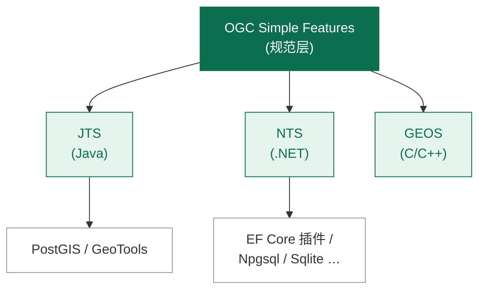

# 认识 NetTopologySuite

> 如果你曾在 .NET 里需要"判断一个点是否在多边形内"、"计算两条路线的交集"或"给河流生成 50 米缓冲区"，那么 NetTopologySuite（简称 NTS）就是你要找的库。

## 它是什么

NetTopologySuite 是 **JTS Topology Suite**（Java）在 .NET 平台上的快速、完整的移植版本。JTS 是 GIS 领域久经考验的几何运算库，被 PostGIS、GeoTools 等知名项目使用。NTS 让 .NET 开发者可以零成本获得同样的能力：

- 一个完整的、遵循 **OGC 简单要素访问规范 (SFS)** 的几何对象模型
- 一套健壮的拓扑运算算子（叠加、缓冲、距离、谓词……）
- 空间索引、三角剖分、几何简化、线性参考等高级工具
- 多种序列化格式：WKT、WKB、GeoJSON、GML……

## 它解决什么问题

很多团队第一次接触空间数据时，会本能地"自己写公式"。这是一条充满坑的路：

| 自己造轮子的常见问题 | NTS 已帮你解决 |
| --- | --- |
| 浮点精度导致"两个应该相交的线没相交" | 稳健的拓扑算法 + 精度模型 |
| 多边形自相交、孔洞方向混乱 | 严格的几何有效性校验 |
| 缓冲区端点不平滑、连接处有缺口 | 差分圆角、斜接、端点风格可选 |
| "点在多边形内"在大数据集下慢得无法用 | STRtree / PreparedGeometry 加速 |
| 不同坐标系混用导致结果偏差 | 明确的坐标顺序（XY/ZM）与精度模型 |

## 主要能力一览

NTS 的能力大致可以分为四层：

1. **几何模型层**：`Coordinate`、`CoordinateSequence`、`Geometry` 及其子类 `Point`、`LineString`、`Polygon` 等。
2. **运算层**：叠加分析（Union/Intersection/Difference/SymDifference）、缓冲（Buffer）、凸包（ConvexHull）、简化（Simplify）、距离（Distance）等。
3. **谓词层**：Contains、Within、Intersects、Touches、Crosses、Overlaps、Disjoint、Equals，全部基于 **DE-9IM** 矩阵。
4. **生态层**：空间索引、三角剖分、线性参考、`PreparedGeometry`、`GeometryGrapher` 等。

## NTS 与其他库的关系



- **JTS**：算法的"原版"，所有移植都参照它。
- **NTS**：.NET 上的等价实现，API 与 JTS 高度一致，方便迁移。
- **GEOS**：C/C++ 移植，PostGIS 内部就是用它。
- **EF Core 空间插件**：基于 NTS，让 Entity Framework Core 直接支持 `geometry` 列。

## 一个最简短的例子

```csharp
using NetTopologySuite.Geometries;

var factory = new GeometryFactory();

var home     = factory.CreatePoint(new Coordinate(116.40, 39.90));   // 北京天安门附近
var campus   = factory.CreatePoint(new Coordinate(116.31, 39.99));   // 清华大学附近

double meters = home.Distance(campus);   // 平面距离，单位取决于你的坐标系
Console.WriteLine($"两点距离 = {meters:F4} 单位");
```

::: tip 单位是什么？
`Distance()` 返回的是 **坐标系单位**。如果你用经纬度（WGS84），结果就是"度"；要得到米，需要先把几何投影到适合该地区的米制投影（例如中国常用 CGCS2000 / Gauss-Kruger 分带），或者用专门的地理计算库（如 GeoAPI + ProjNet）做大地距离。
:::

## 这份教程的读者

- 后端 .NET 开发者，正在构建 LBS、地图、轨迹分析、选址、配送范围、围栏等功能
- 数据工程师，需要在 ETL 中清洗、校验、合并空间数据
- 学生与研究者，希望理解几何运算背后的算法

我们假设你已经熟悉 C# 基本语法、LINQ 与 .NET 项目结构，但 **不假设你有 GIS 背景**——所有概念都会从零解释。

## 接下来

- [快速开始](./getting-started.md)：装好包、跑通第一段代码
- [第一个几何对象](./first-geometry.md)：动手创建并操作几何
- [坐标与几何层级](../02-geometry-fundamentals/geometry-hierarchy.md)：理解 NTS 的对象模型
