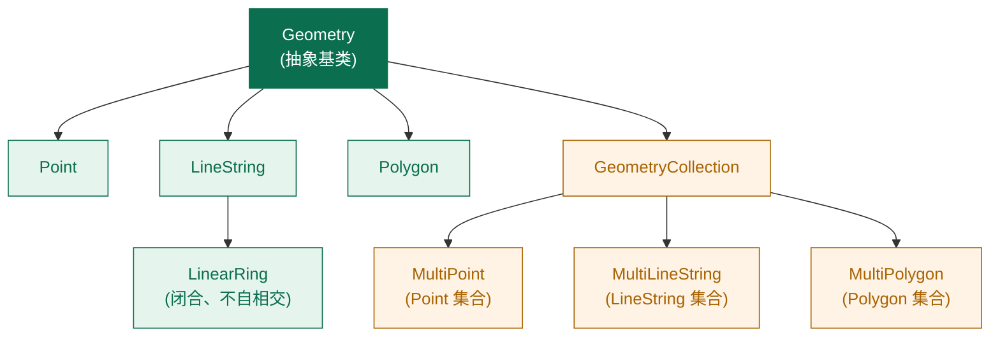

# 几何类型层级

理解 NTS 的几何类型层级，是写出正确空间代码的前提。本节从 `Geometry` 抽象基类出发，完整讲解 OGC 简单要素规范定义的继承树。

> 前置知识：如果你还不熟悉 `Coordinate` 和 `CoordinateSequence`，请先阅读 [坐标与坐标序列](./coordinate-system.md)。

## Geometry 继承树



::: tip OGC 简单要素规范
这套层级是 OGC **Simple Features Access for SQL** 规范定义的。无论你用 PostGIS、SQL Server spatial、MySQL spatial 还是 NTS，类型名都一样——这就是规范的力量。
:::

## Geometry 抽象基类

`Geometry` 定义了所有几何共有的接口，最重要的几组：

### 1. 元数据

```csharp
public abstract class Geometry
{
    public GeometryFactory Factory { get; }
    public int SRID { get; }             // 空间参考 ID
    public PrecisionModel PrecisionModel { get; }
    public int Dimension { get; }         // 0=点, 1=线, 2=面
    public GeometryType GeometryType { get; }  // 枚举：Point, LineString...
    public string GeometryTypeText { get; }    // 字符串
    public bool IsEmpty { get; }
    public bool IsValid { get; }
}
```

### 2. 拓扑谓词（返回 bool）

```csharp
public bool EqualsExact(Geometry other);
public bool EqualsTopologically(Geometry other);
public bool Intersects(Geometry g);
public bool Disjoint(Geometry g);
public bool Contains(Geometry g);
public bool Within(Geometry g);
public bool Covers(Geometry g);
public bool CoveredBy(Geometry g);
public bool Crosses(Geometry g);
public bool Touches(Geometry g);
public bool Overlaps(Geometry g);
public bool Relate(Geometry g, string intersectionPattern);
```

详见 [空间谓词](../03-spatial-relations/relationships.md)。

### 3. 运算（返回新 Geometry）

```csharp
public Geometry Buffer(double distance);
public Geometry Buffer(double distance, BufferParameters parameters);
public Geometry Union(Geometry other);
public Geometry Intersection(Geometry other);
public Geometry Difference(Geometry other);
public Geometry SymDifference(Geometry other);
public Geometry ConvexHull();
public Geometry Reverse();
public Geometry Normalize();
```

详见 [几何操作](../04-geometry-operations/overlay.md)。

### 4. 测量

```csharp
public double Area { get; }
public double Length { get; }
public double Distance(Geometry g);
public bool IsWithinDistance(Geometry g, double distance);
```

### 5. 集合导航

```csharp
public int NumGeometries { get; }
public abstract Geometry GetGeometryN(int n);
public Geometry[] Geometries { get; }
```

## Polygon 的结构

`Polygon` 是最复杂的单一几何类型。它的字段：

```csharp
public class Polygon : Geometry
{
    private readonly LinearRing _shell;          // 外壳
    private readonly LinearRing[] _holes;        // 孔洞数组（可为空）
}
```

<figure class="nts-diagram">
<svg viewBox="0 0 320 160" width="320" height="160">
  <polygon points="20,20 300,20 300,140 20,140" fill="rgba(11,110,79,0.12)" stroke="#0b6e4f" stroke-width="2"/>
  <polygon points="80,60 130,60 130,100 80,100" fill="#fff" stroke="#a00" stroke-width="1.5"/>
  <polygon points="200,70 250,70 250,110 200,110" fill="#fff" stroke="#a00" stroke-width="1.5"/>
  <text x="120" y="135" font-family="monospace" font-size="11" fill="#0b6e4f">外壳 Shell</text>
  <text x="80" y="55" font-family="monospace" font-size="10" fill="#a00">hole1</text>
  <text x="200" y="65" font-family="monospace" font-size="10" fill="#a00">hole2</text>
</svg>
<figcaption>Polygon：1 个外壳 + 0..N 个孔洞</figcaption>
</figure>

### 孔洞的规则

1. 每个 hole 必须完全在 shell 内部
2. hole 之间不能相交
3. hole 的方向 **理论上** 与 shell 相反（NTS 不强制，但 OGC 标准要求）
4. 孔洞里还可以再嵌套"岛"——不过那需要分成多个 Polygon 用 MultiPolygon 表达

## 方向：CW 与 CCW

环的方向有约定：

- **CCW（逆时针）**：通常是外壳
- **CW（顺时针）**：通常是孔洞

```csharp
var shell = factory.CreateLinearRing(new[]
{
    new Coordinate(0, 0),
    new Coordinate(10, 0),    // → 顺时针就反过来了
    new Coordinate(10, 10),
    new Coordinate(0, 10),
    new Coordinate(0, 0)
});

bool ccw = shell.IsCCW;  // true：因为是逆时针（在 NTS 默认坐标系下）
Console.WriteLine($"外壳是 CCW 吗？ {ccw}");
```

如果你拿到一个方向混乱的多边形，调用 `polygon.Normalize()` 会让所有 shell 变 CCW、所有 hole 变 CW。

## 几何的有效性 (Validity)

不是任意坐标都能构成合法几何。`IsValid` 检查是否符合 OGC SFS：

```csharp
// 自相交的"领结"多边形——无效
var bowtie = factory.CreatePolygon(new[]
{
    new Coordinate(0, 0),
    new Coordinate(10, 10),
    new Coordinate(10, 0),
    new Coordinate(0, 10),
    new Coordinate(0, 0)
});

Console.WriteLine(bowtie.IsValid);  // False
```

无效几何在参与运算时可能产生错误结果。修复办法见 [常见问题 FAQ](../appendix/faq.md) 中的"几何修复"一节。

## 小结

- 继承树遵循 OGC SFS：`Point`/`LineString`/`Polygon` + 三个 `Multi*` 集合
- `Geometry` 抽象基类定义了所有几何共有的元数据、谓词、运算和测量接口
- `Polygon` = 1 个 `LinearRing` 外壳 + N 个 `LinearRing` 孔洞
- 方向规则（CCW 外壳 / CW 孔洞）与有效性是 GIS 数据的"卫生"基础

## 下一步

- [坐标与坐标序列](./coordinate-system.md)：了解几何的"原子"单位
- [几何属性](./geometry-properties.md)：Area、Length、Envelope 等属性详解
- [几何工厂 GeometryFactory](./geometry-factory.md)：所有几何的入口
- [精度模型 PrecisionModel](./precision-model.md)：控制浮点误差
- [WKT 与 WKB](./wkt-wkb.md)：序列化格式