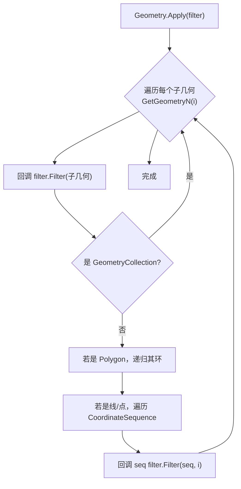
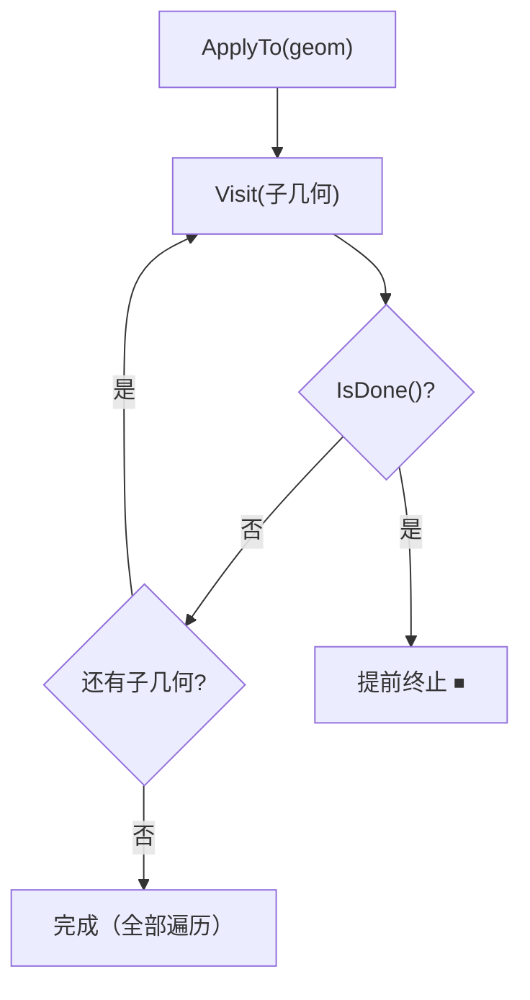

# 几何提取与遍历

NTS 的几何对象是一棵树：`GeometryCollection` 持有子几何，`Polygon` 持有外壳与孔洞环，环又持有顶点序列。要"读懂"一个几何——统计顶点、抽出所有多边形、修改坐标——你必须能逐层遍历与提取它的组成部分。

本页逐方法详解 NTS 的遍历与提取 API，分三组：**直接遍历**（按索引/属性访问子几何与顶点）、**类型化提取**（用工具类按类型筛出组件）、**辅助工具**（编辑、短路访问、变换）。每个方法给出签名、语义、C# 示例与陷阱。

```csharp
using NetTopologySuite.Geometries;
using NetTopologySuite.Geometries.Utilities;

// 本页示例共用工厂
var factory = new GeometryFactory();
```

## 几何遍历

### GetGeometryN

**签名**：`public abstract Geometry GetGeometryN(int n);`

**语义**：返回第 `n` 个子几何（从 0 开始）。对单一几何（非集合类型），`GetGeometryN(0)` 返回自身——这是"统一遍历模式"的基础。

[几何属性页](./geometry-properties.md#getgeometryn) 已介绍过基本用法，这里聚焦几个深入点。

**1. 返回的是引用，不是副本。** `GetGeometryN` 返回的子几何与父几何共享内部数据，修改它会影响父几何（除非你显式 `Copy()`）：

```csharp
var mp = factory.CreateMultiPolygon(new[] { poly1, poly2 });

// 引用同一个对象
var part = mp.GetGeometryN(0);
Console.WriteLine(ReferenceEquals(part, poly1));   // True
Console.WriteLine(ReferenceEquals(part, mp[0]));   // True（索引器是 GetGeometryN 的语法糖）
```

**2. 索引越界抛 `ArgumentOutOfRangeException`。** 调用前用 `NumGeometries` 守卫，或用统一循环模式。

**3. 对 `GeometryCollection`（异构）同样适用。** `GeometryCollection` 的子可以是任意类型，`GetGeometryN` 不做类型转换。

```csharp
// 异构集合：一个点 + 一条线 + 一个面
var gc = factory.CreateGeometryCollection(new Geometry[]
{
    factory.CreatePoint(new Coordinate(0, 0)),
    factory.CreateLineString(new[] { new Coordinate(0,0), new Coordinate(1,1) }),
    factory.CreatePolygon(new[]
    {
        new Coordinate(0,0), new Coordinate(10,0), new Coordinate(10,10),
        new Coordinate(0,10), new Coordinate(0,0)
    })
});

// 统一遍历，无需判断是否为 Multi*
for (int i = 0; i < gc.NumGeometries; i++)
{
    var g = gc.GetGeometryN(i);
    Console.WriteLine($"{i}: {g.GeometryType}, Dim={g.Dimension}");
}
// 0: Point, Dim=0
// 1: LineString, Dim=1
// 2: Polygon, Dim=2
```

::: warning GetGeometryN 返回引用
子几何与父几何共享 `CoordinateSequence`，通过 `GetGeometryN(i)` 拿到的子几何做就地修改会污染父几何。需要独立副本时调 `g.GetGeometryN(i).Copy()`。详见下文[不可变性](#不可变性遍历返回的是副本还是引用)。
:::

### ExteriorRing

**签名**：`public LineString ExteriorRing { get; }`

**语义**：返回 `Polygon` 的外壳（外边界环），类型为 `LineString`（NTS 实际返回 `LinearRing`）。

```csharp
var poly = factory.CreatePolygon(new[]
{
    new Coordinate(0, 0), new Coordinate(10, 0), new Coordinate(10, 10),
    new Coordinate(0, 10), new Coordinate(0, 0)
});

LineString shell = poly.ExteriorRing;
Console.WriteLine(shell.NumPoints);   // 5（含闭合点）
Console.WriteLine(shell.IsClosed);    // True

// NTS 还提供 Shell 属性，直接返回 LinearRing（强类型）
LinearRing ring = poly.Shell;
```

::: tip ExteriorRing vs Shell
`ExteriorRing` 是 OGC SFS 标准属性，返回 `LineString`；`Shell` 是 NTS 扩展，返回 `LinearRing`。需要 `LinearRing` 类型时（如构造新 `Polygon`）直接用 `Shell`，免去强制转换。
:::

### GetInteriorRingN

**签名**：`public LineString GetInteriorRingN(int n);`

**语义**：返回 `Polygon` 的第 `n` 个孔洞环（从 0 开始），NTS 实际返回 `LinearRing`。

```csharp
// 构造一个带两个孔洞的多边形
var shell = (LinearRing)factory.CreateLinearRing(new[]
{
    new Coordinate(0, 0), new Coordinate(20, 0), new Coordinate(20, 20),
    new Coordinate(0, 20), new Coordinate(0, 0)
});

var hole1 = (LinearRing)factory.CreateLinearRing(new[]
{
    new Coordinate(3, 3), new Coordinate(6, 3), new Coordinate(6, 6),
    new Coordinate(3, 6), new Coordinate(3, 3)
});

var hole2 = (LinearRing)factory.CreateLinearRing(new[]
{
    new Coordinate(12, 12), new Coordinate(16, 12), new Coordinate(16, 16),
    new Coordinate(12, 16), new Coordinate(12, 12)
});

var poly = factory.CreatePolygon(shell, new[] { hole1, hole2 });

Console.WriteLine(poly.NumInteriorRings);          // 2
Console.WriteLine(poly.GetInteriorRingN(0).Area);  // 9（孔洞 1 围成的面积）
Console.WriteLine(poly.GetInteriorRingN(1).Area);  // 16
```

<figure class="nts-diagram">
<svg viewBox="0 0 360 180" width="360" height="180">
  <polygon points="40,20 320,20 320,160 40,160" fill="rgba(11,110,79,0.18)" stroke="#0b6e4f" stroke-width="2.5"/>
  <polygon points="60,40 110,40 110,80 60,80" fill="#fff" stroke="#a00" stroke-width="1.5"/>
  <polygon points="200,110 260,110 260,150 200,150" fill="#fff" stroke="#a00" stroke-width="1.5"/>
  <text x="180" y="100" text-anchor="middle" font-family="monospace" font-size="11" fill="#0b6e4f">ExteriorRing（外壳）</text>
  <text x="85" y="65" text-anchor="middle" font-family="monospace" font-size="9" fill="#a00">InteriorRingN(0)</text>
  <text x="230" y="135" text-anchor="middle" font-family="monospace" font-size="9" fill="#a00">InteriorRingN(1)</text>
</svg>
<figcaption>Polygon 结构：外壳 + N 个孔洞环</figcaption>
</figure>

::: warning 仅 Polygon 有环
`GetInteriorRingN` / `ExteriorRing` / `NumInteriorRings` 只在 `Polygon` 上可用。对非 `Polygon` 调用会抛 `InvalidOperationException`。遍历 `MultiPolygon` 时先 `GetGeometryN(i)` 取出每个 `Polygon`，再访问其环。
:::

### NumInteriorRings

**签名**：`public int NumInteriorRings { get; }`

**语义**：返回 `Polygon` 的孔洞数。无孔洞的多边形返回 `0`。

```csharp
Console.WriteLine(poly.NumInteriorRings);   // 2

// 遍历所有环（外壳 + 孔洞）的统一写法
LineString shell = poly.ExteriorRing;
int n = poly.NumInteriorRings;
Console.WriteLine($"环总数 = 1（外壳）+ {n}（孔洞）");

for (int i = 0; i < n; i++)
{
    var hole = poly.GetInteriorRingN(i);
    Console.WriteLine($"孔洞 {i}: 顶点 {hole.NumPoints}");
}
```

::: tip 不重复顶点数公式
`Polygon` 的"去重顶点数"= `NumPoints - NumInteriorRings - 1`。每个环（外壳 + 孔洞）都有一个闭合重复点，共 `NumInteriorRings + 1` 个环，故减去这么多。
:::

### Coordinates / GetCoordinateN

**签名**：
```csharp
public virtual Coordinate[] Coordinates { get; }   // 所有顶点（副本数组）
public Coordinate GetCoordinateN(int n);            // 第 n 个顶点
```

**语义**：
- `Coordinates`：返回几何所有顶点拼接成的数组，**每次返回新数组**。
- `GetCoordinateN(n)`：返回第 `n` 个顶点的 `Coordinate` 引用（注意：是引用，非副本）。

不同类型的 `Coordinates` 拼接顺序：
- `Point`：1 个坐标（空点为 0）
- `LineString`：所有顶点
- `Polygon`：外壳顶点 → 各孔洞顶点（依次拼接）
- `MultiPolygon`：各子多边形的顶点依次拼接

```csharp
var line = factory.CreateLineString(new[]
{
    new Coordinate(0, 0), new Coordinate(3, 4), new Coordinate(6, 4)
});

Coordinate[] all = line.Coordinates;        // 新数组
Console.WriteLine(all.Length);              // 3
Console.WriteLine(line.GetCoordinateN(1));  // (3, 4)
```

::: warning Coordinates 创建副本，GetCoordinateN 返回引用
- `Coordinates`：每次调用都分配新 `Coordinate[]`，在大几何上反复调用代价高。修改返回数组里的 `Coordinate` 对象会**间接影响原几何**（数组是新的，但元素是共享的 `Coordinate` 引用）。
- `GetCoordinateN(n)`：返回的 `Coordinate` 是几何内部的引用，直接改 `.X/.Y` 会污染原几何。

需要只读遍历或高性能访问时，用下文的 [`CoordinateSequence`](#coordinatesequence)。
:::

### GetCoordinates() 统一遍历模式

NTS 没有为 `Geometry` 提供"返回 `IEnumerable<Coordinate>`"的实例方法，但遍历所有顶点的需求极其常见。推荐用 **`Apply` + 过滤器** 或 **统一循环** 实现一次性枚举：

```csharp
// 方式一：用 ICoordinateSequenceFilter 遍历所有顶点（最高效，不创建副本）
public sealed class CoordinateCollector : ICoordinateSequenceFilter
{
    public List<Coordinate> Coords { get; } = new();
    public bool Done => false;          // 不短路，遍历到底
    public bool GeometryChanged => false;

    public void Filter(CoordinateSequence seq, int i)
        => Coords.Add(seq.GetCoordinate(i));   // 注意：GetCoordinate 创建副本
}

var collector = new CoordinateCollector();
multiGeometry.Apply(collector);
Console.WriteLine(collector.Coords.Count);   // 所有子几何的顶点总数

// 方式二：LINQ 风格的统一枚举（可读性优先）
IEnumerable<Coordinate> EnumerateCoordinates(Geometry g)
{
    for (int i = 0; i < g.NumGeometries; i++)
    {
        var part = g.GetGeometryN(i);
        foreach (var c in part.Coordinates)
            yield return c;
    }
}

int total = EnumerateCoordinates(multiGeometry).Count();
```

::: tip 选择哪种方式
- **遍历一次、要最高性能**：`Apply(ICoordinateSequenceFilter)`，直接在 `CoordinateSequence` 上读 `GetX/GetY`，不创建 `Coordinate` 对象。
- **业务代码、可读性优先**：统一循环 + `Coordinates`，代码直观。
- **多几何批量统计**：`Apply(IGeometryFilter)` 逐子几何回调，下面 [统一遍历模式](#统一遍历模式) 详解。
:::

### CoordinateSequence

**签名**（`NetTopologySuite.Geometries.CoordinateSequence`，常用成员）：
```csharp
public int Count { get; }                       // 顶点数（NTS 用 Count，对应 JTS 的 size()）
public int Dimension { get; }                   // 坐标维度（2/3）
public int Measures { get; }                    // 度量轴数（M 值）
public double GetX(int index);
public double GetY(int index);
public double GetZ(int index);                  // 无 Z 时返回 Coordinate.NullOrdinate
public double GetM(int index);
public double GetOrdinate(int index, int ordinateIndex);
public void   SetX(int index, double value);
public void   SetY(int index, double value);
public void   SetZ(int index, double value);
public void   SetOrdinate(int index, int ordinateIndex, double value);
public Coordinate GetCoordinate(int index);      // 创建 Coordinate 副本
public Coordinate GetCoordinateCopy(int index);  // 显式深拷贝
public CoordinateSequence Copy();                // 整序列深拷贝
```

**语义**：`CoordinateSequence` 是 NTS 内部存储顶点的真正容器，`Point` / `LineString` / `LinearRing` 都通过它持有坐标。直接读写 `CoordinateSequence` 是**最高效**的顶点访问方式——不创建 `Coordinate` 对象、不分配数组。

访问入口（类型特定属性）：

| 几何类型 | 访问属性 |
| --- | --- |
| `Point` | `point.CoordinateSequence` |
| `LineString` / `LinearRing` | `line.CoordinateSequence` |
| `Polygon` | `poly.Shell.CoordinateSequence` + 各 `GetInteriorRingN(i).CoordinateSequence` |

```csharp
var line = factory.CreateLineString(new[]
{
    new Coordinate(0, 0), new Coordinate(3, 4), new Coordinate(6, 4)
});

CoordinateSequence seq = line.CoordinateSequence;
Console.WriteLine(seq.Count);      // 3
Console.WriteLine(seq.Dimension);  // 2

// 高效遍历，零分配
double sumX = 0, sumY = 0;
for (int i = 0; i < seq.Count; i++)
{
    sumX += seq.GetX(i);
    sumY += seq.GetY(i);
}
Console.WriteLine($"重心近似 ({sumX / seq.Count:F2}, {sumY / seq.Count:F2})");

// 读 Z（三维坐标）
var line3d = factory.CreateLineString(new[]
{
    new CoordinateZ(0, 0, 10), new CoordinateZ(5, 5, 20)
});
var seq3d = line3d.CoordinateSequence;
Console.WriteLine(seq3d.GetZ(1));   // 20

// 通用维度访问：GetOrdinate(index, ordinateIndex)
//   X=0, Y=1, Z=2, M=3...
for (int i = 0; i < seq3d.Count; i++)
    for (int o = 0; o < seq3d.Dimension; o++)
        Console.WriteLine($"[{i},{o}] = {seq3d.GetOrdinate(i, o)}");

// 写入：注意直接修改原几何的内部存储
var seq2 = line.CoordinateSequence;
seq2.SetX(0, 100);   // ⚠ 现在 line 的第 0 个顶点 X 变成 100
```

::: warning SetX/SetY 直接改原几何
`CoordinateSequence` 是几何的内部存储，`SetX/SetY/SetOrdinate` **就地修改原几何**。这破坏不可变性，可能让几何的缓存（`EnvelopeInternal` 等）失效。修改后应调用 `geometry.GeometryChanged()` 让缓存失效重算。生产代码优先用 [`GeometryEditor`](#geometryeditor) 或 [`GeometryTransformer`](#geometrytransformer) 返回新几何。
:::

::: tip Count vs Size
NTS 的 `CoordinateSequence` 用 **`Count`** 属性表示顶点数（.NET 习惯）；JTS 用 `size()` 方法。从 JTS 移植代码时记得替换。
:::

### 统一遍历模式

任意几何（单一或集合、点线面任意混合）都能用统一递归模式遍历所有子几何与顶点。NTS 提供三种过滤器接口，由 `Geometry.Apply(...)` 驱动：

| 接口 | 回调粒度 | 适用场景 |
| --- | --- | --- |
| `IGeometryFilter` | 每个子几何（含自身）一次 | 按类型统计、提取子几何 |
| `IGeometryComponentFilter` | 每个组件（含 `Polygon` 的环） | 遍历环、线组件 |
| `ICoordinateSequenceFilter` | 每个 `CoordinateSequence` 的每个顶点 | 顶点级统计/变换（最高效） |

```csharp
// 递归统计：点/线/面的数量
public sealed class TypeCounter : IGeometryFilter
{
    public int Points, Lines, Polys;
    public void Filter(Geometry g)
    {
        switch (g)
        {
            case Point:           Points++; break;
            case LineString:      Lines++;  break;
            case Polygon:         Polys++;  break;
        }
    }
}

var counter = new TypeCounter();
multiGeometry.Apply(counter);   // 递归遍历所有子几何
Console.WriteLine($"点 {counter.Points}, 线 {counter.Lines}, 面 {counter.Polys}");

// 顶点级遍历：统计所有顶点的包围盒
public sealed class EnvelopeBuilder : ICoordinateSequenceFilter
{
    public Envelope Env = new Envelope();
    public bool Done => false;
    public bool GeometryChanged => false;
    public void Filter(CoordinateSequence seq, int i)
        => Env.ExpandToInclude(seq.GetX(i), seq.GetY(i));
}

var eb = new EnvelopeBuilder();
multiGeometry.Apply(eb);
Console.WriteLine($"{eb.Env.MinX},{eb.Env.MinY} ~ {eb.Env.MaxX},{eb.Env.MaxY}");
```



::: tip Apply 的统一性
`Apply` 对单一几何和集合几何行为一致——单一几何会"自己被回调一次"。你无需写 `if (g is GeometryCollection)` 分支，统一交给 `Apply` 即可。`IGeometryFilter` 不会下钻到 `Polygon` 的环，需要环级遍历用 `IGeometryComponentFilter`，需要顶点级用 `ICoordinateSequenceFilter`。
:::

## 几何提取

当几何是嵌套的 `GeometryCollection` 或 `MultiPolygon`，常需要"把所有 `Polygon` 抽出来变成列表"或"取出所有线组件"。NTS 的 `NetTopologySuite.Geometries.Utilities` 命名空间提供了一组提取工具。

### GeometryExtracter

**签名**（静态类）：
```csharp
public static class GeometryExtracter
{
    // 按类型名（字符串）提取，返回新列表
    public static IList<Geometry> Extract(Geometry geom, string geometryType);
    // 提取并追加到现有列表（多次提取复用同一列表更高效）
    public static IList<Geometry> Extract(Geometry geom, string geometryType, IList<Geometry> list);
    // 泛型重载：编译期类型安全
    public static IList<Geometry> Extract<T>(Geometry geom) where T : Geometry;
    public static IList<Geometry> Extract<T>(Geometry geom, IList<Geometry> list) where T : Geometry;
}
```

**语义**：递归遍历 `geom` 的所有子几何，挑出指定类型的组件返回。`geometryType` 为 `null` 或空白时提取所有类型。泛型 `Extract<T>` 更安全、可读性更好。

类型名取 `GeometryType` 对应的字符串（如 `"Point"`、`"LineString"`、`"Polygon"`、`"MultiPolygon"`）。

```csharp
// 一个嵌套集合：两个面 + 一条线 + 几个点
var mp = factory.CreateMultiPolygon(new[] { poly1, poly2 });
var mline = factory.CreateMultiLineString(new[] { line1, line2 });
var mpt = factory.CreateMultiPoint(new[] { p1, p2, p3 });
var gc = factory.CreateGeometryCollection(new Geometry[] { mp, mline, mpt });

// ① 泛型重载：抽出所有 Polygon（含 MultiPolygon 内部的）
var polys = GeometryExtracter.Extract<Polygon>(gc);
Console.WriteLine(polys.Count);   // 2

// ② 字符串重载：抽出所有 LineString
var lines = GeometryExtracter.Extract(gc, "LineString");
Console.WriteLine(lines.Count);   // 2

// ③ 复用列表：批量提取多个几何
var allPolys = new List<Geometry>();
GeometryExtracter.Extract<Polygon>(gc, allPolys);
GeometryExtracter.Extract<Polygon>(anotherGeometry, allPolys);   // 追加到同一列表
```

<figure class="nts-diagram">
<svg viewBox="0 0 380 200" width="380" height="200">
  <rect x="10" y="20" width="160" height="160" fill="rgba(11,110,79,0.06)" stroke="#999" stroke-width="1" stroke-dasharray="4 3"/>
  <text x="90" y="14" text-anchor="middle" font-family="monospace" font-size="10" fill="#666">输入 GeometryCollection</text>
  <rect x="25" y="40" width="55" height="45" fill="rgba(11,110,79,0.25)" stroke="#0b6e4f" stroke-width="1.5"/>
  <rect x="95" y="40" width="55" height="45" fill="rgba(11,110,79,0.25)" stroke="#0b6e4f" stroke-width="1.5"/>
  <line x1="25" y1="110" x2="150" y2="110" stroke="#a86300" stroke-width="2"/>
  <line x1="25" y1="135" x2="150" y2="135" stroke="#a86300" stroke-width="2"/>
  <circle cx="35" cy="165" r="3" fill="#a00"/>
  <circle cx="60" cy="165" r="3" fill="#a00"/>
  <circle cx="90" cy="165" r="3" fill="#a00"/>

  <path d="M175 100 L205 100" stroke="#0b6e4f" stroke-width="1.5" marker-end="url(#arr)"/>
  <text x="190" y="92" text-anchor="middle" font-family="monospace" font-size="9" fill="#0b6e4f">Extract&lt;Polygon&gt;</text>

  <rect x="215" y="20" width="155" height="160" fill="rgba(11,110,79,0.06)" stroke="#999" stroke-width="1" stroke-dasharray="4 3"/>
  <text x="292" y="14" text-anchor="middle" font-family="monospace" font-size="10" fill="#666">输出 IList&lt;Geometry&gt;</text>
  <rect x="230" y="55" width="55" height="45" fill="rgba(11,110,79,0.25)" stroke="#0b6e4f" stroke-width="1.5"/>
  <text x="257" y="80" text-anchor="middle" font-family="monospace" font-size="9" fill="#0b6e4f">[0]</text>
  <rect x="300" y="55" width="55" height="45" fill="rgba(11,110,79,0.25)" stroke="#0b6e4f" stroke-width="1.5"/>
  <text x="327" y="80" text-anchor="middle" font-family="monospace" font-size="9" fill="#0b6e4f">[1]</text>

  <defs>
    <marker id="arr" markerWidth="8" markerHeight="8" refX="6" refY="4" orient="auto">
      <path d="M0,0 L8,4 L0,8 z" fill="#0b6e4f"/>
    </marker>
  </defs>
</svg>
<figcaption>GeometryExtracter：从嵌套集合中按类型抽出所有 Polygon</figcaption>
</figure>

::: warning 类型名是字符串，拼写要精确
`Extract(geom, "Polygon")` 的类型名必须与 `GeometryType` 字符串完全一致（区分大小写）。建议优先用泛型 `Extract<Polygon>(geom)`，编译期检查、避免拼写错误。
:::

::: tip 不下钻到环
`GeometryExtracter.Extract<Polygon>` 返回的是 `Polygon` 对象本身，不会把外壳/孔洞环作为独立 `LineString` 返回。要拿环或线组件，用 [`LinearComponentExtracter`](#linearcomponentextracter)。
:::

### PointExtracter / LineStringExtracter / PolygonExtracter

**签名**（均为 `IGeometryFilter` 实现，提供静态便捷方法）：
```csharp
public class PointExtracter
{
    public static ICollection<Geometry> GetPoints(Geometry geom);
    public static ICollection<Geometry> GetPoints(Geometry geom, IList<Geometry> list);
}

public class LineStringExtracter
{
    public static ICollection<Geometry> GetLines(Geometry geom);
    public static ICollection<Geometry> GetLines(Geometry geom, ICollection<Geometry> lines);
    public static Geometry GetGeometry(Geometry geom);   // 合成 LineString 或 MultiLineString
}

public class PolygonExtracter
{
    public static ICollection<Geometry> GetPolygons(Geometry geom);
    public static ICollection<Geometry> GetPolygons(Geometry geom, IList<Geometry> list);
}
```

**语义**：三个类型化提取器，与 `GeometryExtracter.Extract<T>` 等价但更直观。它们既能用静态 `GetXxx()` 一步提取，也能实例化后作为 `IGeometryFilter` 传给 `Apply`（多次提取复用同一实例更高效）。`LineStringExtracter.GetGeometry` 额外把结果合成单个 `LineString`/`MultiLineString`。

```csharp
// 一步提取
var pts  = PointExtracter.GetPoints(gc).OfType<Point>().ToList();
var lns  = LineStringExtracter.GetLines(gc).OfType<LineString>().ToList();
var plys = PolygonExtracter.GetPolygons(gc).OfType<Polygon>().ToList();

// 把线合成一个 MultiLineString
Geometry mergedLines = LineStringExtracter.GetGeometry(gc);
Console.WriteLine(mergedLines.GeometryType);   // MultiLineString（多条时）

// 复用实例，跨多个几何提取
var allPts = new List<Geometry>();
var pe = new PointExtracter(allPts);
gc1.Apply(pe);
gc2.Apply(pe);   // 累加到 allPts
```

::: tip GeometryExtracter vs 类型化提取器
`GeometryExtracter.Extract<T>` 是统一入口（推荐）；`PointExtracter` 等是历史更早的专用版本，API 风格略不同（返回 `ICollection<Geometry>` 而非 `IList<Geometry>`）。功能上等价，按团队习惯选一种即可。
:::

### GeometryCombiner

**签名**（静态类）：
```csharp
public static class GeometryCombiner
{
    public static Geometry Combine(ICollection<Geometry> geoms);
    public static Geometry Combine(Geometry g0, Geometry g1);
    public static Geometry Combine(Geometry g0, Geometry g1, Geometry g2);
    public static Geometry CreateGeometryCollection(ICollection<Geometry> geoms);
}
```

**语义**：把一组几何组合成最合适的结果——同类型组合成 `Multi*`，混合类型组合成 `GeometryCollection`，空输入返回空几何。`CreateGeometryCollection` 强制返回 `GeometryCollection`（即使同类型）。

```csharp
var g1 = factory.CreatePoint(new Coordinate(0, 0));
var g2 = factory.CreatePoint(new Coordinate(1, 1));
var g3 = factory.CreatePoint(new Coordinate(2, 2));

// 同类型 → MultiPoint
Geometry mp = GeometryCombiner.Combine(g1, g2, g3);
Console.WriteLine(mp.GeometryType);   // MultiPoint

// 混合类型 → GeometryCollection
var line = factory.CreateLineString(new[] { new Coordinate(0,0), new Coordinate(1,1) });
Geometry gc = GeometryCombiner.Combine(g1, line);
Console.WriteLine(gc.GeometryType);   // GeometryCollection

// 强制 GeometryCollection
Geometry forceGc = GeometryCombiner.CreateGeometryCollection(new[] { g1, g2, g3 });
Console.WriteLine(forceGc.GeometryType);   // GeometryCollection
```

::: warning Combine 会过滤空几何
`Combine` 默认跳过输入中的空几何（`IsEmpty == true`）。若全部输入为空，返回空 `GeometryCollection`。需要保留空几何时改用 `CreateGeometryCollection`。
:::

### GeometryMapper

**签名**（静态类）：
```csharp
public static class GeometryMapper
{
    // 把每个一级成员映射成新几何，跳过 null，返回最具体类型
    public static Geometry Map(Geometry geom, IMapOp op);
    public static Geometry Map(Geometry geom, Func<Geometry, Geometry> op);
    // 同上，但允许把一个成员映射成多个原子几何（扁平化）
    public static Geometry FlatMap(Geometry geom, Dimension emptyDim, IMapOp op);

    public interface IMapOp
    {
        Geometry Map(Geometry geom);
    }
}
```

**语义**：对几何的**一级成员**应用映射函数，重建同结构的新几何。`Map` 一对一映射；`FlatMap` 一对多（返回的子几何会被扁平化合并）。`null` 结果被丢弃。注意：对嵌套 `GeometryCollection`，只映射第一级成员，不递归。

```csharp
// 把 MultiPolygon 的每个 Polygon 都简化（DouglasPeucker）
Geometry simplified = GeometryMapper.Map(multiPolygon, part =>
    (Geometry)NetTopologySuite.Simplify.TopologyPreservingSimplifier.Simplify(part, 0.5));

// 用 IMapOp 实现：给每个点偏移
public sealed class ShiftOp : GeometryMapper.IMapOp
{
    public Geometry Map(Geometry g) => g is Point p
        ? factory.CreatePoint(new Coordinate(p.X + 10, p.Y + 10))
        : g.Copy();
}

Geometry shifted = GeometryMapper.Map(multiPoint, new ShiftOp());
```

::: warning Map 不递归嵌套集合
对 `GeometryCollection` 套 `GeometryCollection` 的结构，`Map` 只映射第一级。需要全树递归变换时用 [`GeometryTransformer`](#geometrytransformer)。
:::

### LinearComponentExtracter

**签名**：
```csharp
public class LinearComponentExtracter
{
    public LinearComponentExtracter(ICollection<Geometry> lines);
    public LinearComponentExtracter(ICollection<Geometry> lines, bool isForcedToLineString);

    public static ICollection<Geometry> GetLines(Geometry geom);
    public static ICollection<Geometry> GetLines(Geometry geom, ICollection<Geometry> lines);
    public static ICollection<Geometry> GetLines(Geometry geom, ICollection<Geometry> lines, bool forceToLineString);
    public bool IsForcedToLineString { get; set; }
}
```

**语义**：提取几何中所有 **1 维**组件——`LineString`、`LinearRing`、`MultiLineString` 的子线，以及 `Polygon` 的**外壳与孔洞环**。`isForcedToLineString` 为 `true` 时，把 `LinearRing` 强制作为 `LineString` 返回（去掉环类型语义）。

```csharp
// 从多边形提取所有环（外壳 + 孔洞）作为线
var rings = LinearComponentExtracter.GetLines(poly);
Console.WriteLine(rings.Count);   // 1 + NumInteriorRings

// 强制转为 LineString（而非 LinearRing）
var asLines = new List<Geometry>();
LinearComponentExtracter.GetLines(poly, asLines, forceToLineString: true);

// 从 GeometryCollection 提取所有线组件
var allLines = LinearComponentExtracter.GetLines(gc);
```

::: tip 提取多边形"边界线"用 LinearComponentExtracter
`Polygon.Boundary` 返回 `MultiLineString` 但语义是边界；若你想拿到可单独遍历的 `LineString` 列表（含孔洞环），`LinearComponentExtracter.GetLines(poly)` 最直接。`forceToLineString: true` 在需要统一类型时很有用。
:::

### PointLocator / GeometryLocation

**签名**（`NetTopologySuite.Algorithm.Locate` 命名空间）：
```csharp
public interface IPointOnGeometryLocator
{
    Location Locate(Coordinate p);   // 返回 Interior / Boundary / Exterior / None
}

public class IndexedPointInAreaLocator : IPointOnGeometryLocator   // 面状几何，建索引，多次查询高效
{
    public IndexedPointInAreaLocator(Geometry g);   // g 必须是 polygonal
    public Location Locate(Coordinate p);
}

public class SimplePointInAreaLocator : IPointOnGeometryLocator   // O(n) 射线法，单次查询用
{
    public static Location Locate(Coordinate p, Geometry geom);
    public static bool IsEmpty(Geometry geom);
}

// 表示"在某几何组件上的定位点"
public class GeometryLocation
{
    public Geometry Component { get; }      // 所在的子组件
    public int SegmentIndex { get; }        // 线段索引
    public bool IsInsideArea { get; }       // 是否落在面内
    public Coordinate Coordinate { get; }   // 定位点坐标
}
```

**语义**：判断点相对于面状几何的位置——`Interior`（内部）、`Boundary`（边界）、`Exterior`（外部）。`IndexedPointInAreaLocator` 预建空间索引，适合对同一面几何做**大量**点测试；`SimplePointInAreaLocator` 适合一次性判断。`GeometryLocation` 用于记录点落在哪个子组件的哪条线段上（线性参考场景常用）。

```csharp
var poly = factory.CreatePolygon(new[]
{
    new Coordinate(0, 0), new Coordinate(10, 0), new Coordinate(10, 10),
    new Coordinate(0, 10), new Coordinate(0, 0)
});

// 单次判断：直接用静态方法
var p1 = new Coordinate(5, 5);
var p2 = new Coordinate(15, 5);
Console.WriteLine(SimplePointInAreaLocator.Locate(p1, poly));   // Interior
Console.WriteLine(SimplePointInAreaLocator.Locate(p2, poly));   // Exterior

// 批量判断：建索引，复用
var locator = new IndexedPointInAreaLocator(poly);
foreach (var pt in testPoints)
{
    if (locator.Locate(pt.Coordinate) == Location.Interior)
        count++;
}
```

::: warning IndexedPointInAreaLocator 仅支持面状几何
`IndexedPointInAreaLocator` 构造时要求传入 polygonal 几何（`Polygon` 或 `MultiPolygon`），传 `LineString` 会抛异常。点是否在线上/端点上的判断走 `Location` 的 `Boundary` 语义，不在此 locator 职责内——线定位用 `NetTopologySuite.LinearReferencing` 命名空间。
:::

::: tip 与 PreparedGeometry 的区别
`PreparedGeometry` 优化的是**几何对几何**的谓词（`Contains`、`Intersects`）；`IndexedPointInAreaLocator` 优化的是**大量点对一个面**的判断。批量点测试时后者更轻量、更快。
:::

## 辅助工具

### GeometryEditor

**签名**（`NetTopologySuite.Geometries.Utilities.GeometryEditor`）：
```csharp
public class GeometryEditor
{
    public GeometryEditor();
    public GeometryEditor(GeometryFactory factory);   // 指定输出工厂（可换 SRID/PrecisionModel）

    // 用操作对象编辑，保持原结构
    public Geometry Edit(Geometry geometry, IGeometryEditorOperation operation);

    // 内置操作类型
    public abstract class CoordinateOperation : IGeometryEditorOperation { ... }
    public abstract class CoordinateSequenceOperation : IGeometryEditorOperation { ... }
    public class NoOpGeometryOperation : IGeometryEditorOperation { ... }   // 仅换工厂
    public interface IGeometryEditorOperation
    {
        Geometry Edit(Geometry geometry, GeometryFactory factory);
    }
}
```

**语义**：遍历几何的每个组件，应用一个编辑操作，**返回结构相同的新几何**。子类化 `CoordinateSequenceOperation` 重写 `Edit(Geometry, GeometryFactory)` 是修改顶点的标准做法——原几何不变，得到新几何。也可子类化 `GeometryEditor` 重写 `EditPolygon`/`EditLineString` 改变组件结构。

```csharp
// 把所有顶点坐标四舍五入到 0.1
public sealed class RoundCoordOp : GeometryEditor.CoordinateSequenceOperation
{
    private readonly double _step;
    public RoundCoordOp(double step) => _step = step;

    public override CoordinateSequence Edit(Geometry geometry, CoordinateSequence sequence)
    {
        var seq = sequence.Copy();
        for (int i = 0; i < seq.Count; i++)
        {
            seq.SetX(i, Math.Round(seq.GetX(i) / _step) * _step);
            seq.SetY(i, Math.Round(seq.GetY(i) / _step) * _step);
        }
        return seq;
    }
}

var editor = new GeometryEditor(factory);
Geometry rounded = editor.Edit(messyGeometry, new RoundCoordOp(0.1));
// messyGeometry 不受影响，rounded 是新对象

// 改变 SRID（用 NoOpGeometryOperation + 新工厂）
var wgs84Factory = new GeometryFactory(new PrecisionModel(), 4326);
var reprojected = new GeometryEditor(wgs84Factory).Edit(
    geom, new GeometryEditor.NoOpGeometryOperation());
Console.WriteLine(reprojected.SRID);   // 4326
```

::: tip GeometryEditor vs 直接改 CoordinateSequence
`GeometryEditor` 走"遍历 → 编辑 → 重建"流程，**不修改原几何**，符合不可变约定。直接 `seq.SetX(...)` 更快但破坏不可变性。批量、可重用的坐标修改优先用 `GeometryEditor`；一次性、性能敏感且你能控制副作用的场景可直接改 `CoordinateSequence`。
:::

### ShortCircuitedGeometryVisitor

**签名**（抽象类）：
```csharp
public abstract class ShortCircuitedGeometryVisitor
{
    public void ApplyTo(Geometry geom);          // 启动遍历
    protected abstract void Visit(Geometry element);   // 每个子几何回调
    protected abstract bool IsDone();            // 返回 true 即提前终止
}
```

**语义**：递归访问几何的每个子几何，**一旦 `IsDone()` 返回 `true` 就停止**。适合"找到第一个满足条件的组件即可"的场景，避免遍历整棵树。

```csharp
// 找第一个面积大于 100 的多边形
public sealed class FirstBigPolygonFinder : ShortCircuitedGeometryVisitor
{
    public Polygon Found { get; private set; }
    protected override void Visit(Geometry element)
    {
        if (element is Polygon p && p.Area > 100)
            Found = p;
    }
    protected override bool IsDone() => Found != null;
}

var finder = new FirstBigPolygonFinder();
finder.ApplyTo(hugeMultiPolygon);
if (finder.Found != null)
    Console.WriteLine($"找到: {finder.Found.Area}");
```



::: warning IsDone 一旦 true 必须保持 true
`IsDone` 的契约：返回 `true` 后，后续每次调用也必须返回 `true`。不要写"时而 true 时而 false"的逻辑。典型实现是 `=> Found != null` 这种单调条件。
:::

### GeometryTransformer

**签名**（`NetTopologySuite.Geometries.Utilities.GeometryTransformer`，框架基类）：
```csharp
public class GeometryTransformer
{
    public Geometry Transform(Geometry inputGeom);

    // 子类按需重写：每个坐标序列都会经过这里
    protected virtual CoordinateSequence TransformCoordinates(CoordinateSequence coords, Geometry parent);
    protected virtual Geometry TransformPoint(Point geom, Geometry parent);
    protected virtual Geometry TransformLineString(LineString geom, Geometry parent);
    protected virtual Geometry TransformLinearRing(LinearRing geom, Geometry parent);
    protected virtual Geometry TransformPolygon(Polygon geom, Geometry parent);
    protected virtual Geometry TransformMultiPoint(MultiPoint geom, Geometry parent);
    protected virtual Geometry TransformMultiLineString(MultiLineString geom, Geometry parent);
    protected virtual Geometry TransformMultiPolygon(MultiPolygon geom, Geometry parent);
    protected virtual Geometry TransformGeometryCollection(GeometryCollection geom, Geometry parent);
}
```

**语义**：几何变换的通用框架。子类重写 `TransformCoordinates`（最常见，对所有顶点统一处理）或具体的 `TransformXxx`。`Transform(input)` 返回新几何，原几何不变。与 `GeometryEditor` 的区别：`GeometryTransformer` **允许改变几何类型与结构**（如把 `Polygon` 变成 `LineString`），`GeometryEditor` 保持结构。

```csharp
// 顶点级平移变换器
public sealed class TranslateTransformer : GeometryTransformer
{
    private readonly double _dx, _dy;
    public TranslateTransformer(double dx, double dy) { _dx = dx; _dy = dy; }

    protected override CoordinateSequence TransformCoordinates(CoordinateSequence coords, Geometry parent)
    {
        var seq = coords.Copy();
        for (int i = 0; i < seq.Count; i++)
        {
            seq.SetX(i, seq.GetX(i) + _dx);
            seq.SetY(i, seq.GetY(i) + _dy);
        }
        return seq;
    }
}

var moved = new TranslateTransformer(100, 50).Transform(multiPolygon);
// multiPolygon 不变，moved 是平移后的新几何

// 内置实现：AffineTransformation（仿射变换）也基于此框架
var affine = new AffineTransformation().Translate(10, 0).Rotate(Math.PI / 6);
Geometry rotated = affine.Transform(multiPolygon);
```

::: tip 选 GeometryEditor 还是 GeometryTransformer
- **只改坐标值、保持结构与类型** → `GeometryEditor` + `CoordinateSequenceOperation`，语义更明确。
- **可能改变结构/类型，或需要递归处理嵌套集合** → `GeometryTransformer`，递归能力更强。
- **仿射变换（旋转/平移/缩放）** → 直接用 `AffineTransformation`，不必自己子类化。
:::

## 性能与不可变性

### 遍历性能：Coordinates 创建副本 vs CoordinateSequence 直接访问

| 访问方式 | 分配 | 适用 |
| --- | --- | --- |
| `g.Coordinates` | 每次 `new Coordinate[N]` + 若干 `Coordinate` 对象 | 一次性、可读性优先 |
| `g.GetCoordinateN(i)` | 返回内部 `Coordinate` 引用（不分配） | 按索引取单点，**但修改会污染原几何** |
| `line.CoordinateSequence` + `GetX/GetY` | **零分配** | 高频遍历、大几何、热点路径 |
| `Apply(ICoordinateSequenceFilter)` | 零分配（若 Filter 不创建对象） | 全树递归统计/变换 |

经验法则：**热点代码用 `CoordinateSequence`，业务代码用 `Coordinates`**。一个 10 万顶点的 `MultiLineString`，`Coordinates` 一次分配约 10 万个 `Coordinate` + 一个数组；用 `CoordinateSequence.GetX(i)` 则零分配。

```csharp
// 反例：在循环里反复调 Coordinates
double BadSumX(Geometry g)
{
    double s = 0;
    for (int i = 0; i < g.NumPoints; i++)
        s += g.Coordinates[i].X;   // ⚠ 每次循环都重新分配整个数组！
    return s;
}

// 正例：取一次序列，直接访问
double GoodSumX(LineString line)
{
    var seq = line.CoordinateSequence;
    double s = 0;
    for (int i = 0; i < seq.Count; i++)
        s += seq.GetX(i);   // 零分配
    return s;
}
```

### 不可变性：遍历返回的是副本还是引用

NTS 几何**约定为不可变**，但 `Coordinate` 与 `CoordinateSequence` 本身是**可变**的。这是初学者最常踩的坑。下表汇总各 API 的"修改是否影响原几何"：

| API | 返回的是 | 直接改会影响原几何？ |
| --- | --- | --- |
| `g.Coordinates` | 新数组，但元素是共享的 `Coordinate` 引用 | **会**（改元素 `.X/.Y` 污染原几何） |
| `g.GetCoordinateN(i)` | 内部 `Coordinate` 引用 | **会** |
| `g.GetGeometryN(i)` | 内部子几何引用 | **会** |
| `poly.ExteriorRing` / `GetInteriorRingN(i)` | 内部环引用 | **会** |
| `line.CoordinateSequence` | 内部序列引用 | **会**（`SetX` 等） |
| `g.Copy()` | 深拷贝 | 否（独立副本） |
| `g.CoordinateSequence.Copy()` | 序列深拷贝 | 否 |
| `GeometryEditor.Edit(...)` | 全新几何 | 否 |
| `GeometryTransformer.Transform(...)` | 全新几何 | 否 |

::: warning 安全修改的唯一姿势
要让几何"改了坐标但不影响原对象"，有两条安全路径：
1. **`g.Copy()` 后改副本**——简单，但整几何深拷贝。
2. **`GeometryEditor` / `GeometryTransformer`**——返回新几何，原几何不动，推荐。

绝不写 `g.Coordinates[0].X = 5` 这种看似"只改副本"的代码——`Coordinates` 返回的数组是新的，但 `Coordinate` 元素是共享引用，原几何已被改。
:::

## 实战

### 从 MultiGeometry 提取所有 Polygon

```csharp
// 场景：数据库返回一个 GeometryCollection，需要把所有面单独处理
Geometry raw = ReadFromDb();   // 可能是 MultiPolygon / GeometryCollection / 单个 Polygon

// 统一抽出所有 Polygon，不管输入层级
var polygons = GeometryExtracter.Extract<Polygon>(raw)
    .OfType<Polygon>()
    .ToList();

foreach (var p in polygons)
{
    Console.WriteLine($"面积 {p.Area:F2}, 孔洞 {p.NumInteriorRings}");
}
```

### 统计任意几何的顶点数（去重）

```csharp
// 递归统计所有顶点，区分"含闭合重复点"与"去重"
public static (int raw, int deduped) CountVertices(Geometry g)
{
    int raw = 0, deduped = 0;
    var seen = new HashSet<Coordinate>();

    g.Apply(new CoordinateSeqCounter((seq, i) =>
    {
        raw++;
        var c = seq.GetCoordinate(i);   // 副本，可安全入集合
        if (seen.Add(c)) deduped++;
    }));

    return (raw, deduped);
}

// 辅助：把 ICoordinateSequenceFilter 写成委托
public sealed class CoordinateSeqCounter : ICoordinateSequenceFilter
{
    private readonly Action<CoordinateSequence, int> _action;
    public CoordinateSeqCounter(Action<CoordinateSequence, int> action) => _action = action;
    public bool Done => false;
    public bool GeometryChanged => false;
    public void Filter(CoordinateSequence seq, int i) => _action(seq, i);
}

var (raw, deduped) = CountVertices(multiPolygon);
Console.WriteLine($"原始顶点 {raw}, 去重 {deduped}");
```

### 修改顶点并保持不可变性

```csharp
// 把几何所有顶点对齐到 1 米网格，原几何不变
public static Geometry SnapToGrid(Geometry g, double grid)
{
    var op = new GridSnapOp(grid);
    return new GeometryEditor(g.Factory).Edit(g, op);
}

public sealed class GridSnapOp : GeometryEditor.CoordinateSequenceOperation
{
    private readonly double _grid;
    public GridSnapOp(double grid) => _grid = grid;
    public override CoordinateSequence Edit(Geometry geometry, CoordinateSequence sequence)
    {
        var seq = sequence.Copy();
        for (int i = 0; i < seq.Count; i++)
        {
            seq.SetX(i, Math.Round(seq.GetX(i) / _grid) * _grid);
            seq.SetY(i, Math.Round(seq.GetY(i) / _grid) * _grid);
        }
        return seq;
    }
}

var snapped = SnapToGrid(messyPolygon, 1.0);
// messyPolygon 完全不变
Console.WriteLine(snapped.IsValid);   // 网格化可能引入自相交，记得校验
```

::: warning 顶点修改可能破坏有效性
网格化、四舍五入、随机抖动都可能让原本有效的多边形自相交。修改顶点后**务必用 `IsValid` 校验**，无效的用 `Buffer(0)` 或 `GeometryFixer` 修复。
:::

## 速查表

| API | 类别 | 作用 | 返回副本/引用 |
| --- | --- | --- | --- |
| `GetGeometryN(n)` | 遍历 | 第 n 个子几何 | 引用 |
| `NumGeometries` | 遍历 | 子几何数 | — |
| `ExteriorRing` / `Shell` | 遍历 | Polygon 外壳 | 引用 |
| `GetInteriorRingN(n)` | 遍历 | 第 n 个孔洞环 | 引用 |
| `NumInteriorRings` | 遍历 | 孔洞数 | — |
| `Coordinates` | 遍历 | 所有顶点数组 | 新数组+共享元素 |
| `GetCoordinateN(n)` | 遍历 | 第 n 个顶点 | 引用 |
| `CoordinateSequence` | 遍历 | 顶点序列（高效） | 引用 |
| `Apply(IGeometryFilter)` | 遍历 | 递归回调子几何 | — |
| `Apply(ICoordinateSequenceFilter)` | 遍历 | 递归回调顶点（零分配） | — |
| `GeometryExtracter.Extract<T>` | 提取 | 按类型抽子几何 | 列表（元素引用） |
| `PointExtracter.GetPoints` | 提取 | 抽所有点 | 列表 |
| `LineStringExtracter.GetLines` | 提取 | 抽所有线 | 列表 |
| `PolygonExtracter.GetPolygons` | 提取 | 抽所有面 | 列表 |
| `LinearComponentExtracter.GetLines` | 提取 | 抽所有 1 维组件（含环） | 列表 |
| `GeometryCombiner.Combine` | 提取 | 组合几何 | 新几何 |
| `GeometryMapper.Map` | 提取 | 映射一级成员 | 新几何 |
| `IndexedPointInAreaLocator` | 提取 | 批量点-面定位 | — |
| `GeometryEditor` | 工具 | 编辑顶点，保持结构 | 新几何 |
| `ShortCircuitedGeometryVisitor` | 工具 | 短路遍历 | — |
| `GeometryTransformer` | 工具 | 变换几何（可改结构） | 新几何 |

## 下一步

- [几何属性](./geometry-properties.md)：遍历的搭档——了解 `NumGeometries`、`NumPoints`、`Coordinates` 等属性
- [自定义操作与扩展](../07-advanced-topics/extending.md)：用 `IGeometryFilter`、`GeometryTransformer`、`GeometryEditor` 写自定义处理
- [PreparedGeometry 性能优化](../06-performance/prepared-geometry.md)：批量谓词判断的另一条性能路径
- [仿射变换](../04-geometry-operations/affine-transform.md)：`AffineTransformation` 的完整用法
- [API 速查表](../appendix/cheatsheet.md)：全站 API 索引