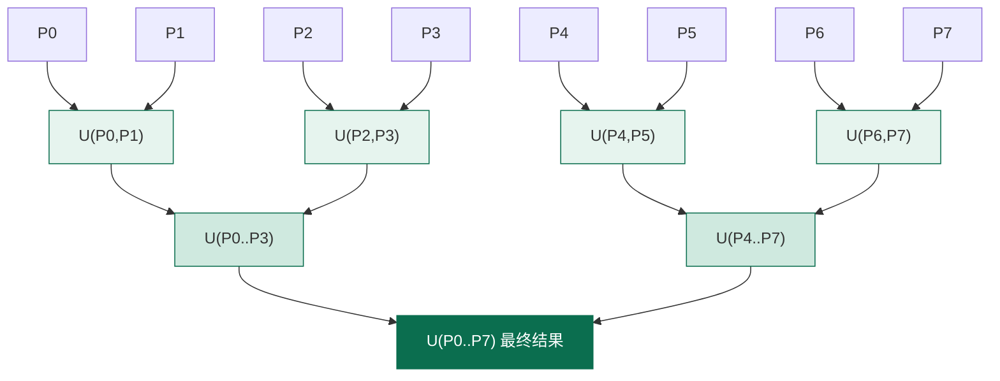

# 批量 Union

把一组几何合并成一个，是 GIS 里最高频的批处理操作之一：合并配送范围、拼行政边界、组连续路网。NTS 提供了一整套批量合并策略，选对方法能让 10 万级数据的合并从"分钟级"降到"秒级"。本页逐方法、逐类拆解批量 Union 的 API、内部机制与陷阱。

```csharp
using NetTopologySuite.Geometries;
using NetTopologySuite.Operation.Union;            // UnaryUnionOp、CascadedPolygonUnion、UnionStrategy
using NetTopologySuite.Operation.OverlayNG;        // CoverageUnion、UnaryUnionNG
using NetTopologySuite.Operation.Overlay;          // OverlayOp、SpatialFunction
using NetTopologySuite.Operation.Overlay.Snap;     // SnapOverlayOp、SnapIfNeededOverlayOp
using NetTopologySuite.Geometries.Utilities;       // GeometryFixer

// 本页示例共用工厂（默认浮点精度）
var factory = new GeometryFactory();
```

## 批量合并的挑战

### 为什么不能简单循环 Union

合并 N 个几何，最直白的写法是循环调用二元 `Union`：

```csharp
// ❌ 朴素循环：性能灾难
Geometry result = geoms[0];
for (int i = 1; i < geoms.Count; i++)
{
    result = result.Union(geoms[i]);   // 每次 result 越来越大，后继 Union 越来越慢
}

// 等价的 LINQ 写法，同样糟糕：
// var result = geoms.Aggregate((acc, g) => acc.Union(g));
```

这种写法的时间复杂度是 **O(n²)**，甚至更糟。原因有二：

1. **结果几何单调膨胀**：每轮 `Union` 都把上一步累积的"大结果"与新几何做一次完整叠加。叠加成本与输入顶点数正相关，而结果几何随轮次越来越大，单次成本一路飙升。
2. **重复 node 化**：每轮都把整张"大结果"重新求交、重建拓扑，已经在上一轮处理过的边被反复 node 化，做了大量无用功。

对 1 万个相邻多边形，朴素循环可能要几十秒甚至几分钟；改用 `UnaryUnionOp` 通常几百毫秒到几秒。差距随数据量放大。


结论很直接：**只要合并的几何多于两个，就用 `UnaryUnionOp`（或更专用的 `CoverageUnion`），不要循环 `Union`。**

## UnaryUnionOp 类

**命名空间**：`NetTopologySuite.Operation.Union`

**用途**：高效合并一组几何（或一个 `GeometryCollection`）。相比循环 `Union`，它采用**级联（cascaded）合并策略**——先把几何按空间邻近分组、自底向上两两合并，时间复杂度接近 O(n log n)。它还支持异构集合（点、线、面混合），并能"清洗"子组件之间相互相交的 `MultiPolygon`（每个子多边形仍须各自有效）。

> 类名注意：NTS 中正确类名是 **`UnaryUnionOp`**，没有 `UnaryUnionOperation` 这个类。JTS 历史上也叫 `UnaryUnionOp`。

### 构造函数

**签名**：

```csharp
public UnaryUnionOp(IEnumerable<Geometry> geoms)
public UnaryUnionOp(IEnumerable<Geometry> geoms, GeometryFactory geomFact)
public UnaryUnionOp(Geometry geom)   // 传入 GeometryCollection 也可
```

**语义**：构造一个 unary union 运算。构造时只做输入抽取与分类，**不触发计算**。

- 第一个重载：用输入几何自身的工厂。
- 第二个重载：显式指定工厂——**当输入可能为空集合时务必传工厂**，否则空输入会返回 `null`（见[空几何处理](#空几何处理)）。
- 第三个重载：传入单个几何（通常是 `GeometryCollection` / `MultiPolygon`），对其所有子组件做合并。

```csharp
var polygons = new List<Geometry> { polyA, polyB, polyC };

// 1. 基本构造
var op1 = new UnaryUnionOp(polygons);

// 2. 显式工厂：空输入时也能返回空 GeometryCollection，而非 null
var op2 = new UnaryUnionOp(polygons, factory);

// 3. 直接传 MultiPolygon / GeometryCollection
var op3 = new UnaryUnionOp(multiPoly);
```

::: warning 空集合记得传工厂
`new UnaryUnionOp(geoms)` 若 `geoms` 为空且未指定工厂，`Union()` 会返回 `null`。处理可能为空的批量数据时，要么用 `new UnaryUnionOp(geoms, factory)`，要么用静态 `UnaryUnionOp.Union(geoms, factory)`。
:::

### Union() — 实例方法

**签名**：`public Geometry Union()`

**语义**：执行级联合并并返回结果。这是**触发实际计算**的入口（构造时只保存输入）。

返回值契约（来自源码注释）：

| 输入情况 | 返回 |
| --- | --- |
| 正常几何集合 | 合并后的几何 |
| 空输入 + 已知维度（含空几何） | 该维度的空原子几何（如 `POINT EMPTY`） |
| 空输入 + 提供了工厂 | 空 `GeometryCollection` |
| 空输入 + 未提供工厂 | `null` |

```csharp
var polygons = new List<Geometry> { /* 1000 个相邻行政多边形 */ };
Geometry merged = new UnaryUnionOp(polygons, factory).Union();
Console.WriteLine(merged.Area);   // 所有多边形面积之和 − 重叠部分
```

### Union(IEnumerable) — 静态便捷方法

**签名**：

```csharp
public static Geometry Union(IEnumerable<Geometry> geoms)
public static Geometry Union(IEnumerable<Geometry> geoms, GeometryFactory geomFact)
public static Geometry Union(Geometry geom)   // 对单个几何（集合）合并
```

**语义**：一行完成"构造 + 合并"，适合无需配置的简单场景。内部就是 `new UnaryUnionOp(...).Union()`。

```csharp
// 一行批量合并
Geometry merged = UnaryUnionOp.Union(polygons);

// 显式工厂版本（推荐：兼容空输入）
Geometry safe = UnaryUnionOp.Union(polygons, factory);

// 对一个 MultiPolygon 自身做合并（消除子多边形间的重叠/相交）
Geometry cleaned = UnaryUnionOp.Union(multiPoly);
```

::: tip 静态方法优先带工厂重载
除非你能保证输入非空，否则**总是用带 `GeometryFactory` 的重载**。它让空输入的返回值可预期（空 `GeometryCollection` 而非 `null`），减少后续判空负担。
:::

### UnionStrategy 属性 — 合并策略（自定义扩展点）

**签名**：

```csharp
public UnionStrategy UnionStrategy { get; set; }
```

**语义**：获取或设置内部两两合并所用的策略。读取时若未设置，返回默认值 `CascadedPolygonUnion.ClassicUnion`（经典 overlay 合并策略）。

> 命名渊源：JTS 中这个扩展点叫 `setUnionFunction(UnionStrategy)`，部分老资料/老版本 NTS 也写作 `SetUnionFunction`。**当前 NTS 已将其重构为 `UnionStrategy` 属性**（`op.UnionStrategy = ...`），语义等价。

```csharp
var op = new UnaryUnionOp(polygons, factory);
// op.UnionStrategy = ...;   // 见下方说明：普通业务无需也无法设置
var merged = op.Union();
```

::: warning UnionStrategy 是 sealed + internal，外部不可自定义
查阅 NTS 源码，`UnionStrategy` 是 `public sealed class`，构造函数与 `Union` / `IsFloatingPrecision` 成员均为 `internal`。这意味着**外部代码既不能继承它，也不能 new 出新实例**——它实质上是内部扩展点，不是给业务代码用的钩子。

所以日常开发**不要**试图传入自定义策略。若你真正需要的是：
- **固定精度合并**（更稳健、治微缝）：用 [`UnaryUnionNG.Union(geoms, precisionModel)`](#浮点精度对合并结果的影响)；
- **覆盖面合并**（更快）：用 [`CoverageUnion`](#coverageunion-类nts-2x)；
- **snap 合并**：见 [Snap 模式合并](#snap-模式-合并处理微小缝隙)。

这些才是 NTS 暴露给用户的"换算法"入口。
:::

### 内部机制 — 树形分治合并 + 空间索引

`UnaryUnionOp` 快的根源不是单次 `Union` 变快，而是**组织方式**变了：

1. **按类型分流**：把输入拆成 `Polygon` / `LineString` / `Point` 三组分别处理。多边形走 `CascadedPolygonUnion`，点走 `PointGeometryUnion`。
2. **空间索引分组**：用 STRtree 把多边形按 Envelope 邻近聚类，让"真正相邻、可能相交"的多边形优先配对。
3. **树形分治（pairwise cascaded）**：自底向上两两合并，每层输入规模相近，单次 `Union` 的成本可控；上层合并时下层已消解的内部边不再参与。
4. **重叠优化**：`OverlapUnion` 识别"完全不相交"的子集，直接 `Combine` 而不做完整拓扑叠加，进一步省时。



树形分治让合并路径长度变成 O(log n) 层，每层总工作量与顶点总量同阶，因此整体接近 **O(n log n)**，远优于朴素循环的 O(n²)。

::: tip 线合并的语义是 node + dissolve
对一组 `LineString`，`UnaryUnionOp` 做的是**完全 node 化 + 消解**：所有交叉处插入节点，重合线段合并为一条。若你要的是"把相连的线合并成更长的线"（不 node 化），请改用 `NetTopologySuite.Operation.Linemerge.LineMerger`。
:::

## CoverageUnion 类（NTS 2.x+）

**命名空间**：`NetTopologySuite.Coverage`（新版本推荐）；早期版本位于 `NetTopologySuite.Operation.OverlayNG`

**用途**：合并**多边形覆盖（polygonal coverage）**——一组无重叠、共享边界、邻接无缝的多边形。识别覆盖结构后，它只消除共享边、不做全局 node 化，性能比 `UnaryUnionOp` 快约一个数量级。

### CoverageUnion.Union(geoms)

**签名**（两版并存，按 NTS 版本选用）：

```csharp
// 新版（推荐，NTS 2.4+）：NetTopologySuite.Coverage
public static Geometry Union(Geometry[] coverage)

// 旧版：NetTopologySuite.Operation.OverlayNG
public static Geometry Union(Geometry coverage)   // 传单个 MultiPolygon / GeometryCollection
```

**语义**：把一组构成有效覆盖的多边形合并为单个几何，**内部共享边被消除**，不产生细缝。

- 新版接收 `Geometry[]`（多边形数组）。
- 旧版接收单个 `Geometry`（通常是 `MultiPolygon` 或多边形集合）。

```csharp
// 一个完整的行政区划：区县之间邻接无缝、无重叠 → 典型覆盖
Geometry[] districtArray = districts.Select(d => d.Geometry).ToArray();

// 新版 API
var cityRegion = NetTopologySuite.Coverage.CoverageUnion.Union(districtArray);
Console.WriteLine(cityRegion.Area);   // 各区面积之和（共享边已消除，无重叠可减）
```

<figure class="nts-diagram">
<svg viewBox="0 0 440 170" width="440" height="170">
  <!-- 左：有效覆盖 -->
  <text x="100" y="18" text-anchor="middle" font-family="monospace" font-size="11" fill="#0b6e4f">有效覆盖（Coverage）</text>
  <polygon points="20,40 100,40 100,130 20,130" fill="rgba(11,110,79,0.2)" stroke="#0b6e4f" stroke-width="2"/>
  <polygon points="100,40 180,40 180,130 100,130" fill="rgba(11,110,79,0.2)" stroke="#0b6e4f" stroke-width="2"/>
  <polygon points="20,130 100,130 100,150 180,150 180,130" fill="none"/>
  <text x="100" y="158" text-anchor="middle" font-family="monospace" font-size="10" fill="#0b6e4f">邻接无缝、无重叠 → CoverageUnion 适用</text>

  <!-- 右：非覆盖 -->
  <text x="330" y="18" text-anchor="middle" font-family="monospace" font-size="11" fill="#a00">非覆盖</text>
  <polygon points="250,40 330,40 330,120 250,120" fill="rgba(11,110,79,0.2)" stroke="#0b6e4f" stroke-width="2"/>
  <!-- 与左块部分重叠 -->
  <polygon points="315,55 395,55 395,135 315,135" fill="rgba(168,99,0,0.2)" stroke="#a86300" stroke-width="2"/>
  <!-- 缝隙 -->
  <polygon points="250,120 315,120 315,135 250,135" fill="none" stroke="#a00" stroke-width="1.4" stroke-dasharray="4 3"/>
  <text x="332" y="158" text-anchor="middle" font-family="monospace" font-size="10" fill="#a00">有重叠/缝隙 → 改用 UnaryUnionOp</text>
</svg>
<figcaption>覆盖面（左）vs 非覆盖面（右）：CoverageUnion 仅在左侧条件下保证正确与高效</figcaption>
</figure>

**适用条件（必须同时满足）**：

1. 所有几何都是多边形（`Polygon` / `MultiPolygon`）。
2. 多边形之间**无重叠**（ interiors 不相交）。
3. 相邻多边形**共享边界且无缝**（无 sliver 缝隙）。
4. 每个多边形自身有效。

::: warning 不满足覆盖条件不要用 CoverageUnion
若多边形之间存在重叠或缝隙，`CoverageUnion` 的结果**可能不正确**（它假设共享边精确匹配，不会去处理重叠区域）。这种情况请用 `UnaryUnionOp`——它走完整 overlay，能正确处理重叠与缝隙，只是慢一些。

判断技巧：若 `Σ(各多边形面积) ≈ 合并后面积`，数据很可能是覆盖；若合并后面积明显小于求和，说明有重叠，应走 `UnaryUnionOp`。
:::

::: tip CoverageUnion 比 UnaryUnionOp 快约一个数量级
对真正的覆盖数据（如完整行政区划、地籍图、Voronoi 图），`CoverageUnion` 通常比 `UnaryUnionOp` 快 5~10 倍，且结果顶点更少、更干净。前提是数据确实是覆盖——先验证再切换。
:::

## 其他合并策略

### OverlayOp.Union — 朴素二元模式

**命名空间**：`NetTopologySuite.Operation.Overlay`

**签名**：

```csharp
public static Geometry Overlay(Geometry g0, Geometry g1, SpatialFunction opCode)
```

**语义**：经典叠加引擎，按 `SpatialFunction.Union` 计算两几何并集。NTS 2.x 中 `Geometry.Union(other)` 默认走新一代 OverlayNGRobust，`OverlayOp` 留给需要经典算法或访问中间拓扑图（`Graph` 属性）的场景。

```csharp
// 两两合并（仅适合极小数据集）
var pair = OverlayOp.Overlay(polyA, polyB, SpatialFunction.Union);
Console.WriteLine(pair.Area);
```

::: warning 批量合并绝不要循环 OverlayOp
`OverlayOp.Overlay` 是**两两**算子。循环调用它合并 N 个几何，和循环 `Geometry.Union` 一样是 O(n²) 性能灾难。批量场景请用 [`UnaryUnionOp`](#unaryunionop-类) 或 [`CoverageUnion`](#coverageunion-类nts-2x)。`OverlayOp` 仅在"只合并两个几何"或"需要经典拓扑图"时使用。
:::

### Snap 模式 — 合并（处理微小缝隙）

实际数据常有"本应贴合却因浮点偏差留下 1e-9 级细缝"的问题。Snap 模式先把几乎重合的顶点/边吸附到一起，再做合并。

::: warning NTS 没有 SnapUnionOp 类
查阅 NTS 源码，`Operation.Union` 命名空间下只有 `UnaryUnionOp`、`CascadedPolygonUnion`、`OverlapUnion`、`PointGeometryUnion`、`UnionInteracting`、`UnionStrategy`——**没有名为 `SnapUnionOp` 的类**。需要 snap 合并时，用下面三种实操方案。
:::

**方案 1：默认就够（OverlayNGRobust 自动 snap）**

`Geometry.Union` 与 `UnaryUnionOp` 的底层默认走 OverlayNGRobust：普通计算失败时会自动多级 snap 重试。绝大多数场景**无需**手动 snap。

```csharp
// 默认即含 snap 容错，先试这个
var merged = UnaryUnionOp.Union(polys, factory);
```

**方案 2：两两 snap 合并（治顽固细缝）**

对"两几何本应贴合却有微小偏差"的成对场景，用 `SnapOverlayOp` 或更省心的 `SnapIfNeededOverlayOp`（先普通算，失败才 snap）：

```csharp
// 显式 snap 合并两个几何
var snapped = new SnapOverlayOp(polyA, polyB)
    .GetResultGeometry(SpatialFunction.Union);

// 或：先普通 overlay，抛 TopologyException / 结果无效时才回退到 snap
var robust = SnapIfNeededOverlayOp.Overlay(polyA, polyB, SpatialFunction.Union);
```

**方案 3：批量 + 显式 snap（固定精度）**

对存在系统性微缝的批量数据，最稳妥的做法是用**固定精度模型**合并——底层 `SnapRoundingNoder` 会把坐标吸附到固定网格，彻底消除浮点不确定性：

```csharp
// 用 1/1000 精度合并：所有坐标吸附到 0.001 网格，微缝被抹平
var pm = new PrecisionModel(1000);
var merged = UnaryUnionNG.Union(polys, pm);
```

::: tip snap 容差的选择
- `SnapOverlayOp` 的容差由 `GeometrySnapper` 根据几何尺度自动推算，通常**无需手动设**。
- 固定精度法（`UnaryUnionNG` + `PrecisionModel`）的"容差"由精度模型决定（如 `PrecisionModel(1000)` 即 0.001 单位网格）。容差过大误吸附本应分离的顶点，过小消除不了缝——参考你的数据采集精度选择。
:::

### 自定义 UnionAll — 分批 + UnaryUnionOp 组合

NTS 没有内建的 `Geometry.UnionAll(...)`，但用 `UnaryUnionOp` 包一层即可。要点是**正确处理空集**与**工厂**：

```csharp
// 把任意几何序列合并为一个几何；空序列返回空 GeometryCollection
Geometry UnionAll(IEnumerable<Geometry> geoms, GeometryFactory factory)
{
    var list = geoms.ToList();
    if (list.Count == 0)
        return factory.CreateGeometryCollection();
    return UnaryUnionOp.Union(list, factory);
}

// 用法
var merged = UnionAll(circles, factory);
Console.WriteLine(merged.IsEmpty);   // False
Console.WriteLine(UnionAll(Array.Empty<Geometry>(), factory).IsEmpty);  // True
```

**大数据集分批合并**：当几何数量极大（如几十万），一次性 `UnaryUnionOp.Union` 可能内存压力大。可按空间切片分批合并，再合并各批结果：

```csharp
// 大数据集分批合并策略：按 Envelope 分桶 → 各批 UnaryUnionOp → 再合并
Geometry UnionAllBatched(IEnumerable<Geometry> geoms, GeometryFactory factory,
    int batchSize = 5000)
{
    var list = geoms.ToList();
    if (list.Count == 0)
        return factory.CreateGeometryCollection();

    // 小数据集直接合并
    if (list.Count <= batchSize)
        return UnaryUnionOp.Union(list, factory);

    // 大数据集：按 X 中点分批（也可按 STRtree 切片/按网格分桶）
    var batches = list
        .OrderBy(g => g.EnvelopeInternal.MinX)   // 空间局部性：让相邻几何尽量同批
        .Select((g, i) => new { g, i })
        .GroupBy(x => x.i / batchSize)
        .Select(grp => grp.Select(x => x.g).ToList())
        .Select(batch => UnaryUnionOp.Union(batch, factory))   // 每批级联合并
        .ToList();

    // 把各批结果再做一次级联合并（此时对象数已大幅减少）
    return UnaryUnionOp.Union(batches, factory);
}
```

::: tip 分批的关键是空间局部性
分批时务必让"空间相邻"的几何进同一批（按 Envelope 排序、按网格分桶或用 STRtree 切片）。若随机分批，各批内部合并不出"大块"成果，二轮合并时仍有海量零散碎片，加速有限。`batchSize` 一般取 2000~10000，依内存与单几何复杂度调整。
:::

## 性能对比

### 三种策略对比

| 策略 | 复杂度 | 适用条件 | 优点 | 限制 |
| --- | --- | --- | --- | --- |
| 朴素循环 `Union` / `OverlayOp` | O(n²) | 仅小数据集（n < 几十） | 写法直观 | 数据量稍大即不可用 |
| `UnaryUnionOp` | ≈ O(n log n) | 通用，任意几何、任意关系 | 稳健、支持异构、处理重叠/缝隙 | 比覆盖合并慢 |
| `CoverageUnion` | ≈ O(n) | 多边形构成有效覆盖（无重叠、无缝） | 最快、结果最干净 | 不满足覆盖条件则结果可能错误 |
| `UnaryUnionNG` | ≈ O(n log n) | 需固定精度/治微缝 | 数值稳健、消除浮点不确定性 | 精度损失由 PrecisionModel 决定 |

### 性能基准

下表为**示意性**基准（非严格基准测试），用于感受数量级差异。

**测试环境**：NTS 2.5.x / .NET 8 / x64 桌面机（中端 CPU）/ 1 万个相邻多边形（网格切分，每块约 50 顶点）/ 合并为单个几何 / 取多次运行平均、剔除首次 JIT。

| 策略 | 耗时 | 备注 |
| --- | --- | --- |
| 朴素循环 `Aggregate((a,b)=>a.Union(b))` | ~45 s | 后半程每轮合并越来越慢 |
| `UnaryUnionOp.Union(geoms)` | ~650 ms | 级联分治，通用首选 |
| `CoverageUnion.Union(coverage)` | ~70 ms | 数据为有效覆盖时；快约一个数量级 |
| `UnaryUnionNG.Union(geoms, pm)` | ~800 ms | 固定精度，多 SnapRounding 开销 |

::: warning 基准会随环境波动
实际耗时受 NTS 版本、.NET 版本、CPU、数据分布（均匀 vs 聚集）、几何复杂度（顶点数）、重叠程度影响极大。覆盖数据下 `CoverageUnion` 优势最明显；高重叠数据下 `UnaryUnionOp` 的 `OverlapUnion` 优化会触发，耗时也低于上表。请以你自己的数据做 benchmark 为准。
:::

## 实战案例

### 案例 1：合并配送范围

100 个骑手各有半径 3km 的圆形配送范围，合并成"店铺整体可达区域"：

```csharp
var riderCenters = new List<Coordinate>
{
    new(0, 0), new(2, 0), new(4, 0), new(1, 2), new(3, 2) /* … 100 个 */
};

// 每个骑手 → 圆形多边形（Buffer 近似圆）
var circles = riderCenters
    .Select(c => factory.CreatePoint(c).Buffer(3.0))
    .Cast<Geometry>()
    .ToList();

// 一次性级联合并（不要循环 Union！）
var reachable = UnaryUnionOp.Union(circles, factory);
Console.WriteLine($"整体可达面积 = {reachable.Area:F2}");

// 派单：判断顾客点是否在可达范围内
var customer = factory.CreatePoint(new Coordinate(2.5, 1));
Console.WriteLine(reachable.Covers(customer));   // True / False
```

::: tip 圆用 Buffer 近似，分段数影响顶点
`Point.Buffer(r)` 默认用 32 段四分之一圆逼近圆，每个圆约 129 个顶点。100 个圆就是上万顶点——这正是不该循环 Union 的原因。若精度要求不高，用 `Buffer(r, 8)`（8 段）减少顶点，合并更快。
:::

### 案例 2：行政边界合并

把一组相邻区县多边形合并成"市域"范围。这类数据通常共享边界，合并后应无缝隙：

```csharp
// districts：从 shapefile / 数据库读入的区县多边形
var districtGeoms = districts.Select(d => d.Geometry).ToList();

// 1. 先修复（行政数据常有微小自相交/缝隙）
var fixedGeoms = districtGeoms
    .Select(g => g.IsValid ? g : GeometryFixer.Fix(g))
    .ToList();

// 2. 判断是否构成有效覆盖：各区面积之和 ≈ 合并后面积
double sumArea = fixedGeoms.Sum(g => g.Area);
var probe = UnaryUnionOp.Union(fixedGeoms, factory);
bool isCoverage = Math.Abs(sumArea - probe.Area) / sumArea < 1e-6;

// 3. 是覆盖 → 用 CoverageUnion（更快）；否则用 UnaryUnionOp
Geometry cityRegion = isCoverage
    ? CoverageUnion.Union(fixedGeoms.ToArray())   // NetTopologySuite.Coverage
    : UnaryUnionOp.Union(fixedGeoms, factory);

Console.WriteLine($"合并面积 {cityRegion.Area:F0}，各区之和 {sumArea:F0}");

// 若数据源精度差、合并后仍残留细缝，可对成对相邻多边形用 snap 兜底：
// var snapped = new SnapOverlayOp(polyA, polyB).GetResultGeometry(SpatialFunction.Union);
```

::: tip 行政区划天然是覆盖
完整的行政区划（省→市→区县）天然无重叠、邻接无缝，是 `CoverageUnion` 的理想场景。但若数据来自不同年份、不同来源，可能存在边界不一致导致的微小缝隙——这种情况要么先做数据治理（拓扑纠偏），要么回退到 `UnaryUnionOp`。
:::

### 案例 3：路网合并

把多条线段合并成连续路网。注意 `UnaryUnionOp` 对线做的是 **node + dissolve**（交叉处插节点、重合段合并），不是"拼接成长线"：

```csharp
var segments = new List<Geometry>
{
    factory.CreateLineString(new[] { new Coordinate(0, 0), new Coordinate(5, 0) }),
    factory.CreateLineString(new[] { new Coordinate(5, 0), new Coordinate(10, 0) }),
    factory.CreateLineString(new[] { new Coordinate(3, -2), new Coordinate(3, 2) }),
    factory.CreateLineString(new[] { new Coordinate(5, 0), new Coordinate(8, 3) })
};

// node + dissolve：交叉处插节点，重合段消解，结果是一个 MultiLineString
var network = UnaryUnionOp.Union(segments, factory);
Console.WriteLine(network.GeometryType);   // MultiLineString
Console.WriteLine($"线段数 = {network.NumGeometries}");

// 若要的是"把首尾相连的线合并成更长的线"，用 LineMerger：
// var merged = new LineMerger().GetMergedLineStrings(segments);
```

<figure class="nts-diagram">
<svg viewBox="0 0 280 130" width="280" height="130">
  <!-- 原始 4 段 -->
  <line x1="20" y1="60" x2="120" y2="60" stroke="#a86300" stroke-width="2"/>
  <line x1="120" y1="60" x2="220" y2="60" stroke="#a86300" stroke-width="2"/>
  <line x1="120" y1="20" x2="120" y2="100" stroke="#a86300" stroke-width="2"/>
  <line x1="120" y1="60" x2="190" y2="95" stroke="#a86300" stroke-width="2"/>
  <text x="30" y="50" font-family="monospace" font-size="9" fill="#a86300">输入线段</text>

  <!-- node 后的节点 -->
  <circle cx="20" cy="60" r="3" fill="#0b6e4f"/>
  <circle cx="120" cy="60" r="3.5" fill="#a00"/>
  <circle cx="220" cy="60" r="3" fill="#0b6e4f"/>
  <circle cx="120" cy="20" r="3" fill="#0b6e4f"/>
  <circle cx="120" cy="100" r="3" fill="#0b6e4f"/>
  <circle cx="190" cy="95" r="3" fill="#0b6e4f"/>
  <text x="126" y="56" font-family="monospace" font-size="9" fill="#a00">交叉节点</text>
  <text x="80" y="120" text-anchor="middle" font-family="monospace" font-size="10" fill="#444">UnaryUnionOp：node + dissolve</text>
</svg>
<figcaption>路网合并：交叉处插入节点，重合段消解为一条</figcaption>
</figure>

::: warning Union 与 LineMerger 语义不同
- `UnaryUnionOp.Union(lines)`：完全 node 化 + 消解重合段。交叉处必然产生节点，结果可能是多条线。
- `LineMerger.GetMergedLineStrings(lines)`：把**首尾相连**的线拼接成更长的线，**不**在交叉处 node 化。

构建可路由的路网拓扑（图）通常用前者；生成连续行驶轨迹用后者。别混用。
:::

## 稳健性与边界情况

### 空几何处理

`UnaryUnionOp` 对空输入的返回遵循契约（见 [`Union()` 实例方法](#union-实例方法)），核心规律：

| 输入 | 是否提供工厂 | 返回 |
| --- | --- | --- |
| 空集合 | 是 | 空 `GeometryCollection` |
| 空集合 | 否 | `null` |
| 含空几何的非空集合 | — | 忽略空几何，合并其余；空几何影响结果维度 |

```csharp
// 空 + 无工厂 → null（容易踩坑）
var dangerous = UnaryUnionOp.Union(Array.Empty<Geometry>());
Console.WriteLine(dangerous == null);   // True

// 空 + 工厂 → 空 GeometryCollection（安全）
var safe = UnaryUnionOp.Union(Array.Empty<Geometry>(), factory);
Console.WriteLine(safe.IsEmpty);        // True
Console.WriteLine(safe.GeometryType);   // GeometryCollection
```

::: tip 防御性写法：永远带工厂
批量合并入口统一用 `UnaryUnionOp.Union(geoms, factory)`，让空输入返回空几何而非 `null`。空几何是合法对象，可继续参与运算（通常传播空集），下游无需写 `?? empty` 兜底。这与 [几何属性](../02-geometry-fundamentals/geometry-properties.md#isempty) 中"空几何是合法几何"一致。
:::

### 不同类型几何混合合并

`UnaryUnionOp` **完整支持异构集合**（点、线、面混合）。它按类型分流处理：

- **面**：合并区域（取并集）。
- **线**：完全 node 化 + 消解重合段。
- **点**：去重（合并相同点）。

最终把三类结果组合返回（通常为 `GeometryCollection` 或最高维度的 `Multi*`）。

```csharp
var mixed = new List<Geometry> { polygon, lineString, point, anotherPoint };
var result = UnaryUnionOp.Union(mixed, factory);
// result 通常是 GeometryCollection，含合并后的面/线/点
```

::: warning 异构合并的结果类型不固定
混合维度输入的合并结果**类型不固定**：可能是 `GeometryCollection`、`MultiPolygon`、`Polygon`，甚至单一 `Point`（其余都被消解时）。下游代码用 `NumGeometries` + `GetGeometryN` 统一遍历，不要假设固定类型。参考 [几何属性](../02-geometry-fundamentals/geometry-properties.md#numgeometries)。
:::

### 内存与大数据集分块

合并几十万几何时，内存与峰值是真实约束：

- **中间结果驻留**：级联合并的中间几何在 GC 回收前都占内存。一次性 `UnionAll` 几十万复杂多边形可能峰值数 GB。
- **分批合并**：用 [自定义 UnionAll 分批实现](#自定义-unionall-分批--unaryunionop-组合)，按空间局部性分桶，每批合并后中间对象被释放，峰值显著降低。
- **先简化再合并**：若几何顶点过多，合并前用 `DouglasPeuckerSimplifier`（拓扑安全简化）降顶点，能同时降内存与时间。
- **流式输出**：超大结果可考虑按空间切片分批输出，而非一次性持有整张合并结果。

```csharp
// 大数据集：分批 + 各批结果再合并（见上文 UnionAllBatched）
var cityAll = UnionAllBatched(hugePolygonList, factory, batchSize: 5000);
```

::: tip 分批不是免费
分批合并多了一次"二轮合并"，对小数据集反而更慢。仅在内存压力或单次合并超时才启用。`batchSize` 越大，单批越快但峰值越高——在内存与时间之间权衡。
:::

### 无效几何处理（合并前修复）

无效几何（自相交、孔洞越界、环未闭合等）会让合并产生错误结果或 `TopologyException`。**运算前先校验并修复**：

```csharp
// 入库/入批前统一修复
var cleanGeoms = rawGeoms
    .Select(g => g.IsValid ? g : GeometryFixer.Fix(g))
    .ToList();

var merged = UnaryUnionOp.Union(cleanGeoms, factory);
```

- **`GeometryFixer.Fix(g)`**（NTS 2.3+，`NetTopologySuite.Geometries.Utilities`）：逐组件修复，保留尽可能多的原始结构，**首选**。
- **`g.Buffer(0)`**：经典修复，用 0 距离缓冲"规整"几何，兼容性好，但对复杂无效（如孔洞越界）可能丢失部分区域。

::: tip 入库时统一修复
生产环境建议在数据入库环节用 `IsValid` 校验 + `GeometryFixer` 修复，保证库里都是有效几何，后续合并就不会反复处理无效输入。`UnaryUnionOp` 虽然能清洗"子组件相互相交"的 `MultiPolygon`，但前提是**每个子组件自身有效**——它治不了自相交的多边形。
:::

### 浮点精度对合并结果的影响

合并是数值最敏感的操作之一——它要把所有边求交并重新拼装。浮点误差会导致：漏交/伪交、细缝（sliver）、`TopologyException`。

**应对策略**：

| 策略 | 说明 |
| --- | --- |
| **OverlayNGRobust**（默认） | `UnaryUnionOp` / `Geometry.Union` 底层；失败时自动多级 snap 重试，绝大多数场景无需干预 |
| **固定精度合并** | `UnaryUnionNG.Union(geoms, precisionModel)`，底层 `SnapRoundingNoder` 把坐标吸附到固定网格，彻底消除浮点不确定性 |
| **GeometryFixer / Buffer(0)** | 修复无效输入，治本于"输入不合法" |
| **预投影** | 经纬度（WGS84）下合并按"度"运作，微小坐标差被放大成拓扑问题；先投影到米制坐标系再合并 |

```csharp
// 固定精度合并：坐标按 0.001 取整，提升稳健性
var pm = new PrecisionModel(1000);   // 1/1000 精度
var safeUnion = UnaryUnionNG.Union(polys, pm);
```

::: warning 经纬度下合并需先投影
经纬度（WGS84）坐标下做合并不会报错，但精度模型按"度"运作，细小坐标差会被放大成拓扑问题（细缝、自相交）。建议先投影到米制坐标系（如 CGCS2000 / Web 墨卡托）再合并。详见 [精度模型](../02-geometry-fundamentals/precision-model.md)。
:::

::: tip 固定精度会改变坐标
`UnaryUnionNG` 会把结果坐标吸附到 `PrecisionModel` 网格，与原始坐标有微小偏移（≤ 精度单位）。若要求结果严格保留原始坐标，用默认浮点 `UnaryUnionOp` + OverlayNGRobust 容错；只在出现顽固 robustness 问题时才升级到固定精度。
:::

## 小结速查表

| 需求 | 方法 / 类 | 复杂度 | 备注 |
| --- | --- | --- | --- |
| 批量合并（通用） | `UnaryUnionOp.Union(geoms, factory)` | ≈ O(n log n) | 默认首选，支持异构 |
| 批量合并（覆盖面） | `CoverageUnion.Union(coverage[])` | ≈ O(n) | 仅多边形覆盖，最快 |
| 固定精度批量合并 | `UnaryUnionNG.Union(geoms, pm)` | ≈ O(n log n) | 治微缝、提升稳健性 |
| 两几何合并 | `a.Union(b)` | — | 底层 OverlayNGRobust |
| 两几何经典合并 | `OverlayOp.Overlay(a, b, Union)` | — | 需经典算法/`Graph` |
| 两几何 snap 合并 | `SnapOverlayOp(a,b).GetResultGeometry(Union)` | — | 治顽固细缝 |
| 按 X 切批合并大数据 | `UnionAllBatched(geoms, factory)` | ≈ O(n log n) | 内存友好 |
| 修复无效几何 | `GeometryFixer.Fix(g)` / `g.Buffer(0)` | — | 合并前必做 |
| 线拼接（非 node） | `LineMerger.GetMergedLineStrings(lines)` | — | 首尾相连拼接 |

**核心心智模型**：

- **不要循环 `Union`**——O(n²) 性能灾难。批量合并首选 `UnaryUnionOp.Union(geoms, factory)`。
- **覆盖数据用 `CoverageUnion`**——快约一个数量级，但必须满足"无重叠、无缝隙"。
- **空输入带工厂**——`UnaryUnionOp.Union(geoms, factory)` 让空集返回空几何而非 `null`。
- **无效几何先修复**——`GeometryFixer.Fix` 是新项目首选。
- **微缝/Topological 问题**——默认 OverlayNGRobust 自动容错；顽固问题用 `UnaryUnionNG` 固定精度，或成对用 `SnapOverlayOp`。
- **NTS 没有 `SnapUnionOp`**——snap 合并走 `SnapOverlayOp`（成对）或 `UnaryUnionNG`（批量固定精度）。

## 下一步

- [叠加分析 (Overlay)](./overlay.md)：交/并/差/对称差的完整算子与稳健性
- [缓冲区 Buffer](./buffer.md)：圆形配送范围的来源，与合并配合做可达分析
- [凸包与简化](./convex-simplify.md)：合并后降顶点数，降内存与渲染开销
- [空间索引 STRtree](../06-performance/spatial-index.md)：`UnaryUnionOp` 内部分组加速的底层结构
- [精度模型](../02-geometry-fundamentals/precision-model.md)：浮点精度如何影响合并，固定精度合并的原理
- [API 速查表](../appendix/cheatsheet.md)