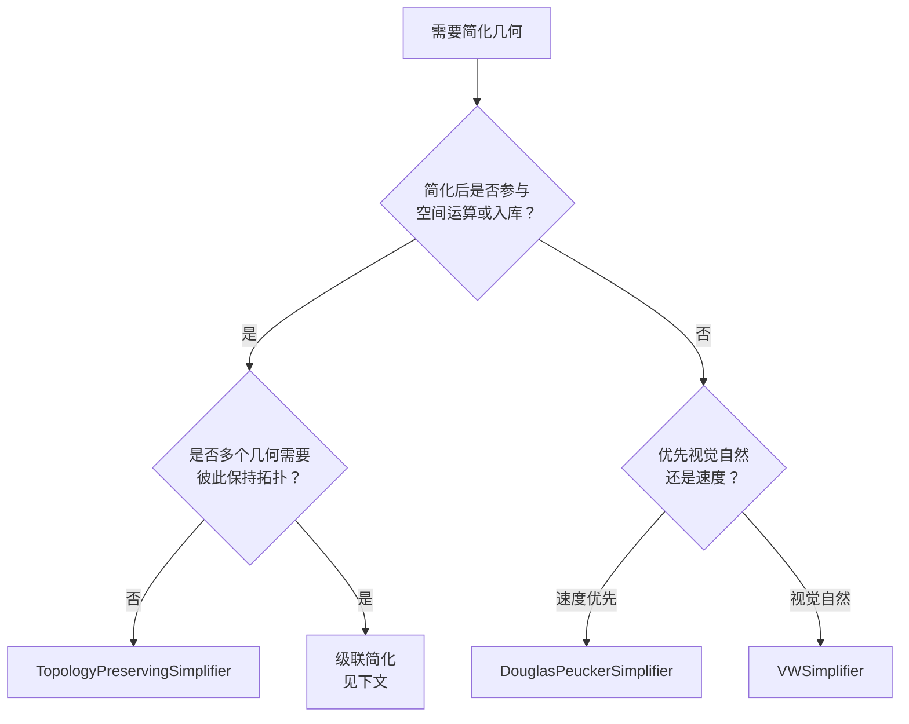
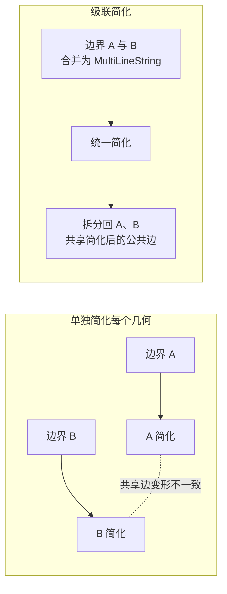

# 凸包与简化

凸包 (Convex Hull) 和简化 (Simplification) 是两类"形状变换"操作：前者把任意点集包裹成最小的凸多边形；后者减少顶点数，让几何更轻、显示更快。本页逐方法讲解每个 API 的签名、语义、示例与陷阱。

```csharp
using NetTopologySuite.Geometries;
using NetTopologySuite.Algorithm;
using NetTopologySuite.Simplify;
using NetTopologySuite.Densify;

// 本页示例共用工厂
var factory = new GeometryFactory();
```

## 凸包 ConvexHull

凸包是包含输入几何所有顶点的 **最小凸多边形**。想象把钉子按在板上，用一根橡皮筋绷紧围住所有钉子——松开后橡皮筋的形状就是凸包。

### ConvexHull.Create — 静态 API

**签名**：

```csharp
// 接受任意几何
public static Geometry Create(Geometry geometry);

// 接受坐标数组（需提供工厂以构造结果）
public static Geometry Create(Coordinate[] coordinates, GeometryFactory factory);
```

**语义**：NTS 2.x 推荐的静态入口。对任意 `Geometry` 或坐标数组求凸包，内部按需选择 Graham 扫描或 Andrew's monotone chain。落在凸包内部的点会被自动忽略。

```csharp
var points = new[]
{
    new Coordinate(0, 0),
    new Coordinate(1, 0),
    new Coordinate(2, 1),
    new Coordinate(1, 2),
    new Coordinate(0, 2),
    new Coordinate(0.5, 1)   // 内部点，会被忽略
};

var hull = ConvexHull.Create(points, factory);
// hull: POLYGON ((0 0, 1 0, 2 1, 1 2, 0 2, 0 0))
Console.WriteLine(hull.GeometryType);   // Polygon
Console.WriteLine(hull.NumPoints);      // 6（含闭合点）

// 也接受几何直接传入
var hull2 = ConvexHull.Create(someGeometry);
```

<figure class="nts-diagram">
<svg viewBox="0 0 200 140" width="200" height="140">
  <polygon points="20,110 60,110 90,80 60,30 20,30 20,110" fill="rgba(11,110,79,0.15)" stroke="#0b6e4f" stroke-width="1.5"/>
  <g fill="#a00">
    <circle cx="20" cy="110" r="3"/>
    <circle cx="60" cy="110" r="3"/>
    <circle cx="90" cy="80" r="3"/>
    <circle cx="60" cy="30" r="3"/>
    <circle cx="20" cy="30" r="3"/>
    <circle cx="40" cy="80" r="3"/>
    <circle cx="55" cy="70" r="3"/>
  </g>
</svg>
<figcaption>红点为输入点集，绿线为凸包（内部点被自动忽略）</figcaption>
</figure>

::: tip 静态 API 优先
`ConvexHull.Create` 是 NTS 2.x 的标准入口，无需 `new` 实例。旧的 `new ConvexHull(coords, factory).GetConvexHull()` 仍可用，但风格上推荐静态调用。
:::

### g.ConvexHull — 实例 API

**签名**：`public Geometry ConvexHull()`（注意是方法，不是属性）

**语义**：实例方法，适用于任何几何类型。内部委托 `ConvexHull.Create`，行为与静态 API 完全一致。

```csharp
var line = factory.CreateLineString(new[]
{
    new Coordinate(0, 0), new Coordinate(5, 2), new Coordinate(10, 0)
});
var poly = factory.CreatePolygon(...);
var mp   = factory.CreateMultiPoint(...);

var hull1 = line.ConvexHull();
var hull2 = poly.ConvexHull();
var hull3 = mp.ConvexHull();
```

不同输入的输出类型：

| 输入 | ConvexHull 输出 |
| --- | --- |
| 0 个点 | 空 `GeometryCollection` |
| 1 个点 | `Point` |
| 共线点集 | `LineString` |
| 一般点集 / 多边形 / 线 | `Polygon` |

::: warning 输出类型不一定是 Polygon
`ConvexHull()` 返回 `Geometry`，退化情形（共线、单点）会返回 `LineString` 或 `Point`。调用前若直接当 `Polygon` 用，需先判断 `GeometryType`，或用 `is Polygon` 模式匹配。
:::

### 凸包算法复杂度

NTS 内部使用 Graham 扫描或 Andrew's monotone chain：

- **时间复杂度**：O(n log n)，瓶颈在排序
- **空间复杂度**：O(n)
- **退化情形**：共线点集 O(n)，无需排序

实测：10 万个点求凸包在毫秒级完成。

::: tip 重复点不影响正确性
输入含重复点不影响凸包正确性，但会拖慢排序。预处理去重可提升性能：`coords.Distinct().ToArray()`。
:::

### 凸包的典型用途

- **碰撞检测粗筛**：两个凸包不相交，则原几何必然不相交——先做凸包相交测试可剔除大量负例
- **形状近似**：地理要素的"外轮廓"，便于做相似度比较、形状索引
- **空间索引辅助**：用凸包代替原始几何做 STRtree 的粗过滤
- **轨迹范围**：把一条 GPS 轨迹的所有点取凸包，得到大致活动区域

## 简化 Simplify

简化通过减少顶点来降低几何复杂度，目标是 **少顶点 + 形状近似**。NTS 提供三种主流简化算法，外加一种"反向"加密操作。

### DouglasPeuckerSimplifier.Simplify — DP 算法

**签名**：`public static Geometry Simplify(Geometry geom, double distanceTolerance);`

**语义**：经典"分而治之"算法。

1. 保留线段两端点 S、E，连成"弦" S→E
2. 计算所有中间顶点到弦的垂直距离，找出最大者及其顶点 P_far
3. 若最大距离 < `distanceTolerance`，删除所有中间点
4. 否则以 P_far 为分界，对 S→P_far 与 P_far→E 两段递归重复 1~3

`distanceTolerance` 单位为坐标系单位（**距离**，不是面积）：与弦距离小于阈值的中间点会被删除。

```csharp
var line = factory.CreateLineString(new[]
{
    new Coordinate(0, 0), new Coordinate(1, 0.1), new Coordinate(2, -0.1),
    new Coordinate(3, 5),  new Coordinate(4, 0.1), new Coordinate(5, 0),
    new Coordinate(6, 0)
});

var simplified = DouglasPeuckerSimplifier.Simplify(line, 0.5);
Console.WriteLine($"原始 {line.NumPoints} 点 → 简化后 {simplified.NumPoints} 点");
// 原始 7 点 → 简化后 4 点
```

<figure class="nts-diagram">
<svg viewBox="0 0 380 280" width="380" height="280">
  <!-- 上图：连弦，找最远点 -->
  <g font-family="monospace" font-size="10">
    <text x="10" y="15" font-weight="bold" fill="#0b6e4f">① 连弦，找最远点 P_far</text>

    <!-- 容忍带 -->
    <rect x="30" y="65" width="320" height="30" fill="rgba(11,110,79,0.08)"/>
    <text x="290" y="58" font-size="9" fill="#0b6e4f">tolerance 带</text>

    <!-- 弦 -->
    <line x1="30" y1="80" x2="350" y2="80" stroke="#0b6e4f" stroke-width="1.5" stroke-dasharray="5 3"/>

    <!-- 折线 -->
    <polyline points="30,80 60,60 110,30 160,55 220,40 280,70 320,75 350,80"
              fill="none" stroke="#a86300" stroke-width="2"/>

    <!-- 顶点 -->
    <g fill="#a86300">
      <circle cx="30" cy="80" r="3"/>
      <circle cx="60" cy="60" r="3"/>
      <circle cx="110" cy="30" r="3"/>
      <circle cx="160" cy="55" r="3"/>
      <circle cx="220" cy="40" r="3"/>
      <circle cx="280" cy="70" r="3"/>
      <circle cx="320" cy="75" r="3"/>
      <circle cx="350" cy="80" r="3"/>
    </g>

    <!-- 最远点 -->
    <circle cx="110" cy="30" r="6" fill="none" stroke="#a00" stroke-width="2"/>
    <line x1="110" y1="30" x2="110" y2="80" stroke="#a00" stroke-width="1" stroke-dasharray="2 2"/>
    <text x="116" y="25" fill="#a00">P_far (d=50 &gt; tol)</text>

    <text x="20" y="92" fill="#0b6e4f">S</text>
    <text x="345" y="92" fill="#0b6e4f">E</text>
  </g>

  <!-- 分隔线 -->
  <line x1="20" y1="128" x2="360" y2="128" stroke="#ccc" stroke-width="0.5" stroke-dasharray="3 3"/>

  <!-- 下图：分裂后递归 -->
  <g font-family="monospace" font-size="10" transform="translate(0, 130)">
    <text x="10" y="15" font-weight="bold" fill="#0b6e4f">② 以 P_far 分裂，左右两段各自递归</text>

    <!-- 弦 S-P_far -->
    <line x1="30" y1="80" x2="110" y2="30" stroke="#0b6e4f" stroke-width="1.5" stroke-dasharray="5 3"/>
    <!-- 弦 P_far-E -->
    <line x1="110" y1="30" x2="350" y2="80" stroke="#0b6e4f" stroke-width="1.5" stroke-dasharray="5 3"/>

    <!-- 折线 -->
    <polyline points="30,80 60,60 110,30 160,55 220,40 280,70 320,75 350,80"
              fill="none" stroke="#a86300" stroke-width="2"/>

    <!-- 顶点 -->
    <g fill="#a86300">
      <circle cx="30" cy="80" r="3"/>
      <circle cx="60" cy="60" r="3"/>
      <circle cx="110" cy="30" r="3"/>
      <circle cx="160" cy="55" r="3"/>
      <circle cx="220" cy="40" r="3"/>
      <circle cx="280" cy="70" r="3"/>
      <circle cx="320" cy="75" r="3"/>
      <circle cx="350" cy="80" r="3"/>
    </g>

    <!-- 阈值内点：× -->
    <g stroke="#999" stroke-width="1.5">
      <line x1="56" y1="56" x2="64" y2="64"/>
      <line x1="64" y1="56" x2="56" y2="64"/>
      <line x1="156" y1="51" x2="164" y2="59"/>
      <line x1="164" y1="51" x2="156" y2="59"/>
      <line x1="276" y1="66" x2="284" y2="74"/>
      <line x1="284" y1="66" x2="276" y2="74"/>
      <line x1="316" y1="71" x2="324" y2="79"/>
      <line x1="324" y1="71" x2="316" y2="79"/>
    </g>

    <!-- 下一轮最远点 -->
    <circle cx="220" cy="40" r="5" fill="none" stroke="#a00" stroke-width="1.5"/>
    <text x="226" y="35" font-size="9" fill="#a00">下轮 P_far</text>

    <text x="20" y="92" fill="#0b6e4f">S</text>
    <text x="345" y="92" fill="#0b6e4f">E</text>
  </g>

  <!-- 图例 -->
  <g font-family="monospace" font-size="9" transform="translate(20, 262)">
    <circle cx="6" cy="6" r="3" fill="#a86300"/>
    <text x="15" y="9">顶点</text>
    <circle cx="70" cy="6" r="5" fill="none" stroke="#a00" stroke-width="1.5"/>
    <text x="80" y="9" fill="#a00">最远点（保留）</text>
    <g transform="translate(190, 0)">
      <line x1="2" y1="2" x2="10" y2="10" stroke="#999" stroke-width="1.5"/>
      <line x1="10" y1="2" x2="2" y2="10" stroke="#999" stroke-width="1.5"/>
    </g>
    <text x="205" y="9" fill="#666">阈值内点（删除）</text>
  </g>
</svg>
<figcaption>DP 算法：递归找最远点 P_far，距离阈值内的中间点被删除</figcaption>
</figure>

::: warning DP 的拓扑风险
DP 算法 **不保证** 简化前后拓扑一致。具体可能：

- 让一条线穿过原本不相交的另一条线（穿线）
- 让多边形自相交
- 让孔洞"逃出"外壳

如果几何会参与后续空间运算，**不要用 DP**。仅用于"渲染时的视觉简化"。
:::

<figure class="nts-diagram">
<svg viewBox="0 0 380 210" width="380" height="210">
  <g font-family="monospace" font-size="10" text-anchor="middle">
    <!-- 行标签 -->
    <text x="10" y="50" text-anchor="start" fill="#666" font-size="9">原始</text>
    <text x="10" y="145" text-anchor="start" fill="#666" font-size="9">DP 后</text>

    <!-- Panel 1: 穿线 -->
    <g transform="translate(50, 25)">
      <polyline points="0,15 20,25 40,30 60,40 80,30" fill="none" stroke="#0b6e4f" stroke-width="2"/>
      <polyline points="0,55 20,50 40,55 60,45 80,55" fill="none" stroke="#a86300" stroke-width="2"/>
      <text x="40" y="80" font-size="9" fill="#666">两条独立线</text>
    </g>
    <g transform="translate(50, 120)">
      <line x1="0" y1="22" x2="80" y2="38" stroke="#0b6e4f" stroke-width="2"/>
      <line x1="0" y1="52" x2="80" y2="42" stroke="#a86300" stroke-width="2"/>
      <circle cx="40" cy="40" r="3" fill="#a00"/>
      <text x="40" y="80" font-size="9" fill="#a00">穿线</text>
    </g>

    <!-- Panel 2: 自相交 -->
    <g transform="translate(160, 25)">
      <polygon points="0,15 35,15 35,40 60,40 60,65 0,65 0,15"
               fill="rgba(11,110,79,0.2)" stroke="#0b6e4f" stroke-width="2"/>
      <text x="30" y="80" font-size="9" fill="#666">凹多边形</text>
    </g>
    <g transform="translate(160, 120)">
      <polygon points="0,15 60,55 60,15 0,55 0,15"
               fill="rgba(168,99,0,0.2)" stroke="#a00" stroke-width="2"/>
      <circle cx="30" cy="35" r="2.5" fill="#a00"/>
      <text x="30" y="80" font-size="9" fill="#a00">自相交</text>
    </g>

    <!-- Panel 3: 孔洞逃出 -->
    <g transform="translate(280, 25)">
      <rect x="0" y="15" width="80" height="50" fill="rgba(11,110,79,0.2)" stroke="#0b6e4f" stroke-width="2"/>
      <rect x="30" y="30" width="20" height="20" fill="#fff" stroke="#a00" stroke-width="1.5"/>
      <text x="40" y="80" font-size="9" fill="#666">孔洞在内</text>
    </g>
    <g transform="translate(280, 120)">
      <rect x="20" y="25" width="40" height="30" fill="rgba(11,110,79,0.2)" stroke="#0b6e4f" stroke-width="2"/>
      <rect x="55" y="20" width="20" height="20" fill="#fff" stroke="#a00" stroke-width="1.5"/>
      <text x="40" y="80" font-size="9" fill="#a00">孔洞逃出</text>
    </g>
  </g>
</svg>
<figcaption>DP 简化的三种典型拓扑破坏：穿线 / 自相交 / 孔洞逃出外壳</figcaption>
</figure>

### TopologyPreservingSimplifier.Simplify — 拓扑保持

**签名**：`public static Geometry Simplify(Geometry geom, double distanceTolerance);`

**语义**：在 DP 基础上引入拓扑约束，保证简化后的几何与原几何 **拓扑等价**——无新增自相交、孔洞不出外壳、自身不相交。

**原理**：

1. 对每个环（外壳、孔洞、独立环）单独运行 DP
2. 用 `TaggedLineString` 给每个顶点打标签，记录"拓扑关键节点"
3. 拓扑维护器持续检查：删除某点是否会导致自相交或穿线
4. 若会破坏拓扑，则保留该点；否则允许 DP 删除

```csharp
var simplified = TopologyPreservingSimplifier.Simplify(complexPolygon, 2.0);
Console.WriteLine(simplified.IsValid);   // True（保证）
```

**与 DP 的对比**：

| 维度 | DouglasPeucker | TopologyPreserving |
| --- | --- | --- |
| 拓扑保证 | ❌ | ✅ |
| 速度 | 快 | 较慢（额外拓扑检查） |
| 简化率 | 高（更激进） | 略低（保留更多点） |
| 适用场景 | 渲染、可视化 | 后续运算、入库 |

::: tip 同一 tolerance 下点数更多是正常的
TopologyPreserving 为了不破坏拓扑，会"被迫"保留一些 DP 会删的点。这不是 bug，是设计取舍——用少量性能换拓扑正确性。
:::

### VWSimplifier.Simplify — Visvalingam-Whyatt

**签名**：`public static Geometry Simplify(Geometry geom, double toleranceArea);`

**语义**：基于"有效面积"删除顶点。

- 对每个中间顶点 C，计算它与前一点 B、后一点 D 构成的三角形 △BCD 的面积，称为 C 的 **有效面积**
- 面积越小，说明 C 越接近直线 BD，删除 C 对形状影响越小
- 迭代删除所有有效面积 < `toleranceArea` 的点；每次删除后重新计算相邻点的有效面积

`toleranceArea` 单位为坐标系单位的 **平方**（面积，不是距离）。

```csharp
var result = VWSimplifier.Simplify(geometry, 0.5);   // 0.5 平方单位
```

<figure class="nts-diagram">
<svg viewBox="0 0 380 200" width="380" height="200">
  <g font-family="monospace" font-size="10">
    <!-- 折线 -->
    <polyline points="30,80 100,150 180,140 260,150 340,80"
              fill="none" stroke="#0b6e4f" stroke-width="2"/>

    <!-- 三角形 ABC（B 的有效面积，大） -->
    <polygon points="30,80 100,150 180,140" fill="rgba(11,110,79,0.2)" stroke="#0b6e4f" stroke-width="1" stroke-dasharray="3 2"/>
    <text x="80" y="125" text-anchor="middle" font-size="9" fill="#0b6e4f">S_B 大</text>

    <!-- 三角形 BCD（C 的有效面积，小） -->
    <polygon points="100,150 180,140 260,150" fill="rgba(168,99,0,0.4)" stroke="#a86300" stroke-width="1.5"/>
    <text x="180" y="162" text-anchor="middle" font-size="9" fill="#a86300">S_C 小</text>

    <!-- 三角形 CDE（D 的有效面积，大） -->
    <polygon points="180,140 260,150 340,80" fill="rgba(11,110,79,0.2)" stroke="#0b6e4f" stroke-width="1" stroke-dasharray="3 2"/>
    <text x="280" y="125" text-anchor="middle" font-size="9" fill="#0b6e4f">S_D 大</text>

    <!-- 顶点（保留） -->
    <g fill="#0b6e4f">
      <circle cx="30" cy="80" r="3.5"/>
      <circle cx="100" cy="150" r="3.5"/>
      <circle cx="260" cy="150" r="3.5"/>
      <circle cx="340" cy="80" r="3.5"/>
    </g>

    <!-- 中间点 C：有效面积小，标红 -->
    <circle cx="180" cy="140" r="5" fill="none" stroke="#a00" stroke-width="2"/>

    <!-- 顶点标签 -->
    <text x="30" y="72" text-anchor="middle" font-size="9">A</text>
    <text x="100" y="165" text-anchor="middle" font-size="9">B</text>
    <text x="180" y="180" text-anchor="middle" font-size="9" fill="#a00">C（删）</text>
    <text x="260" y="165" text-anchor="middle" font-size="9">D</text>
    <text x="340" y="72" text-anchor="middle" font-size="9">E</text>

    <text x="190" y="194" text-anchor="middle" font-size="9" fill="#666">每个顶点的有效面积 = 与前后两点构成的三角形面积，小者先删</text>
  </g>
</svg>
<figcaption>VW：C 的有效面积（△BCD）最小，优先删除</figcaption>
</figure>

VW 的特点：

- 不像 DP 受端点约束——任何点都可能被删
- 自然地"吃掉"小毛刺
- 视觉上比 DP 更自然，对尖锐转弯更友好
- **不保证拓扑**，与 DP 一样仅用于显示

::: warning tolerance 是面积不是距离
`VWSimplifier` 的 tolerance 是 **面积**，`DouglasPeuckerSimplifier` 的 tolerance 是 **距离**。两者不能直接换算——粗略地 `面积 ≈ 距离² / 2`。
:::

### Densifier.Densify — 加密顶点

**签名**：`public static Geometry Densify(Geometry geom, double distanceTolerance);`

**语义**：简化的"反向"操作。在每两个相邻顶点之间均匀插入点，使相邻点距离不超过 `distanceTolerance`。结果几何形状不变，仅顶点变密。

```csharp
var sparse = factory.CreateLineString(new[]
{
    new Coordinate(0, 0), new Coordinate(10, 0)
});

var dense = Densifier.Densify(sparse, 2.0);
// LINESTRING (0 0, 2 0, 4 0, 6 0, 8 0, 10 0)
Console.WriteLine(dense.NumPoints);   // 6
```

应用场景：

- 把简化几何"还原"为可用于精确缓冲的形态（缓冲算法在稀疏长直线段处圆角会失真）
- 让折线在视觉上更平滑（配合圆角连接）
- 在曲线上分布采样点（如沿道路每隔 50 米取一点用于标注、里程桩）
- 为叠加运算准备输入，避免长直线段在布尔运算中产生退化情形

::: warning Densify 不改变形状
`Densify` 只插入共线点，不改变几何形状或面积。若需要真正的平滑（贝塞尔、样条、Chaikin 算法），需借助其他库或自行实现。
:::

## 三种简化算法对比

| 算法 | 类 | 拓扑保证 | tolerance 含义 | 强项 | 弱项 |
| --- | --- | --- | --- | --- | --- |
| Douglas-Peucker | `DouglasPeuckerSimplifier` | ❌ | 距离 | 快、简单、保端点 | 破坏拓扑、保留毛刺 |
| Topology-Preserving | `TopologyPreservingSimplifier` | ✅ | 距离 | 安全可入库 | 较慢、简化率略低 |
| Visvalingam-Whyatt | `VWSimplifier` | ❌ | 面积 | 自然去毛刺、视觉好 | 不保拓扑 |

### 简化前后量化对比

以一个 1000 顶点的复杂行政边界多边形为例（米制坐标系，原始面积 5.82 km²，`IsValid = True`）：

| 算法 | tolerance | 简化后点数 | 压缩率 | 面积保留率 | IsValid |
| --- | --- | --- | --- | --- | --- |
| 原始 | — | 1000 | 0% | 100% | True |
| DP | 2.0 m | 142 | 85.8% | 99.94% | True |
| DP | 5.0 m | 78 | 92.2% | 99.81% | **False**（自相交） |
| TopologyPreserving | 2.0 m | 168 | 83.2% | 99.96% | True |
| TopologyPreserving | 5.0 m | 95 | 90.5% | 99.88% | True |
| VW | 4.0 m² | 131 | 86.9% | 99.92% | True |

::: warning DP 的 IsValid 不保证
上表 DP 在 tolerance=5 时出现 `IsValid == False`——这就是 DP 拓扑风险的实例化。生产环境若简化后还要做空间运算，必须改用 `TopologyPreservingSimplifier`。

注意：所有简化算法都会让面积 **略微下降**——凸出的细节被"切平"后面积减小。TopologyPreserving 因保留更多点，面积损失最小。
:::

### 简化对 IsValid 的影响

- `TopologyPreservingSimplifier`：**保证** 输出 `IsValid == True`（前提是输入有效）
- `DouglasPeuckerSimplifier` 与 `VWSimplifier`：**不保证**。可能产生：
  - 自相交环（`IsValid == False`）
  - 退化环（顶点 < 4，无法构成面）
  - 孔洞超出外壳（`IsValid == False`）

简化后若需参与空间运算，建议养成习惯：

```csharp
var simplified = DouglasPeuckerSimplifier.Simplify(g, tol);
if (!simplified.IsValid)
{
    // 回退到拓扑安全简化，或用 Buffer(0) / GeometryFixer 修复
    simplified = TopologyPreservingSimplifier.Simplify(g, tol);
}
```

## 选择建议决策表



速查表：

| 场景 | 推荐 |
| --- | --- |
| 仅地图渲染、显示 | Douglas-Peucker |
| 简化后还要参与空间运算 | TopologyPreserving |
| 简化轨迹做可视化 | Douglas-Peucker 或 VW |
| 简化行政边界存数据库 | TopologyPreserving |
| 去毛刺、视觉自然 | VW |
| 多个相邻边界一起简化 | 级联简化 |

## 实战：简化 GPS 轨迹

GPS 轨迹通常每秒一个点，1 小时就是 3600 个点，其中大量冗余：

```csharp
// 原始 3600 个点的轨迹（WGS84 经纬度）
var rawTrack = LoadTrackFromGpx("morning_run.gpx");
Console.WriteLine($"原始点数: {rawTrack.NumPoints}");   // 3600

// 用 VW 简化（保留视觉特征）—— tolerance 是面积（平方度）
var visual = VWSimplifier.Simplify(rawTrack, 0.00001);   // 1e-5 平方度
Console.WriteLine($"VW 简化后: {visual.NumPoints}");     // 约 200~500

// 用拓扑安全简化（用于后续运算：缓冲、求交等）
var analytical = TopologyPreservingSimplifier.Simplify(rawTrack, 0.0001);
Console.WriteLine($"拓扑简化后: {analytical.NumPoints}");
Console.WriteLine($"IsValid: {analytical.IsValid}");     // True

// 计算里程损失
double rawLen = rawTrack.Length;
double simpLen = analytical.Length;
Console.WriteLine($"里程损失: {(1 - simpLen / rawLen) * 100:F2}%");
```

典型效果：3600 点 → 200~500 点，体积减小约 90%，里程损失通常 < 1%。

::: tip 经纬度下 tolerance 的取值
WGS84 下 1 度 ≈ 111 km，所以：

- `tolerance = 0.0001`（距离）≈ 11 米
- `tolerance = 0.00001`（面积）≈ (11 m)² ≈ 121 m²

更严谨的做法是先投影到米制坐标系（如 CGCS2000 / Gauss-Kruger、UTM）再简化，tolerance 直接用米，避免经纬度非线性带来的误差。
:::

## 级联简化：多个几何一起简化

`simplifier.Simplify(geometry)` 一次只处理一个几何。如果需要批量简化且 **保持彼此的拓扑关系**（如相邻行政边界不能重叠、路网不能断开），需要级联简化。

### 为什么需要级联



单独简化每个多边形，原本共享的边界会被简化成不同形状，导致缝隙（gap）或重叠（overlap）。

### 实现思路

```csharp
using NetTopologySuite.Operation.Linemerge;
using NetTopologySuite.Operation.Polygonize;

// 1. 提取所有边界，合并为 MultiLineString
var boundaries = polygons.Select(p => (LineString)p.Boundary).ToArray();
var merged = factory.CreateMultiLineString(boundaries);

// 2. 用 TopologyPreservingSimplifier 统一简化
//    （它对 MultiLineString 内共享线段会保持一致简化）
var simplified = TopologyPreservingSimplifier.Simplify(merged, tolerance);

// 3. 重新构造成多边形（用 Polygonizer）
var polygonizer = new Polygonizer();
polygonizer.Add(simplified);
var result = polygonizer.GetPolygons();   // IList<Polygon>
```

::: warning 级联简化是高级主题
级联简化涉及边界提取、统一简化、多边形重构三个步骤，每一步都有边界情况（悬挂边、退化环、孔洞丢失）。NTS 没有内置的"级联简化器"，需要用 `Polygonizer`、`LineMerger` 等工具组合实现。对拓扑正确性要求高的场景，可参考 PostGIS 的 `ST_CoverageSimplify` 算法思路。
:::

## 小结速查表

| 操作 | 方法 | 拓扑保证 | 用途 |
| --- | --- | --- | --- |
| 凸包 | `ConvexHull.Create(g)` / `g.ConvexHull()` | — | 包络、形状近似、粗筛 |
| DP 简化 | `DouglasPeuckerSimplifier.Simplify(g, tol)` | ❌ | 视觉简化，tolerance=距离 |
| 拓扑简化 | `TopologyPreservingSimplifier.Simplify(g, tol)` | ✅ | 运算前简化、入库 |
| VW 简化 | `VWSimplifier.Simplify(g, tol)` | ❌ | 自然视觉简化，tolerance=面积 |
| 加密 | `Densifier.Densify(g, dist)` | — | 反向操作，增加顶点密度 |

## 下一步

- [缓冲区 Buffer](./buffer.md)：与简化配合使用，简化后缓冲更高效
- [叠加分析 Overlay](./overlay.md)：简化几何参与布尔运算前务必用拓扑安全版
- [空间谓词](../03-spatial-relations/relationships.md)：用简化后的几何做关系判断
- [测量与距离](../05-spatial-measurement/measurement.md)：评估简化对长度/面积的影响
- [PreparedGeometry](../06-performance/prepared-geometry.md)：简化后重复查询的加速
- [API 速查表](../appendix/cheatsheet.md)：所有操作的快速复制粘贴模板
