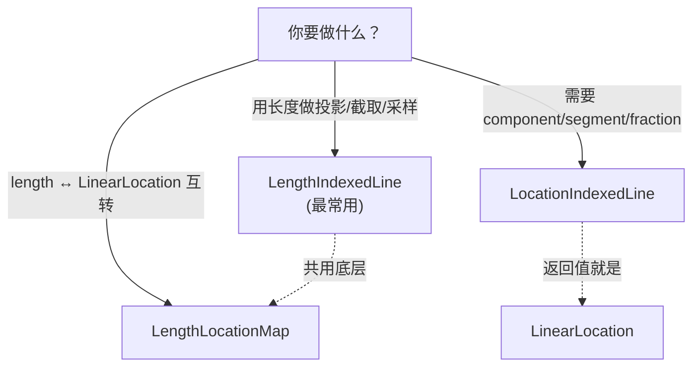

# 线性参考与沿线投影

常规几何用 XY 坐标定位点，但很多线性场景用"沿线的距离"更自然——"事故发生在 K12+300 处"、"地铁 3.5 公里处设站"、"截取第 2km 到第 5km 的路段"。这种沿线性要素度量位置的模型叫 **线性参考（Linear Referencing）**。NTS 在 `NetTopologySuite.LinearReferencing` 命名空间提供完整支持。

```csharp
using NetTopologySuite.Geometries;
using NetTopologySuite.LinearReferencing;

// 本页示例共用工厂
var factory = new GeometryFactory();

// 共用路线：L 形折线，全长 20
// (0,0) →(10,0) →(10,10)
var route = factory.CreateLineString(new[]
{
    new Coordinate(0, 0), new Coordinate(10, 0), new Coordinate(10, 10)
});
Console.WriteLine(route.Length);  // 20
```

<figure class="nts-diagram">
<svg viewBox="0 0 320 170" width="320" height="170">
  <polyline points="40,140 160,140 160,20" fill="none" stroke="#0b6e4f" stroke-width="2.5"/>
  <circle cx="40" cy="140" r="4" fill="#0b6e4f"/>
  <circle cx="100" cy="140" r="4" fill="#0b6e4f"/>
  <circle cx="160" cy="140" r="4" fill="#0b6e4f"/>
  <circle cx="160" cy="80" r="4" fill="#0b6e4f"/>
  <circle cx="160" cy="20" r="4" fill="#0b6e4f"/>
  <text x="40" y="158" text-anchor="middle" font-family="monospace" font-size="10" fill="#0b6e4f">0</text>
  <text x="100" y="158" text-anchor="middle" font-family="monospace" font-size="10" fill="#0b6e4f">5</text>
  <text x="160" y="158" text-anchor="middle" font-family="monospace" font-size="10" fill="#0b6e4f">10</text>
  <text x="172" y="84" font-family="monospace" font-size="10" fill="#0b6e4f">15</text>
  <text x="172" y="24" font-family="monospace" font-size="10" fill="#0b6e4f">20</text>
  <text x="190" y="150" font-family="monospace" font-size="10" fill="#666">路线</text>
  <text x="6" y="90" font-family="monospace" font-size="10" fill="#a86300">里程 (长度索引)</text>
</svg>
<figcaption>线性参考：沿线长度定位点，而非 XY 坐标</figcaption>
</figure>

## 线性参考的核心概念

线性参考把"位置"从二维坐标变成沿线性要素的一维度量。NTS 用两种索引方式表达位置：

| 索引方式 | 类型 | 说明 |
| --- | --- | --- |
| **长度索引** | `double`（沿线长度） | 直观，"5.0 处"就是距起点 5 个单位的点 |
| **位置索引** | `LinearLocation` | 拓扑三元组 `(componentIndex, segmentIndex, segmentFraction)`，精确到段内分数 |

二者通过 `LengthLocationMap` 互相转换。三类核心工具：



### LinearLocation：位置三元组

`LinearLocation` 是位置索引的载体，**类**（非结构体），实现 `IComparable`：

```csharp
public class LinearLocation : IComparable<LinearLocation>, IComparable
{
    public int ComponentIndex { get; }   // 多线串的第几个组件
    public int SegmentIndex { get; }     // 组件内的第几段（从 0 起）
    public double SegmentFraction { get; } // 段内分数 [0,1]
    public bool IsVertex { get; }        // 是否正好落在顶点上

    public LinearLocation();
    public LinearLocation(int segmentIndex, double segmentFraction);
    public LinearLocation(int componentIndex, int segmentIndex, double segmentFraction);

    public Coordinate GetCoordinate(Geometry linearGeom);
    public LineSegment GetSegment(Geometry linearGeom);
    public bool IsEndpoint(Geometry linearGeom);
    public void Clamp(Geometry linearGeom);
    public bool IsValid(Geometry linearGeom);
    public void SetToEnd(Geometry linear);
    public static LinearLocation GetEndLocation(Geometry linear);
}
```

注意 `LinearLocation` 自身 **不持有** 几何引用——所有需要解析坐标的方法都要把 `linearGeom` 作为参数传入。这是有意为之：同一个 `LinearLocation` 可在不同几何上复用，对象更轻量。

```csharp
// 路线第 0 段的 0.5 处 → 中点 (5, 0)
var loc = new LinearLocation(0, 0.5);
Coordinate pt = loc.GetCoordinate(route);
Console.WriteLine($"{pt.X}, {pt.Y}");  // 5, 0

// 终点位置
var end = LinearLocation.GetEndLocation(route);
Console.WriteLine(end.IsEndpoint(route));  // True
```

::: tip LinearLocation 比 double 更稳的场景
当几何是 `MultiLineString` 或带自相交的非简单线时，单一长度值可能对应多个位置。`LinearLocation` 的 `ComponentIndex` + `SegmentIndex` 能唯一定位，避免歧义。
:::

## LengthLocationMap：长度 ↔ 位置映射

`LengthLocationMap` 是最底层的转换器，只做一件事：在 **沿线长度（double）** 与 **`LinearLocation`** 之间互转。

**签名**：

```csharp
public class LengthLocationMap
{
    public LengthLocationMap(Geometry linearGeom);

    // 实例
    public LinearLocation GetLocation(double length);
    public LinearLocation GetLocation(double length, bool resolveLower);
    public double GetLength(LinearLocation loc);

    // 静态便捷重载
    public static LinearLocation GetLocation(Geometry linearGeom, double length);
    public static LinearLocation GetLocation(Geometry linearGeom, double length, bool resolveLower);
    public static double GetLength(Geometry linearGeom, LinearLocation loc);
}
```

### GetLocation(length) — 长度 → 位置

**语义**：返回沿 `linearGeom` 距起点 `length` 处的 `LinearLocation`。负值从终点反向度量，超出范围被钳到端点。组件端点处的歧义默认按 **最低** 位置解析。

```csharp
var map = new LengthLocationMap(route);

var loc5 = map.GetLocation(5.0);     // 第 0 段 0.5 处
Console.WriteLine(loc5.GetCoordinate(route));   // (5, 0)

var loc15 = map.GetLocation(15.0);   // 第 1 段 0.5 处
Console.WriteLine(loc15.GetCoordinate(route));  // (10, 5)

// 负值：从终点反向 5 → 等价于长度 15
var locFromEnd = map.GetLocation(-5.0);
Console.WriteLine(locFromEnd.GetCoordinate(route));  // (10, 5)

// 超长：钳到终点
var locOver = map.GetLocation(999);
Console.WriteLine(locOver.IsEndpoint(route));  // True
```

`resolveLower` 控制 **恰好落在组件端点** 时取哪一侧：`true` 取低（当前组件末端），`false` 取高（下一组件起点）。这在 `MultiLineString` 跨组件时才有差别。

### GetLength(loc) — 位置 → 长度

**语义**：`GetLocation` 的逆运算，返回 `LinearLocation` 对应的累计长度。

```csharp
var loc = new LinearLocation(1, 0.5);   // 第 1 段中点
double len = LengthLocationMap.GetLength(route, loc);
Console.WriteLine(len);  // 15（第 0 段长 10 + 第 1 段一半 5）
```

::: warning LengthLocationMap 不能由坐标反查、也不能直接取点
常见误用：以为 `LengthLocationMap` 有 `GetLocation(Coordinate)` 或 `ExtractPoint(distance)`——**这两个方法在 NTS 中并不存在**。`LengthLocationMap` 只做 `length ↔ LinearLocation` 互转：

- 想由 **长度直接取坐标** → 用 `loc.GetCoordinate(linearGeom)`，或更方便的 `LengthIndexedLine.ExtractPoint(index)`。
- 想由 **坐标反查里程** → 用 `LengthIndexedLine.Project(pt)` 或 `LocationIndexedLine.IndexOf(pt)`（见下文）。
:::

## LengthIndexedLine：长度索引线（最常用）

`LengthIndexedLine` 把一条线性几何包装成"以长度为索引"的可操作视图，是日常线性参考的主力。它**只读**——内部几何在构造时固定，没有修改方法。

**签名**：

```csharp
public class LengthIndexedLine
{
    public LengthIndexedLine(Geometry linearGeom);

    public double StartIndex { get; }   // 始终为 0
    public double EndIndex { get; }     // = linearGeom.Length

    public Coordinate ExtractPoint(double index);
    public Coordinate ExtractPoint(double index, double offsetDistance);
    public Geometry  ExtractLine(double startIndex, double endIndex);

    public double   IndexOf(Coordinate pt);
    public double   IndexOfAfter(Coordinate pt, double minIndex);
    public double[] IndicesOf(Geometry subLine);
    public double   Project(Coordinate pt);

    public bool   IsValidIndex(double index);
    public double ClampIndex(double index);
}
```

### ExtractPoint(index) — 取里程处的点

**语义**：返回距起点 `index` 处的坐标。越界返回首/末点；Z 值会按所在段插值。

```csharp
var indexed = new LengthIndexedLine(route);

Console.WriteLine(indexed.ExtractPoint(5));   // (5, 0)
Console.WriteLine(indexed.ExtractPoint(15));  // (10, 5)
Console.WriteLine(indexed.ExtractPoint(-5));  // (10, 5)  负值从终点反向
Console.WriteLine(indexed.ExtractPoint(999)); // (10, 10)  越界→终点
```

带偏移的重载 `ExtractPoint(index, offsetDistance)` 在该点沿**法线方向**再偏移一段距离：正值偏向左侧、负值偏向右侧。常用于生成路侧设施点、双线路中心线。

```csharp
// 在 5 处向左偏移 2 单位（y 轴向上为左）
Console.WriteLine(indexed.ExtractPoint(5, 2));  // (5, 2)
```

### ExtractLine(startIndex, endIndex) — 截取子线

**语义**：返回 `[startIndex, endIndex]` 区间内的子线（`LineString` 或 `MultiLineString`）。若 `endIndex < startIndex`，结果**反向**。越界索引先被 `ClampIndex` 钳到合法范围。

```csharp
var sub = indexed.ExtractLine(5, 15);
Console.WriteLine(sub.AsText());
// LINESTRING (5 0, 10 0, 10 5)
```

<figure class="nts-diagram">
<svg viewBox="0 0 320 170" width="320" height="170">
  <polyline points="40,140 160,140 160,20" fill="none" stroke="#bbb" stroke-width="2" stroke-dasharray="5 4"/>
  <polyline points="100,140 160,140 160,80" fill="none" stroke="#0b6e4f" stroke-width="4"/>
  <circle cx="100" cy="140" r="5" fill="#a86300"/>
  <circle cx="160" cy="80" r="5" fill="#a86300"/>
  <text x="100" y="158" text-anchor="middle" font-family="monospace" font-size="10" fill="#a86300">起点 5</text>
  <text x="172" y="84" font-family="monospace" font-size="10" fill="#a86300">终点 15</text>
  <text x="40" y="158" text-anchor="middle" font-family="monospace" font-size="10" fill="#999">0</text>
  <text x="160" y="158" text-anchor="middle" font-family="monospace" font-size="10" fill="#999">10</text>
  <text x="172" y="24" font-family="monospace" font-size="10" fill="#999">20</text>
  <text x="195" y="135" font-family="monospace" font-size="10" fill="#0b6e4f">ExtractLine(5,15)</text>
</svg>
<figcaption>ExtractLine：按里程区间截取子线，端点不必是原顶点</figcaption>
</figure>

::: warning 截取端点不必是原顶点
`ExtractLine(5, 15)` 的起止点 `(5,0)` 与 `(10,5)` 是按长度**插值**出来的新点，不在原 `route` 的顶点里。子线的中间顶点会保留原线对应位置的真实顶点（这里是拐角 `(10,0)`）。
:::

### IndexOf(pt) / Project(pt) — 由点反查里程

**签名**：

```csharp
public double IndexOf(Coordinate pt);
public double Project(Coordinate pt);
public double IndexOfAfter(Coordinate pt, double minIndex);
```

**语义**：

- `Project(pt)`：返回线上**离 pt 最近**的点对应的长度索引。点不必落在线上——这就是"沿线投影"。
- `IndexOf(pt)`：语义相同（NTS 实现中二者调用同一个底层 `LengthIndexOfPoint.IndexOf`），文档上 `IndexOf` 偏向"点已知在线上"、`Project` 偏向"点可能偏离线"。**建议投影场景统一用 `Project`**，表意更清晰。
- `IndexOfAfter(pt, minIndex)`：返回大于 `minIndex` 的下一个匹配索引，用于非简单线上同一点出现多次时枚举所有索引。

```csharp
var gps = new Coordinate(3, 2);   // 偏离路线 2 个单位

double mileage = indexed.Project(gps);
Console.WriteLine(mileage);                  // 3
Console.WriteLine(indexed.ExtractPoint(mileage));  // (3, 0)  投影点

// IndexOf 通常返回相同结果
Console.WriteLine(indexed.IndexOf(gps));     // 3
```

::: tip Project 与 IndexOf 的区别
两者底层实现一致，结果相同。差异只在文档语义：写"投影一个外部点到线上"用 `Project`；写"查一个已知在线上的点的里程"用 `IndexOf`。在非简单线（自相交/自重合）上，同一点可能有多个索引，`IndexOf` 返回**最小**的那个，用 `IndexOfAfter` 枚举其余。
:::

### IndicesOf(subLine) — 子线的里程区间

**语义**：给定一条"本线的子线"，返回 `[起始里程, 结束里程]`。子线的中间顶点必须与原线对应位置一致。

```csharp
var subLine = factory.CreateLineString(new[]
{
    new Coordinate(5, 0), new Coordinate(10, 0), new Coordinate(10, 5)
});
double[] range = indexed.IndicesOf(subLine);
Console.WriteLine($"{range[0]}, {range[1]}");  // 5, 15
```

常与 `ExtractLine` 配合：先用 `IndicesOf` 拿到一段子线的里程，再做平移、缩放后用 `ExtractLine` 重新截取。

### StartIndex / EndIndex / ClampIndex / IsValidIndex — 范围控制

```csharp
Console.WriteLine(indexed.StartIndex);  // 0
Console.WriteLine(indexed.EndIndex);    // 20

Console.WriteLine(indexed.IsValidIndex(10));   // True
Console.WriteLine(indexed.IsValidIndex(25));   // False

Console.WriteLine(indexed.ClampIndex(25));    // 20（钳到终点）
Console.WriteLine(indexed.ClampIndex(-5));    // 15（负值先转为从末尾度量：20-5）
Console.WriteLine(indexed.ClampIndex(-999));  // 0（极度负值钳到起点）
```

::: warning NTS 没有 SetLocation / GetLocation / WrapIndex
网上一些资料（或对应其它 GIS 库）会提到 `SetLocation`、`GetLocation`、`WrapIndex`——**这些在 NTS 的 `LengthIndexedLine` 上并不存在**：

- **没有 `SetLocation`**：`LengthIndexedLine` 是只读视图，要换参照线就 `new` 一个新实例。
- **没有公开 `GetLocation`**：取点用 `ExtractPoint`；要把长度转成 `LinearLocation` 用 `LengthLocationMap.GetLocation`。
- **没有 `WrapIndex`**：越界一律 `ClampIndex` 钳到 `[0, Length]`，**不会环绕**。闭合环跨接缝截取要手动分两段（见 [闭合环的处理](#闭合环的处理)）。
:::

## LocationIndexedLine：位置索引线

`LocationIndexedLine` 与 `LengthIndexedLine` 几乎对称，区别是 **索引用 `LinearLocation` 而非 `double`**。当你的位置逻辑需要区分"第几个组件、第几段"时用它。

**签名**：

```csharp
public class LocationIndexedLine
{
    public LocationIndexedLine(Geometry linearGeom);  // 仅接受 LineString / MultiLineString

    public LinearLocation StartIndex { get; }   // new LinearLocation()（起点）
    public LinearLocation EndIndex { get; }     // GetEndLocation(linearGeom)

    public