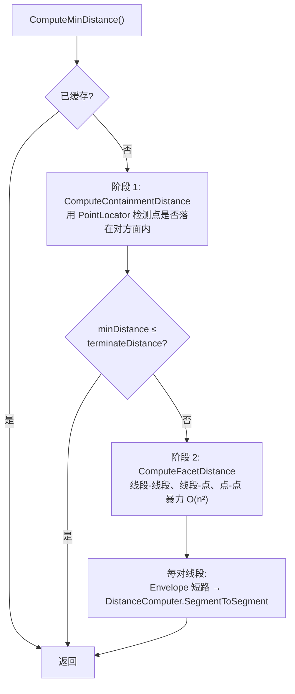

# 最近点与投影

`Distance()` 告诉你两个几何有多远，但很多场景你需要知道 **最近在哪里**：用户最近的道路入口、GPS 点在道路上的投影、两几何的接触位置。NTS 把这些能力集中在 `NetTopologySuite.Operation.Distance.DistanceOp` 一类中。本页逐方法讲解它的完整 API，配示例、陷阱与图示。

```csharp
using NetTopologySuite.Geometries;
using NetTopologySuite.Operation.Distance;

// 本页示例共用工厂
var factory = new GeometryFactory();
```

## DistanceOp 类

**签名**：

```csharp
namespace NetTopologySuite.Operation.Distance;

public class DistanceOp
{
    // 构造
    public DistanceOp(Geometry g0, Geometry g1);
    public DistanceOp(Geometry g0, Geometry g1, double terminateDistance);

    // 静态便捷
    public static double Distance(Geometry g0, Geometry g1);
    public static Coordinate[] NearestPoints(Geometry g0, Geometry g1);
    public static bool IsWithinDistance(Geometry g0, Geometry g1, double distance);

    // 实例
    public double Distance();
    public Coordinate[] NearestPoints();
    public GeometryLocation[] NearestLocations();
}
```

**语义**：计算两个几何之间的最小欧氏距离，以及"最近点对"——一对坐标 `(p0, p1)`，其中 `p0 ∈ g0`、`p1 ∈ g1`，二者距离等于两几何的最小距离。

要点：

- 最近点 **不一定是顶点**，可能落在某条线段的内部（投影点）
- 空几何组件会被忽略；任一输入为空时 `Distance()` 返回 `0`
- 算法是 **暴力 O(n²)** 比较，外加 `Envelope` 短路剪枝；大规模几何请用 [IndexedFacetDistance](#indexedfacetdistance-加速大几何)

### 构造函数

**签名**：

```csharp
public DistanceOp(Geometry g0, Geometry g1);
public DistanceOp(Geometry g0, Geometry g1, double terminateDistance);
```

**语义**：

- 第一形式：标准构造，找出真正的最近点对
- 第二形式：传入 `terminateDistance`（终止距离）。一旦在计算过程中发现距离已 ≤ `terminateDistance`，立即返回——**不再保证给出最精确的最近点**

```csharp
var road = factory.CreateLineString(new[]
{
    new Coordinate(0, 0), new Coordinate(10, 0), new Coordinate(10, 5)
});
var user = factory.CreatePoint(new Coordinate(3, 2));

// 标准用法：要精确最近点
var exact = new DistanceOp(road, user);

// 提前终止用法：只关心 100 米内是否存在候选
var op = new DistanceOp(road, user, terminateDistance: 100);
```

::: warning terminateDistance 的语义不是"上限"
`terminateDistance` **不是**对结果的硬性约束，而是一个"够近就停"的阈值。如果实际最小距离 ≤ 它，调用 `NearestPoints()` 得到的可能是任意一个"足够近"的点对，**不保证** 是真正最近的。

只在两种场景下使用：

1. 配合 `IsWithinDistance` 做存在性判断（你不在乎具体点在哪）
2. 你愿意接受"近似最近点"换取性能

需要精确最近点时，用第一形式或显式传 `0`。
:::

### Distance()

**签名**：

```csharp
public static double Distance(Geometry g0, Geometry g1);  // 静态便捷
public double Distance();                                   // 实例
```

**语义**：返回两几何最小欧氏距离（坐标系单位）。`Geometry.Distance(other)` 内部正是调用静态形式。

```csharp
var a = factory.CreatePoint(new Coordinate(0, 0));
var b = factory.CreatePoint(new Coordinate(3, 4));

Console.WriteLine(DistanceOp.Distance(a, b));   // 5（静态）
Console.WriteLine(a.Distance(b));                // 5（实例扩展方法等价）

// 实例形式：复用同一 DistanceOp 算一次距离，再取最近点
var op = new DistanceOp(a, b);
Console.WriteLine(op.Distance());                 // 5
```

::: tip 既要距离又要最近点，复用 DistanceOp
`Distance()` 与 `NearestPoints()` 在同一个 `DistanceOp` 实例上调用，底层 `ComputeMinDistance()` 只算一次（结果缓存）。如果你既要距离又要最近点，**不要** 分别调 `a.Distance(b)` 和 `DistanceOp.NearestPoints(a, b)`——那样会算两遍。
:::

::: warning 空几何返回 0
任一输入为空几何时，`Distance()` 返回 `0`，**不抛异常**。如果你依赖"距离为 0 即相交"的判定，记得先检查 `IsEmpty`，否则空几何会假阳性。
:::

### NearestPoints()

**签名**：

```csharp
public static Coordinate[] NearestPoints(Geometry g0, Geometry g1);  // 静态
public Coordinate[] NearestPoints();                                  // 实例
```

**语义**：返回 `Coordinate[2]`——`[0]` 来自 `g0`、`[1]` 来自 `g1`，二者距离等于两几何的最小距离。点的顺序与传入几何的顺序一致。

```csharp
var line = factory.CreateLineString(new[]
{
    new Coordinate(0, 0), new Coordinate(10, 0)
});
var point = factory.CreatePoint(new Coordinate(5, 3));

Coordinate[] nearest = DistanceOp.NearestPoints(line, point);
// nearest[0] = (5, 0)  ← 线上最近点（投影点，不是顶点）
// nearest[1] = (5, 3)  ← 点本身

double distance = nearest[0].Distance(nearest[1]);  // 3
```

::: tip 想知道最近点落在哪个组件/哪段
如果还需要"最近点属于哪条线、第几段"等信息，用实例方法 `NearestLocations()`，返回 `GeometryLocation[]`。详见下文。
:::

::: warning 返回的是新数组，长度恒为 2
`NearestPoints()` 永远返回长度为 2 的数组，**不会**因为存在多个等距候选而返回更多点。多候选场景的处理见下节。
:::

### ClosestPoints 与 NearestPoints 的关系

**重要**：当前 NTS 主分支的 `DistanceOp` **没有** `ClosestPoints` 方法。在很早的版本里曾存在 `ClosestPoints(g0, g1)` 静态方法，但被标注 `[Obsolete("Renamed to NearestPoints")]`，现已移除。如果你在网上看到 `DistanceOp.ClosestPoints(...)` 的代码示例，把它替换成 `NearestPoints(...)` 即可。

**关于"多候选最近点"**：当两几何在某段上平行贴合时（两条平行线段、共线重叠段），存在 **无数对等距最近点**。`NearestPoints()` 在这种情形下只返回 **一对代表点**（通常是首段端点或第一个被找到的等距对），不会枚举所有候选。

<figure class="nts-diagram">
<svg viewBox="0 0 360 200" width="360" height="200">
  <line x1="40" y1="60" x2="320" y2="60" stroke="#0b6e4f" stroke-width="2.5"/>
  <text x="180" y="48" text-anchor="middle" font-family="monospace" font-size="11" fill="#0b6e4f">LineString A</text>
  <line x1="40" y1="130" x2="320" y2="130" stroke="#0b6e4f" stroke-width="2.5"/>
  <text x="180" y="150" text-anchor="middle" font-family="monospace" font-size="11" fill="#0b6e4f">LineString B</text>
  <line x1="80" y1="60" x2="80" y2="130" stroke="#a86300" stroke-width="1" stroke-dasharray="3 3"/>
  <line x1="160" y1="60" x2="160" y2="130" stroke="#a86300" stroke-width="1" stroke-dasharray="3 3"/>
  <line x1="240" y1="60" x2="240" y2="130" stroke="#a86300" stroke-width="1" stroke-dasharray="3 3"/>
  <line x1="290" y1="60" x2="290" y2="130" stroke="#a86300" stroke-width="1" stroke-dasharray="3 3"/>
  <text x="180" y="180" text-anchor="middle" font-family="monospace" font-size="10" fill="#a86300">所有虚线对距离都 = 70，互为等距最近点</text>
  <line x1="80" y1="60" x2="80" y2="130" stroke="#a00" stroke-width="2.5"/>
  <circle cx="80" cy="60" r="4.5" fill="#a00"/>
  <circle cx="80" cy="130" r="4.5" fill="#a00"/>
  <text x="95" y="98" font-family="monospace" font-size="10" fill="#a00">NearestPoints 只返回这一对</text>
</svg>
<figcaption>多候选场景：NearestPoints 仅返回一对代表点，不枚举所有等距候选</figcaption>
</figure>

如果你确实需要 **所有** 等距最近点对，需要自己遍历线段并用 `LineSegment.ClosestPoints` 计算：

```csharp
// 找出 a、b 间所有等距最近对（先用 NearestPoints 拿到最小距离）
var rep = DistanceOp.NearestPoints(a, b);
double minDist = rep[0].Distance(rep[1]);

var allPairs = new List<(Coordinate, Coordinate)>();
var ca = a.Coordinates;
var cb = b.Coordinates;
for (int i = 0; i < ca.Length - 1; i++)
{
    var segA = new LineSegment(ca[i], ca[i + 1]);
    for (int j = 0; j < cb.Length - 1; j++)
    {
        var segB = new LineSegment(cb[j], cb[j + 1]);
        var pair = segA.ClosestPoints(segB);   // 返回 [segA上最近点, segB上最近点]
        if (Math.Abs(pair[0].Distance(pair[1]) - minDist) < 1e-9)
            allPairs.Add((pair[0], pair[1]));
    }
}
```

### IsWithinDistance(distance)

**签名**：

```csharp
public static bool IsWithinDistance(Geometry g0, Geometry g1, double distance);
```

**语义**：判断两几何的最小距离是否 ≤ `distance`。它内部走两道短路：

1. 先算 `g0.EnvelopeInternal.Distance(g1.EnvelopeInternal)`——如果外接矩形距离已超阈值，立即返回 `false`，**不必构造** `DistanceOp`
2. 否则构造 `new DistanceOp(g0, g1, distance)`，利用 `terminateDistance` 在计算过程中再剪枝

```csharp
// 我只关心 100 米内有没有候选——更远的不要精确值
if (DistanceOp.IsWithinDistance(road, user, distance: 100))
{
    var pair = DistanceOp.NearestPoints(road, user);
    // ... 处理最近点
}
```

::: tip 等价的实例写法
`IsWithinDistance(g0, g1, d)` 等价于：

```csharp
var envDist = g0.EnvelopeInternal.Distance(g1.EnvelopeInternal);
if (envDist > d) return false;
var op = new DistanceOp(g0, g1, terminateDistance: d);
return op.Distance() <= d;
```

如果同一个 `g0` 要对多个 `g1` 判断，且 `g0` 很大、查询很多，考虑用 `IndexedFacetDistance`（见下文）——它把目标几何的索引缓存复用。
:::

::: warning 当前 NTS 没有"实例 IsWithinDistance(double)"
部分旧文档列出 `op.IsWithinDistance(double)` 实例方法，但 NTS 主分支只提供 **静态** 形式。需要实例写法时，用上面"等价实例写法"的 `op.Distance() <= d`。
:::

### NearestLocations()（实例扩展）

**签名**：

```csharp
public GeometryLocation[] NearestLocations();
```

**语义**：与 `NearestPoints()` 等价，但返回 `GeometryLocation[]`——除坐标外，还包含 **所属子几何、段索引** 等定位信息。`GeometryLocation` 的关键字段：

| 字段 | 含义 |
| --- | --- |
| `GeometryComponent` | 最近点所在的子几何 |
| `SegmentIndex` | 落在第几段（点几何为 `0`，多边形内部为 `InsideArea = -1`） |
| `Coordinate` | 最近点坐标 |

```csharp
var road = factory.CreateMultiLineString(new[]
{
    factory.CreateLineString(new[] { new Coordinate(0, 0), new Coordinate(10, 0) }),       // 第 0 条
    factory.CreateLineString(new[] { new Coordinate(0, 10), new Coordinate(10, 10) })      // 第 1 条
});
var user = factory.CreatePoint(new Coordinate(4, 1));

var op = new DistanceOp(road, user);
GeometryLocation[] locs = op.NearestLocations();
// locs[0].GeometryComponent  → 第 0 条 LineString
// locs[0].SegmentIndex       → 0  （落在第 0 段上）
// locs[0].Coordinate         → (4, 0)
```

::: tip 道路匹配要"哪一段被命中"时用它
`NearestLocations()` 是 GPS 路网匹配的关键：光知道投影坐标不够，还要知道命中了路网里的哪一条、哪一段——后续才能做转向提示、里程定位。
:::

## 点到线段的最近投影

最常见的场景：把一个 GPS 点"吸附"到最近的道路上。

```csharp
var road = factory.CreateLineString(new[]
{
    new Coordinate(0, 0), new Coordinate(10, 0), new Coordinate(10, 5)
});

var gpsPoint = factory.CreatePoint(new Coordinate(3, 2));

var pair = DistanceOp.NearestPoints(road, gpsPoint);
var snapped = factory.CreatePoint(pair[0]);

Console.WriteLine($"吸附后位置: ({snapped.X}, {snapped.Y})");
// (3, 0) — 投影到第一段线段上
```

<figure class="nts-diagram">
<svg viewBox="0 0 280 100" width="280" height="100">
  <polyline points="20,80 200,80 200,30" fill="none" stroke="#0b6e4f" stroke-width="2.5"/>
  <circle cx="80" cy="55" r="4" fill="#a00"/>
  <circle cx="80" cy="80" r="4" fill="#0b6e4f"/>
  <line x1="80" y1="55" x2="80" y2="80" stroke="#888" stroke-dasharray="3 3"/>
  <text x="90" y="50" font-family="monospace" font-size="11" fill="#a00">GPS 点</text>
  <text x="90" y="78" font-family="monospace" font-size="11" fill="#0b6e4f">吸附点</text>
</svg>
<figcaption>把 GPS 点投影到道路</figcaption>
</figure>

::: tip 单点对单段，直接用 LineSegment 更快
如果你已经知道目标线段（一条 `LineString` 的某一段），用 `LineSegment.ClosestPoint(coord)` 比 `DistanceOp` 更轻量——无需走 `ConnectedElementLocationFilter` 等内部流程。

```csharp
var seg = new LineSegment(new Coordinate(0, 0), new Coordinate(10, 0));
var proj = seg.ClosestPoint(new Coordinate(3, 2));   // (3, 0)
double dist = seg.Distance(new Coordinate(3, 2));   // 2
```
:::

## DistanceOp 内部机制

`DistanceOp.ComputeMinDistance()` 分两个阶段，每个阶段都用 `terminateDistance` 短路：



要点：

- **包含检测**：用 `PointLocator` 判断一方顶点是否落在另一方的多边形内部——若是，距离为 0
- **面面距离**：实际算的是 **边界之间** 的距离（`LinearComponentExtracter.GetLines` 抽取环）
- **短路层级**：从粗到细依次为 外接矩形整体 → 单段外接矩形 → 精确段距
- **算法复杂度**：最坏 O(n²)，对长 `LineString`（如万级顶点路网）会明显变慢

### IndexedFacetDistance：加速大几何

当几何很大、或要对同一目标几何做多次距离查询时，用 `IndexedFacetDistance` 替代 `DistanceOp`。它在 `NetTopologySuite.Operation.Distance` 命名空间下，内部用 `FacetSequenceTreeBuilder` 把几何的"小段序列"建到 STRtree 上，再用 Branch-and-Bound 剪枝：

**签名**：

```csharp
public class IndexedFacetDistance
{
    public IndexedFacetDistance(Geometry g1);              // 缓存目标几何索引
    public double Distance(Geometry g);                    // 实例：复用缓存
    public static double Distance(Geometry g1, Geometry g2);
    public static bool IsWithinDistance(Geometry g1, Geometry g2, double distance);
}
```

```csharp
// 一次性建好路网索引，对一万个 GPS 点查询最近距离
var ifd = new IndexedFacetDistance(roadNetwork);   // 索引缓存
foreach (var gps in gpsPoints)
    Console.WriteLine(ifd.Distance(gps));          // 单次接近 O(log n)
```

何时该换：

| 场景 | 推荐 |
| --- | --- |
| 一次性算两小几何距离 | `DistanceOp` |
| 大几何（数千顶点）算距离 | `IndexedFacetDistance` |
| 同一目标几何 vs 多个查询几何 | `IndexedFacetDistance`（缓存复用） |
| 既需要距离又需要最近点坐标 | `DistanceOp`（`IndexedFacetDistance` 只返回距离数值） |

## IndexedPointInAreaLocator 与 PreparedGeometry.Covers

如果需求其实是 **"判断大量点是否在同一个面内"**（不是"找最近点"），`DistanceOp` 不是合适工具。NTS 提供两条优化路径，按场景选用：

### IndexedPointInAreaLocator

`NetTopologySuite.Algorithm.Locate.IndexedPointInAreaLocator`——把多边形剖分成面积树，单次 `Locate` 接近 O(log n)。返回 `Location` 枚举可区分 **内部 / 边界 / 外部**。

```csharp
using NetTopologySuite.Algorithm.Locate;

var poly = LoadBigPolygon();
var locator = new IndexedPointInAreaLocator(poly);

foreach (var p in oneMillionPoints)
{
    var status = locator.Locate(p.Coordinate);
    bool inside  = status == Location.Interior;
    bool onEdge  = status == Location.Boundary;
    bool outside = status == Location.Exterior;
}
```

### PreparedGeometry.Covers

`NetTopologySuite.Geometries.Prepared.PreparedGeometry`——预编译几何，加速一组谓词（`Covers` / `Contains` / `Intersects` / `Crosses` 等）。返回 `bool`，不区分内部与边界。

```csharp
using NetTopologySuite.Geometries.Prepared;

var prepared = PreparedGeometryFactory.Prepare(poly);

foreach (var p in points)
{
    if (prepared.Covers(p))    // true：含边界
        // ... 在面内或边上
}
```

### 选择指引

| 需求 | 选谁 |
| --- | --- |
| 只判断"点在面内"，**含边界算在内** | `PreparedGeometry.Covers` |
| 只判断"点在面内"，**严格不含边界** | `PreparedGeometry.Contains`，或 `IndexedPointInAreaLocator` + `Location.Interior` |
| 需要 **区分** 内部 / 边界 / 外部 | `IndexedPointInAreaLocator` |
| 还要顺带判断 `Intersects`、`Crosses` 等多个谓词 | `PreparedGeometry`（一次预编译多用谓词） |
| 同一多边形、海量点（百万级） | 两者都够快；`IndexedPointInAreaLocator` 通常略胜 |
| 多边形会动态变化 | 都不合适——重建索引/重编译成本高，退化到普通 `Covers` 即可 |

::: tip 概念边界
`IndexedPointInAreaLocator` 只支持"点对面的定位"。`PreparedGeometry` 支持"任意几何之间的预编译谓词"。如果你要做的是"线是否被面覆盖"等复合谓词，只能选 `PreparedGeometry`。
:::

## 实战：道路匹配 SnapToRoad

把 GPS 点吸附到最近的道路上，超出阈值则保持原点。这是导航、轨迹清洗的常用操作：

```csharp
/// 把 GPS 点吸附到最近的道路上；超出 maxSnapDistance 则原样返回
public static Point SnapToRoad(Geometry road, Point gps, double maxSnapDistance)
{
    // 用 terminateDistance 提前终止：太远不必算精确最近点
    var op = new DistanceOp(road, gps, terminateDistance: maxSnapDistance);
    if (op.Distance() > maxSnapDistance)
        return gps;   // 太远，不吸附

    var pair = op.NearestPoints();
    return gps.Factory.CreatePoint(pair[0]);
}

// 用法
var snapped = SnapToRoad(roadNetwork, rawGps, maxSnapDistance: 50);
```

如果路网很大、要批量吸附一串 GPS 点，把 `roadNetwork` 包成 `IndexedFacetDistance` 一次性建索引——后续每个 GPS 点的距离查询走缓存索引，远点秒过：

```csharp
// 注意：IndexedFacetDistance 只返回距离数值，不返回最近点
var ifd = new IndexedFacetDistance(roadNetwork);   // 路网索引只建一次
var snapped = new List<Point>();
foreach (var gps in gpsTrack)
{
    // 用缓存索引快速算距离（接近 O(log n)），先过滤远点
    if (ifd.Distance(gps) > maxSnapDistance)
    {
        snapped.Add(gps);
        continue;
    }
    // 命中阈值内的少量点，再用 DistanceOp 取最近点（O(n²) 但只对小集合生效）
    var pair = DistanceOp.NearestPoints(roadNetwork, gps);
    snapped.Add(gps.Factory.CreatePoint(pair[0]));
}
```

::: warning IndexedFacetDistance 不返回最近点
`IndexedFacetDistance` 设计目标是 **快速算距离**，不返回最近点坐标。需要最近点时仍得借助 `DistanceOp.NearestPoints`。所以上面的模式是"IFD 粗过滤 + DistanceOp 精取点"——大多数远点在 IFD 阶段就被排除，只有少量点真正进入慢路径。
:::

## 实战：找最近设施

场景：1000 个候选设施，找离用户最近的 K 个。

### 小数据集：直接遍历

候选量在数千以内、且只算一次，直接遍历排序：

```csharp
var candidates = LoadFacilities();   // List<Point>
var user = new Coordinate(116.40, 39.90);

var nearest5 = candidates
    .OrderBy(c => c.Coordinate.Distance(user))
    .Take(5)
    .ToList();
```

### 大数据集：STRtree KNN

候选量到十万级以上时，遍历排序成本不可接受。NTS 的 `STRtree<T>` 提供基于外接矩形的空间索引；它没有内置 KNN，但可用"**半径递增查询 + 精确距离排序**"模式实现：

```csharp
using NetTopologySuite.Index.Strtree;

// 1. 建索引
var tree = new STRtree<Point>();
foreach (var c in candidates)
    tree.Insert(c.EnvelopeInternal, c);
tree.Build();

// 2. KNN 查询：以 user 为中心，逐步扩大半径直到取够 K 个
public static List<Point> Knn(STRtree<Point> tree, Coordinate user, int k)
{
    double r = 1000;          // 初始半径（坐标系单位，按业务调）
    List<Point> hits = new();

    while (hits.Count < k)
    {
        var env = new Envelope(
            user.X - r, user.X + r,
            user.Y - r, user.Y + r);
        hits = tree.Query(env).ToList();

        if (hits.Count < k)
        {
            r *= 2;            // 没找够，半径翻倍
            if (r > 1e9) break;  // 兜底：避免死循环
        }
    }

    // 3. 精确距离排序后取前 K
    return hits
        .OrderBy(c => c.Coordinate.Distance(user))
        .Take(k)
        .ToList();
}

var top5 = Knn(tree, user, k: 5);
```

::: tip 半径递增查询的取舍
- 初始半径取决于业务（如城市内可设 1km，国家级设 100km）
- 半径翻倍是经验值——平均 O(log R) 次查询即可命中
- 如果你已知数据大致密度，可一次性用足够大的半径查询，省去多次调用
- 真正海量场景请考虑专门的 KNN 库（如基于 KD-Tree 的实现），STRtree 本身为范围查询优化
:::

## 小结速查表

| API | 形式 | 返回 | 用途 |
| --- | --- | --- | --- |
| `DistanceOp(g0, g1)` | 构造 | — | 标准最近点计算入口 |
| `DistanceOp(g0, g1, terminateDistance)` | 构造 | — | 带提前终止，配合 `IsWithinDistance` |
| `DistanceOp.Distance(g0, g1)` | 静态 | `double` | 一次性算两几何距离 |
| `op.Distance()` | 实例 | `double` | 复用同一实例算距离 |
| `DistanceOp.NearestPoints(g0, g1)` | 静态 | `Coordinate[2]` | 一次性取最近点对 |
| `op.NearestPoints()` | 实例 | `Coordinate[2]` | 复用算最近点对 |
| `op.NearestLocations()` | 实例 | `GeometryLocation[2]` | 最近点对 + 组件/段索引 |
| `DistanceOp.IsWithinDistance(g0, g1, d)` | 静态 | `bool` | 存在性判断（双短路） |
| `IndexedFacetDistance(g1)` | 构造 | — | 大几何/重复查询的索引缓存 |
| `ifd.Distance(g)` | 实例 | `double` | 复用索引算距离 |
| `IndexedPointInAreaLocator(poly).Locate(p)` | 实例 | `Location` | 批量点在面内（区分边界） |
| `PreparedGeometryFactory.Prepare(g).Covers(p)` | 实例 | `bool` | 批量点在面内（含边界） |
| `STRtree<T>.Query(env)` | 实例 | `IEnumerable<T>` | 范围查询，配合半径递增做 KNN |
| `LineSegment.ClosestPoint(c)` | 实例 | `Coordinate` | 单段投影（已知目标段时最轻量） |

## 下一步

- [测量与距离](./measurement.md)：`Length`、`Area`、`Geometry.Distance` 等度量方法
- [沿线线性参考 Linear Referencing](./linear-referencing.md)：`LengthIndexedLine`、按里程截子线、里程↔位置互转
- [PreparedGeometry 性能优化](../06-performance/prepared-geometry.md)：预编译谓词的内部机制
- [空间索引 STRtree](../06-performance/spatial-index.md)：KNN、范围查询、索引选型
