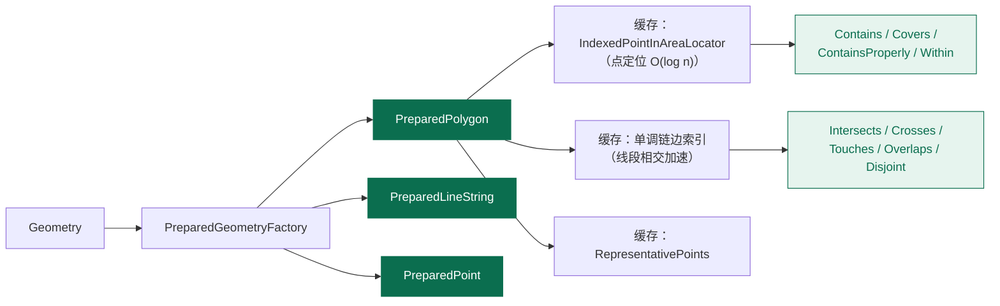
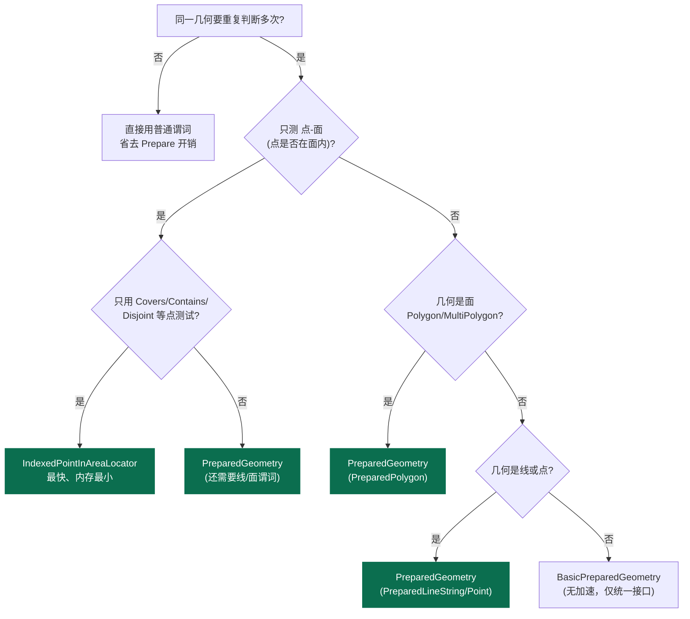
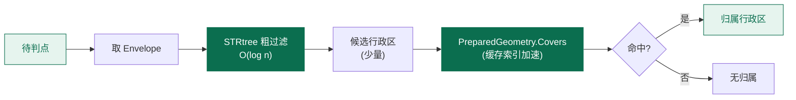

# PreparedGeometry 性能优化

当你用同一个几何与大量其他几何做谓词判断时（典型：1 万个 POI 是否落在某个城市多边形内），普通的 `polygon.Contains(point)` 每次都要重新构建拓扑，效率极低。`PreparedGeometry` 解决的正是这个问题——把同一几何的拓扑结构与空间索引**预先构建并缓存**，后续谓词判断只做"查询"这一步。

本页逐方法讲解 `PreparedGeometry` 的 API、内部实现机制，以及它与 `STRtree`、`IndexedPointInAreaLocator` 的取舍。

```csharp
using NetTopologySuite.Geometries;
using NetTopologySuite.Geometries.Prepared;

// 本页示例共用工厂
var factory = new GeometryFactory();
```

## 问题动机：为什么普通谓词慢

```csharp
// 慢：每个 POI 都重新分析同一个多边形
foreach (var poi in tenThousandPois)
{
    if (cityPolygon.Contains(poi)) { ... }
}
```

每一次 `Contains` 调用都会：

1. 把多边形的边切分成单调链（Monotone Chain）
2. 为这些链构建空间索引
3. 建立点定位器（Point-In-Area Locator）
4. 最后才执行真正的点-多边形测试

对于**同一个多边形**，前三步在循环里被重复了 1 万次——纯属浪费。几何越复杂（顶点越多），这部分开销占比越大。

`PreparedGeometry` 的思路：把第 1~3 步的结果**缓存下来**，循环里只做第 4 步。

```csharp
// 快：预处理一次，重复用
var prepared = PreparedGeometryFactory.Prepare(cityPolygon);

foreach (var poi in tenThousandPois)
{
    if (prepared.Contains(poi)) { ... }   // 只做点测试
}
```

实测速度提升 **10~100 倍**，几何越复杂提升越大。

## PreparedGeometry 接口

`PreparedGeometry` 的类型都位于命名空间 `NetTopologySuite.Geometries.Prepared`。核心是 `IPreparedGeometry` 接口：

```csharp
namespace NetTopologySuite.Geometries.Prepared;

public interface IPreparedGeometry
{
    // 原始几何（只读引用）
    Geometry Geometry { get; }

    // 谓词：返回 bool，语义与 Geometry 上的同名方法一致，只是更快
    bool Contains(Geometry geom);
    bool ContainsProperly(Geometry geom);
    bool Covers(Geometry geom);
    bool CoveredBy(Geometry geom);
    bool Crosses(Geometry geom);
    bool Disjoint(Geometry geom);
    bool Intersects(Geometry geom);
    bool Overlaps(Geometry geom);
    bool Touches(Geometry geom);
    bool Within(Geometry geom);
    bool AnyInteracts(Geometry geom);
}
```

实现体系：

| 实现 | 适用输入 | 缓存了什么 |
| --- | --- | --- |
| `PreparedPolygon` | `Polygon` / `MultiPolygon` | 点定位器 + 边索引 + 代表点 |
| `PreparedLineString` | `LineString` / `MultiLineString` | 边索引 + 代表点 |
| `PreparedPoint` | `Point` / `MultiPoint` | （点谓词本就快，几乎不缓存） |
| `BasicPreparedGeometry` | 其他类型 / 兜底 | 仅代表点，谓词直接委托给原几何 |

::: tip 线程安全
官方文档明确：`IPreparedGeometry` 的子类**设计为线程安全**，可在多线程上下文中共享同一个实例，从而最大化利用预处理状态。把 `PreparedGeometry` 作为单例缓存是推荐做法。
:::

## PreparedGeometryFactory 类

`PreparedGeometryFactory` 是创建 `PreparedGeometry` 的入口。它根据输入几何的类型自动选择合适的实现。注意它本身是普通类（不是静态类），但提供了静态便捷方法。

### Prepare

**签名**：`public static IPreparedGeometry Prepare(Geometry geom)`

**语义**：静态便捷入口。根据 `geom` 的 `GeometryType` 自动选择 `PreparedPolygon` / `PreparedLineString` / `PreparedPoint` / `BasicPreparedGeometry`，构建并返回预处理实例。这是最常用的写法。

```csharp
// 根据类型自动选择实现
IPreparedGeometry prepared = PreparedGeometryFactory.Prepare(cityPolygon);

// 对 MultiPolygon 同样适用，返回 PreparedPolygon
var country = (MultiPolygon)wktReader.Read("MULTIPOLYGON(...)");
var preparedCountry = PreparedGeometryFactory.Prepare(country);
```

::: tip 不知道类型时用 Prepare
`Prepare` 内部就是 `new PreparedGeometryFactory().Create(geom)`。绝大多数场景用这一个静态方法即可，无需关心具体实现类型。
:::

### Create

**签名**：`public IPreparedGeometry Create(Geometry geom)`

**语义**：实例方法，行为与 `Prepare` 完全一致。一般只在需要继承 `PreparedGeometryFactory` 自定义分发逻辑时才用实例方法。

```csharp
var factory2 = new PreparedGeometryFactory();
IPreparedGeometry prepared = factory2.Create(cityPolygon);
```

### PreparedPolygonFactory / PreparedLineStringFactory / PreparedPointFactory

如果你**明确知道**输入类型，可以用类型化工厂直接构造对应的 `Prepared*` 实现，省去类型判别：

```csharp
// 明确是 Polygon：直接用 PreparedPolygonFactory
var prepared = new PreparedPolygonFactory().Create(cityPolygon);
// 返回 PreparedPolygon，针对面优化

// 明确是 LineString
var preparedLine = new PreparedLineStringFactory().Create(riverLine);

// 明确是 Point（通常无必要，点谓词本就快）
var preparedPt = new PreparedPointFactory().Create(poi);
```

| 类型化工厂 | Create 输入 | 返回实现 |
| --- | --- | --- |
| `PreparedPolygonFactory` | `Polygon` | `PreparedPolygon` |
| `PreparedLineStringFactory` | `LineString` | `PreparedLineString` |
| `PreparedPointFactory` | `Point` | `PreparedPoint` |

::: warning 类型化工厂不自动转换
`PreparedPolygonFactory.Create` 期望传入 `Polygon`。若你的几何是 `MultiPolygon`，用通用 `PreparedGeometryFactory.Prepare` 更稳妥——它会正确分派到 `PreparedPolygon`。
:::

## PreparedGeometry 的内部实现

理解"缓存了什么"，才能判断它能加速哪些谓词、为什么快。

`PreparedPolygon` 在预处理阶段构建并缓存了三样东西：

**1. 点定位器（IndexedPointInAreaLocator）**

基于 STRtree 索引单调链，可在 O(log n) 时间内判断一个点落在面的**内部 / 边界 / 外部**。服务于 `Contains`、`Covers`、`ContainsProperly`、`Within` 等"点是否在面内"类谓词。

**2. 边索引（单调链段集）**

把面的所有边切分成单调链并建索引，快速判断"另一几何的线段是否与面的边相交"。服务于 `Intersects`、`Crosses`、`Touches`、`Overlaps`、`Disjoint` 等线段相交类谓词。

> 单调链（Monotone Chain）的性质：链内的线段互不相交；任意连续子段的包络就是其端点的包络，因而可用二分查找加速求交。对真实地理数据，这能消除大量无谓的线段两两比较。

**3. 代表点（RepresentativePoints）**

缓存几何的若干代表点，用于 Envelope 快速排除和反向谓词（例如 `Within(g)` 需测试 this 的代表点是否在 g 内）。

`PreparedLineString` 缓存边索引与代表点；`PreparedPoint` 几乎不缓存（点谓词本就 O(1)）。



## PreparedGeometry 支持的谓词

下面逐个讲解 `IPreparedGeometry` 支持的谓词。所有谓词的**返回结果与普通 `Geometry` 谓词完全一致**，区别仅在于更快。它们都不改变语义。

### Contains

**签名**：`bool Contains(Geometry geom)`

**语义**：测试 `geom` 是否完全在 this 内（含 this 的边界），且两者的内部有交集。等价于 `geom.Within(this)`。

```csharp
var city = PreparedGeometryFactory.Prepare(cityPolygon);
bool hasPoi = city.Contains(poi);   // POI 是否在城区内（含边界）
```

::: warning Contains 对边界微妙
OGC `Contains` 要求"两几何内部有交集"——若 `geom` 完全落在 this 的边界上（如一条贴着边界的线），`Contains` 返回 `false`。如果只是想判断"geom 没有任何点在 this 之外"，用 `Covers` 更稳健。
:::

### ContainsProperly

**签名**：`bool ContainsProperly(Geometry geom)`

**语义**：测试 `geom` 是否完全落在 this 的**内部**（interior）——`geom` 的任何一点都不能落在 this 的边界上，更不能在外部。这是 `Contains` 的**严格版本**：边界接触即返回 `false`。

- 等价定义：`geom` 的每一点都是 this 内部的点
- DE-9IM 相交矩阵匹配 `T**FF*FF*`

**与 `Contains` 的区别**：`Contains` 允许 `geom` 接触 this 的边界（边界点属于 this），`ContainsProperly` 不允许。

<figure class="nts-diagram">
<svg viewBox="0 0 420 170" width="420" height="170">
  <!-- 面板1：严格内部 -->
  <rect x="10" y="20" width="100" height="100" fill="rgba(11,110,79,0.12)" stroke="#0b6e4f" stroke-width="2"/>
  <rect x="40" y="50" width="40" height="40" fill="rgba(11,110,79,0.45)" stroke="#0b6e4f" stroke-width="1.5"/>
  <text x="60" y="140" text-anchor="middle" font-family="monospace" font-size="10" fill="#0b6e4f">Contains = T</text>
  <text x="60" y="155" text-anchor="middle" font-family="monospace" font-size="10" fill="#0b6e4f">ContainsProperly = T</text>
  <!-- 面板2：触边界 -->
  <rect x="150" y="20" width="100" height="100" fill="rgba(11,110,79,0.12)" stroke="#0b6e4f" stroke-width="2"/>
  <rect x="200" y="50" width="50" height="40" fill="rgba(168,99,0,0.45)" stroke="#a86300" stroke-width="1.5"/>
  <text x="200" y="140" text-anchor="middle" font-family="monospace" font-size="10" fill="#a86300">Contains = T</text>
  <text x="200" y="155" text-anchor="middle" font-family="monospace" font-size="10" fill="#a86300">ContainsProperly = F</text>
  <!-- 面板3：跨边界 -->
  <rect x="290" y="40" width="100" height="80" fill="rgba(11,110,79,0.12)" stroke="#0b6e4f" stroke-width="2"/>
  <rect x="320" y="10" width="40" height="50" fill="rgba(170,0,0,0.40)" stroke="#a00" stroke-width="1.5"/>
  <text x="340" y="140" text-anchor="middle" font-family="monospace" font-size="10" fill="#a00">Contains = F</text>
  <text x="340" y="155" text-anchor="middle" font-family="monospace" font-size="10" fill="#a00">ContainsProperly = F</text>
</svg>
<figcaption>ContainsProperly：geom 接触边界即返回 false，比 Contains 严格</figcaption>
</figure>

```csharp
var region = PreparedGeometryFactory.Prepare(boundary);
var patch = factory.CreatePolygon(/* 贴着边界的小面 */);

region.Contains(patch);          // true（边界点也算被包含）
region.ContainsProperly(patch);  // false（接触了边界）
```

::: tip 用 ContainsProperly 做"裁剪前过滤"
`ContainsProperly` 的优势是**用边索引快速判断，无需逐点计算拓扑**。典型场景：要对一批几何与一个大面做 `Intersection` 裁剪，先用 `ContainsProperly` 过滤出"完全在内部"的几何——它们裁剪结果就是自身，可直接跳过昂贵的叠加运算。
:::

### Covers

**签名**：`bool Covers(Geometry geom)`

**语义**：测试 `geom` 是否完全在 this 内（含边界）。比 `Contains` 宽松——不要求"两几何内部相交"，因此 `geom` 完全贴在 this 边界上也返回 `true`。

```csharp
// 判断 POI 是否在区县内（边界点算在内）
bool inside = prepared.Covers(poi);
```

::: tip 优先用 Covers 代替 Contains
`Covers` 没有 `Contains` 的边界微妙性，结果更稳定，且 PreparedGeometry 对它的加速效果好。落区分析这类"点是否在面内"场景，首选 `Covers`。
:::

### CoveredBy

**签名**：`bool CoveredBy(Geometry geom)`

**语义**：`Covers` 的反向——测试 this 是否完全在 `geom` 内（含边界）。等价于 `geom.Covers(this)`。

```csharp
// point 是否被某面覆盖（与 Covers 互为反向）
bool covered = preparedPoint.CoveredBy(polygon);
```

### Crosses

**签名**：`bool Crosses(Geometry geom)`

**语义**：两者相交，交集维度低于两者中较低维度，且 `geom` 部分在 this 内部、部分在外部。典型场景：一条线穿过一个面、两条线相交。

```csharp
// 河流是否穿过保护区
bool crosses = preparedReserve.Crosses(riverLine);
```

### Disjoint

**签名**：`bool Disjoint(Geometry geom)`

**语义**：两者无任何交集（含边界）。即 `!Intersects(geom)`。

```csharp
bool noOverlap = preparedZone.Disjoint(otherZone);
```

### Intersects

**签名**：`bool Intersects(Geometry geom)`

**语义**：两者有任何交集（含边界接触）。最常用的快速判断，即 `!Disjoint(geom)`。PreparedGeometry 用单调链边索引使 `Intersects` 大幅加速——这是它最拿手的谓词。

```csharp
// 候选行政区是否与查询范围相交
bool hit = preparedDistrict.Intersects(queryBox);
```

### Overlaps

**签名**：`bool Overlaps(Geometry geom)`

**语义**：两者同维度，交集同维度，且各自都有"内部在对方之外"的部分（即非 Contains、非 Within，但又有重叠）。典型：两个部分重叠的多边形。

```csharp
// 两块用地是否部分重叠
bool overlaps = preparedLot.Overlaps(anotherLot);
```

### Touches

**签名**：`bool Touches(Geometry geom)`

**语义**：两者仅在边界接触，内部不相交。

```csharp
// 两个地块是否相邻（共享边界）
bool adjacent = preparedParcel.Touches(neighbor);
```

### Within

**签名**：`bool Within(Geometry geom)`

**语义**：测试 this 是否完全在 `geom` 内（含边界）。`Contains` 的反向，等价于 `geom.Contains(this)`。

```csharp
// 判断 POI 是否在城市内（this=POI，geom=城市面）
bool inCity = preparedPoi.Within(cityPolygon);
```

### AnyInteracts

**签名**：`bool AnyInteracts(Geometry geom)`

**语义**：测试两者是否有**任何**空间交互。语义上等价于 `Intersects`（即 `!Disjoint`）——只要两者不 Disjoint，就"有交互"。当你只关心"是否沾边"而不关心具体是哪种关系类型时使用。

```csharp
var region = PreparedGeometryFactory.Prepare(protectedArea);

// 待处理的一批几何，凡是与保护区有任何交互的都要标记
var interacting = candidates
    .Where(g => region.AnyInteracts(g))
    .ToList();
```

::: warning AnyInteracts ≈ Intersects
`AnyInteracts` 的实现就是 `Intersects`，两者结果恒相等。把它理解为"是否存在任意一种关系"的语义糖即可，无需纠结差异。需要精确关系时仍应用具体谓词（`Crosses` / `Touches` / `Overlaps` 等）。
:::

## 不支持的运算

`PreparedGeometry` **只加速谓词**，不加速运算。`Buffer`、`Union`、`Intersection`、`Difference`、`SymmetricDifference`、`Distance` 等都**没有**对应的 prepared 版本。

```csharp
// 这些都做不到加速——PreparedGeometry 上根本没有这些方法
prepared.Buffer(10);          // 编译错误
prepared.Union(other);        // 编译错误
prepared.Intersection(other); // 编译错误
```

如果需要对同一几何做大量叠加运算，应换思路：用空间索引（`STRtree`）粗过滤候选，再对少量候选做普通运算；或对裁剪类需求用 `ContainsProperly` 先过滤"完全在内"的几何跳过叠加。

## 性能基准

对 10000 个随机点，测试是否在一个 1000 顶点的多边形内：

| 方法 | 耗时 | 提升 |
| --- | --- | --- |
| `polygon.Contains(point)` | ~1200 ms | 基准 |
| `prepared.Contains(point)` | ~25 ms | ~48× |
| `IndexedPointInAreaLocator` | ~12 ms | ~100× |

> **测试环境说明**：.NET 8 控制台程序，Release 编译，Windows 11 / x64，单线程串行调用取中位数。数据为 1000 顶点单多边形 × 10000 随机分布点。数值为示意量级，实际提升倍数取决于几何复杂度、点分布（命中率越高，纯几何路径越多）与硬件；几何越复杂、点越多，prepared 的收益越明显。

::: tip 极致优化：点多边形场景
若你的场景严格是"一批点是否在同一个面内"，`IndexedPointInAreaLocator` 比 `PreparedGeometry.Covers` 还快——它专门为点-面测试设计，且更省内存。

```csharp
using NetTopologySuite.Algorithm.Locate;

var locator = new IndexedPointInAreaLocator(cityPolygon);
foreach (var p in pois)
{
    // Locate 返回 Interior / Boundary / Exterior
    bool inside = locator.Locate(p.Coordinate) != Location.Exterior;
}
```
:::

## PreparedGeometry vs IndexedPointInAreaLocator

两者都缓存拓扑、都为重复查询加速，如何选？看场景的几何维度与谓词种类：



## PreparedGeometry 与 STRtree 对比

两者常被混淆，但解决的是不同层面的问题：

| 维度 | `STRtree` | `PreparedGeometry` |
| --- | --- | --- |
| 加速对象 | 在**多个**几何中查找候选 | **单个**几何的重复谓词 |
| 缓存内容 | 所有几何的 Envelope（外包矩形）R 树 | 单个几何的点定位器 + 单调链边索引 + 代表点 |
| 构建复杂度 | O(n log n)，n = 几何个数 | O(m)，m = 单个几何顶点数 |
| 构建耗时 | 几何数多时几十~几百 ms | 1~50 ms（取决于顶点数） |
| 内存占用 | 约每个几何一个 Envelope（几十字节） | 比原几何多 30~80% |
| 查询结果 | 返回候选集合（仍需精判断） | 直接返回布尔结果 |
| 典型配合 | 粗过滤 | 对候选做精判断 |

二者是**互补**关系而非替代：`STRtree` 用 Envelope 快速缩小候选范围，`PreparedGeometry` 对候选做精确谓词判断。两者叠加才是大批量空间查询的标准姿势（见下文场景 3）。

## 应用场景

### 1. POI 落区分析

把全国 50 万个 POI 落到 3000 个区县多边形里。每个多边形用 `PreparedGeometry` 预处理一次：

```csharp
var districts = LoadDistricts();   // 3000 个区县
var pois = LoadAllPois();          // 50 万 POI

var result = new Dictionary<string, List<Point>>();

foreach (var d in districts)
{
    var prepared = PreparedGeometryFactory.Prepare(d.Geometry);
    var matched = pois.Where(p => prepared.Covers(p)).ToList();
    result[d.Name] = matched;
}
```

### 2. 实时地理围栏

车辆每秒上报位置，判断是否在某个围栏内。围栏长期不变、查询高频，是 `PreparedGeometry` 的理想场景：

```csharp
public class GeofenceService
{
    private readonly Dictionary<string, IPreparedGeometry> _zones = new();

    public void AddZone(string id, Geometry zone)
    {
        _zones[id] = PreparedGeometryFactory.Prepare(zone);
    }

    public List<string> CheckViolations(Point location)
    {
        return _zones
            .Where(kvp => kvp.Value.Contains(location))
            .Select(kvp => kvp.Key)
            .ToList();
    }
}
```

### 3. 与 STRtree 组合：粗过滤 + 精判断

```csharp
// 1. 用 STRtree 粗过滤（Envelope 相交）
var tree = new STRtree<Geometry>();
foreach (var d in districts)
    tree.Insert(d.Geometry.EnvelopeInternal, d);
tree.Build();

// 2. 对候选几何用 PreparedGeometry 精判断
var candidates = tree.Query(point.EnvelopeInternal);
foreach (var d in candidates)
{
    var prepared = preparedCache.GetOrAdd(d, PreparedGeometryFactory.Prepare);
    if (prepared.Covers(point))
    {
        // 命中
    }
}
```



## 内存与生命周期

`PreparedGeometry` 持有对原始 `Geometry` 的引用，并附加索引结构，所以内存占用比原几何略大（约多 30~80%）。

- **缓存复用**：把 `PreparedGeometry` 缓存在静态字典或 DI 容器中，长期使用
- **不要每查询一次都 Prepare**：那等于没优化，反而更慢
- **几何不可变**：原始几何**不能修改**——`PreparedGeometry` 不会检测变更。一旦原始几何变化，缓存的索引即失效，结果错误

### 几何不可变警告：错误的模式

```csharp
var prepared = PreparedGeometryFactory.Prepare(poly);

// 任何原地修改 poly 的操作都会让 prepared 失效：
// poly.Normalize();              ← 改变顶点顺序
// poly.Coordinates[0].X = 5;     ← 改变坐标（Coordinate 是可变引用！）
// poly = poly.Buffer(0);         ← 注意：Buffer(0) 返回的是新几何，原 poly 不变
//                                  但若你把新几何赋回 poly 而继续用旧 prepared，仍会出错

prepared.Covers(point);   // 用的是旧拓扑，结果不可信
```

### 正确模式：几何变化则重新 Prepare

```csharp
public class ZoneRegistry
{
    private readonly Dictionary<string, PreparedEntry> _entries = new();

    // 几何变更时整体替换：丢弃旧 prepared，重新构建
    public void UpsertZone(string id, Geometry zone)
    {
        _entries[id] = new PreparedEntry
        {
            Source = zone,
            Prepared = PreparedGeometryFactory.Prepare(zone)
        };
    }

    public bool Contains(string id, Geometry g)
        => _entries[id].Prepared.Covers(g);

    private readonly struct PreparedEntry
    {
        public Geometry Source { get; init; }
        public IPreparedGeometry Prepared { get; init; }
    }
}
```

::: tip 修复几何的正确时机
若入库几何可能无效，**先**用 `Buffer(0)` 或 `GeometryFixer` 修复得到一个全新的 `Geometry`，**再** Prepare 它，并从此缓存这个 prepared 实例。绝不要 Prepare 之后再动几何。
:::

## 与普通谓词的等价性

`PreparedGeometry` 的谓词结果与普通谓词**完全一致**，只是更快。它不改变语义。

```csharp
bool a = polygon.Contains(point);
bool b = prepared.Contains(point);
// a == b 永远成立
```

## 限制

1. 只加速谓词，不加速运算（`Buffer`/`Union`/`Intersection` 等无 prepared 版本）
2. 原始几何不可变（必须重新 Prepare 才能用新数据）
3. 占用额外内存（约比原几何多 30~80%）
4. 准备阶段有成本（构建索引约 1~50 ms，取决于几何复杂度）

::: tip 何时**不**用 PreparedGeometry
- 只判断一次：直接用普通谓词更快（少了 Prepare 开销）
- 几何频繁变化：缓存频繁失效，得不偿失
- 内存敏感场景：考虑用 `IndexedPointInAreaLocator` 等更轻量方案
:::

## 小结速查表

| API | 作用 | 加速来源 |
| --- | --- | --- |
| `PreparedGeometryFactory.Prepare(g)` | 静态入口，按类型自动分派 | — |
| `new PreparedPolygonFactory().Create(g)` | 类型化工厂，直接造 `PreparedPolygon` | — |
| `prepared.Contains(g)` | g 在 this 内（含边界，需内部相交） | 点定位器 |
| `prepared.ContainsProperly(g)` | g 在 this **内部**（不触边界） | 边索引，无需逐点拓扑 |
| `prepared.Covers(g)` | g 在 this 内（含边界，更稳健） | 点定位器 |
| `prepared.CoveredBy(g)` | this 在 g 内（Covers 反向） | 委托 |
| `prepared.Crosses(g)` | 穿过（交集维度更低） | 边索引 |
| `prepared.Disjoint(g)` | 无任何交集 | 边索引 |
| `prepared.Intersects(g)` | 有交集（含边界） | 边索引，最拿手 |
| `prepared.Overlaps(g)` | 同维度部分重叠 | 边索引 |
| `prepared.Touches(g)` | 仅边界接触 | 边索引 |
| `prepared.Within(g)` | this 在 g 内（Contains 反向） | 代表点 + 委托 |
| `prepared.AnyInteracts(g)` | 有任何交互（≈ Intersects） | 边索引 |

**选型一句话**：同一几何重复判断多次 → `PreparedGeometry`；纯点落面极致 → `IndexedPointInAreaLocator`；多几何中找候选 → `STRtree` 粗过滤 + `PreparedGeometry` 精判断。

## 下一步

- [空间索引 STRtree](./spatial-index.md)：批量查询的粗过滤利器
- [空间谓词](../03-spatial-relations/relationships.md)：理解 Contains / Covers / Intersects 的语义边界
- [API 速查表](../appendix/cheatsheet.md)
