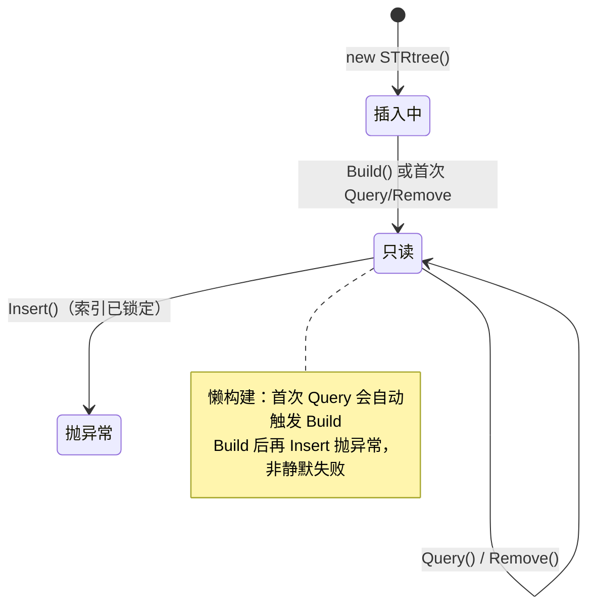

# 空间索引

空间索引是空间数据库的"灵魂"——把 O(n) 的暴力搜索降到接近 O(log n)。NTS 在 `NetTopologySuite.Index` 下内置了一整套索引结构，本页逐类、逐方法拆解它们的签名、语义、用法与陷阱。

```csharp
using NetTopologySuite.Geometries;
using NetTopologySuite.Index.Strtree;
using NetTopologySuite.Index.KdTree;
using NetTopologySuite.Index.Quadtree;
```

## 为什么需要空间索引

假设你有 100 万个 POI，要找出某个矩形范围内的所有点：

```csharp
// ❌ 暴力：100 万次判断，O(n)
var inBox = allPois
    .Where(p => envelope.Contains(p.Coordinate))
    .ToList();

// ✅ 索引：通常只触及几千个候选项，接近 O(log n)
var tree = new STRtree<Point>();
foreach (var p in allPois) tree.Insert(p.EnvelopeInternal, p);
tree.Build();
var inBox = tree.Query(envelope).ToList();
```

对 100 万数据，索引查询通常 < 10 ms，暴力遍历可能要数百毫秒。差距随数据量增长而放大——暴力是线性增长，索引是对数增长。

::: tip 索引只做"粗过滤"
所有 NTS 空间索引的 `Query` 返回的都是 **Envelope（外接矩形）相交** 的候选集，不是精确相交结果。索引的价值在于把 n 个对象砍成少量候选，再用精确谓词（`Intersects` / `Covers`）做二次过滤。这一点贯穿全页。
:::

## NTS 的空间索引家族

| 索引 | 命名空间 | 数据结构 | 特点 | 适用 |
| --- | --- | --- | --- | --- |
| `STRtree` | `Index.Strtree` | R-tree (Sort-Tile-Recursive) | **推荐默认**，半静态 | 通用矩形查询、KNN |
| `KdTree` | `Index.KdTree` | k-d 树 | 仅点数据，最近邻极快 | 最近邻 / 半径查询 |
| `Quadtree` | `Index.Quadtree` | 四叉树 (MX-CIF) | 支持动态增删 | 数据频繁变化 |
| `HPRtree` | `Index.HPRtree` | Hilbert-Packed R-tree | 静态、更省内存 | 一次性构建、内存敏感 |
| `Bintree` | `Index.Bintree` | 一维区间树 | 单维 | 线段 / 一维区间索引 |
| `MonotoneChain` / `MCIndex` | `Index.Chain` / `Noding` | 单调链 + HPRtree | 几何运算内部用 | 求交、叠加内部加速 |

下面逐类详解。

## STRtree 类

`STRtree<TItem>`（`NetTopologySuite.Index.Strtree`）是基于 **Sort-Tile-Recursive** 算法的打包 R-tree，二维空间数据专用。它是 NTS 的推荐默认索引：构建快、查询稳、支持 KNN。

> 类注释原话：插入 **不是** 线程安全的，多线程插入需外部同步；**查询是线程安全的**——构建阶段同步完成，查询本身无状态。

### 索引原理：R-tree 分层结构

STRtree 把每个数据项的 `Envelope`（MBR）作为叶节点，按 X 中点排序切成竖直切片，片内再按 Y 中点排序、按节点容量打包成上层节点；递归向上直到根。最终是一棵"矩形套矩形"的树：上层节点的 Envelope 包住其所有子节点的 Envelope。

<figure class="nts-diagram">
<svg viewBox="0 0 480 220" width="480" height="220">
  <!-- 根 MBR -->
  <rect x="20" y="20" width="440" height="170" fill="none" stroke="#0b6e4f" stroke-width="2.5"/>
  <text x="30" y="16" font-family="monospace" font-size="11" fill="#0b6e4f">根 Envelope（包住全部）</text>

  <!-- 内部节点 A -->
  <rect x="40" y="40" width="180" height="130" fill="rgba(11,110,79,0.10)" stroke="#0b6e4f" stroke-width="1.8" stroke-dasharray="6 3"/>
  <text x="48" y="54" font-family="monospace" font-size="10" fill="#0b6e4f">节点 A</text>
  <!-- A 的叶子项 -->
  <rect x="55" y="70" width="45" height="30" fill="rgba(11,110,79,0.25)" stroke="#0b6e4f" stroke-width="1.2"/>
  <rect x="110" y="65" width="40" height="35" fill="rgba(11,110,79,0.25)" stroke="#0b6e4f" stroke-width="1.2"/>
  <rect x="60" y="120" width="55" height="35" fill="rgba(11,110,79,0.25)" stroke="#0b6e4f" stroke-width="1.2"/>
  <rect x="130" y="115" width="70" height="40" fill="rgba(11,110,79,0.25)" stroke="#0b6e4f" stroke-width="1.2"/>

  <!-- 内部节点 B -->
  <rect x="250" y="40" width="190" height="130" fill="rgba(168,99,0,0.10)" stroke="#a86300" stroke-width="1.8" stroke-dasharray="6 3"/>
  <text x="258" y="54" font-family="monospace" font-size="10" fill="#a86300">节点 B</text>
  <rect x="265" y="68" width="50" height="32" fill="rgba(168,99,0,0.22)" stroke="#a86300" stroke-width="1.2"/>
  <rect x="330" y="62" width="45" height="38" fill="rgba(168,99,0,0.22)" stroke="#a86300" stroke-width="1.2"/>
  <rect x="385" y="70" width="40" height="30" fill="rgba(168,99,0,0.22)" stroke="#a86300" stroke-width="1.2"/>
  <rect x="270" y="118" width="60" height="38" fill="rgba(168,99,0,0.22)" stroke="#a86300" stroke-width="1.2"/>
  <rect x="345" y="122" width="80" height="33" fill="rgba(168,99,0,0.22)" stroke="#a86300" stroke-width="1.2"/>

  <!-- 查询框 -->
  <rect x="300" y="100" width="120" height="55" fill="none" stroke="#a00" stroke-width="2"/>
  <text x="306" y="170" font-family="monospace" font-size="10" fill="#a00">Query Envelope</text>

  <text x="240" y="208" text-anchor="middle" font-family="monospace" font-size="10" fill="#666">查询只下钻与 Query 相交的节点（B），跳过不相交的节点（A）</text>
</svg>
<figcaption>STRtree 的 R-tree 分层结构：根包住内部节点，内部节点包住叶子项</figcaption>
</figure>

查询时从根开始：若某子节点的 Envelope 与查询框不相交，整棵子树被剪掉，无需下钻。这就是 O(log n) 的来源。

### Insert

**签名**：`public void Insert(Envelope itemEnv, TItem item)`

**语义**：把一个数据项与其外接矩形关联后放入索引。**只能在 `Build()` 之前调用**，构建后再插入会抛异常（见下文）。

- `itemEnv` 为 `IsNull`（空 Envelope）时**静默跳过**——不报错也不入库。
- 通常用 `g.EnvelopeInternal` 作为 `itemEnv`，避免创建 `Polygon` 的开销。

```csharp
var tree = new STRtree<Geometry>();

foreach (var poly in polygons)
{
    // 用几何的外接矩形作为索引键
    tree.Insert(poly.EnvelopeInternal, poly);
}
```

::: warning IsNull 的 Envelope 会被静默忽略
若某个几何的 `EnvelopeInternal` 是空的（如空 `Polygon`），`Insert` 直接 return，数据**不会进索引**，查询自然也查不到。排查"少了数据"时先检查 `g.IsEmpty` / `g.EnvelopeInternal.IsNull`。
:::

### Build

**签名**：`public void Build()`（继承自 `AbstractSTRtree<T, TItem>`）

**语义**：根据已插入的数据构建 R-tree 的层级结构。构建后索引变为**只读**：可以 `Query` / `Remove`，但不能再 `Insert`。

- 重复调用安全：已构建则直接 return。
- **懒构建**：`Query` / `Remove` / `Root` / `Count` / `Depth` 在首次访问时会自动触发 `Build()`，所以严格说你不必手动调用。但**显式 `Build()` 是好习惯**——把构建开销控制在预期时刻，并锁定索引。
- 构建是同步的（内部加锁），完成后查询无状态、可并发。

```csharp
tree.Build();   // 显式构建，之后只读
```



STRtree 的生命周期是一次性的：先批量插入，再 `Build`，之后只读（可删）。若需动态增删，请改用 `Quadtree`。

### Query(Envelope) / Query(Envelope, IItemVisitor)

**签名**：
```csharp
public IList<TItem> Query(Envelope searchEnv);
public void Query(Envelope searchEnv, IItemVisitor<TItem> visitor);
```

**语义**：返回所有 **Envelope 与 `searchEnv` 相交** 的数据项。这是粗过滤——返回的候选项可能并不真的与查询几何相交，需要二次精过滤。

- 第一个重载返回列表，简单直接。
- 第二个重载用访问者模式，对每个候选项调用 `visitor.VisitItem(item)`，适合边查边处理、避免大列表分配。`VisitItem` 返回 `void`，不支持提前中断。

```csharp
// 1. 范围查询
var env = new Envelope(116.3, 116.5, 39.85, 39.95);
var matched = tree.Query(env).ToList();

// 2. 两阶段：粗过滤 + 精过滤
var candidates = tree.Query(queryPoly.EnvelopeInternal);
var exact = candidates
    .Where(g => g.Intersects(queryPoly))
    .ToList();

// 3. 访问者模式：实现 IItemVisitor<T>，边查边处理（避免大列表分配）
var results = new List<Polygon>();
tree.Query(queryEnv, new CollectVisitor<Polygon>(p =>
{
    if (p.Intersects(queryGeometry))
        results.Add(p);
}));

// IItemVisitor<T> 是接口（VisitItem 返回 void），需自己实现；
// C# 不会把 lambda 自动转成接口，所以通常写一个通用适配器：
// sealed class CollectVisitor<T> : IItemVisitor<T>
// {
//     private readonly Action<T> _action;
//     public CollectVisitor(Action<T> action) => _action = action;
//     public void VisitItem(T item) => _action(item);
// }
```

::: tip 两阶段查询模式
这是空间索引的标准用法：

1. **粗过滤**：用 Envelope 相交，O(log n)
2. **精过滤**：用真实谓词（`Intersects` / `Covers`），O(候选数)

候选数通常远小于总数据量，所以精过滤虽慢但可接受。如果还嫌慢，对查询几何用 `PreparedGeometry`。
:::


### Remove

**签名**：`public bool Remove(Envelope itemEnv, TItem item)`

**语义**：从索引中移除一项，返回是否找到并移除。`itemEnv` 应与当初 `Insert` 时一致。`Remove` 会自动 `Build()`（若尚未构建）。

```csharp
bool ok = tree.Remove(poly.EnvelopeInternal, poly);
```

::: warning 引用类型按"引用相等"删除
对**引用类型**的 `TItem`，NTS 内部用 `ObjectReferenceEqualityComparer`——比较的是**对象引用**，不是值相等。所以必须传入**当初插入的那个对象实例**，传一个"值相等的新对象"删不掉。

```csharp
// ❌ 新建一个相等的多边形，删不掉
tree.Remove(newPoly.EnvelopeInternal, newPoly);

// ✅ 传回同一个引用
tree.Remove(originalPoly.EnvelopeInternal, originalPoly);
```

对**值类型**（如 `int`、结构体）则用默认的值相等比较。如果你用值类型当 item，删除语义更宽松。
:::

::: tip STRtree 是"半静态"
官方定位是 semi-static：`Build` 后不能 `Insert`，但可以 `Remove`。不过大量 `Remove` 会让节点变稀疏、查询效率下降，这种情况应该重建索引或改用 `Quadtree`。
:::

### NodeCapacity 属性 + 性能影响

**签名**：`public int NodeCapacity { get; }`（继承自 `AbstractSTRtree`，只读）

**语义**：每个节点最多容纳的子项数。通过构造函数指定，默认 `10`，最小推荐 `4`（构造时断言 `> 1`）。

```csharp
var tree = new STRtree<Geometry>(nodeCapacity: 16);
Console.WriteLine(tree.NodeCapacity);  // 16
```

**性能影响**：

| NodeCapacity | 树高 | 构建开销 | 查询开销 | 说明 |
| --- | --- | --- | --- | --- |
| 小（4~6） | 更高 | 略高 | 单节点内扫描少，但下钻层数多 | 节点更"瘦"，重叠少 |
| 默认（10） | 中 | 中 | 中 | 经验最优，多数场景首选 |
| 大（24~32） | 更低 | 略低 | 单节点内线性扫描增多 | 节点更"胖"，重叠可能增加 |

STR 算法在每层把项按 X 排序切成 `ceil(sqrt(ceil(n/cap)))` 个竖直切片，再按 Y 打包。容量越大，树越扁、内存对象越少，但单节点内候选越多。**没有银弹**：默认 10 适合绝大多数场景，仅在 profiling 后再调整。

### KNN 查询 NearestNeighbour

STRtree 用 **Branch-and-Bound** 算法做最近邻搜索，支持单树最近对、对外部项的 1-NN 与 k-NN、跨树最近对，以及距离阈值判断。

**核心签名**：
```csharp
// 单树：树内最近的两项（一对）
public TItem[] NearestNeighbour(IItemDistance<Envelope, TItem> itemDist);

// 对外部项的 1-NN：树中离给定 item 最近的一项
public TItem NearestNeighbour(Envelope env, TItem item, IItemDistance<Envelope, TItem> itemDist);

// 对外部项的 k-NN：树中离给定 item 最近的 k 项
public TItem[] NearestNeighbour(Envelope env, TItem item, IItemDistance<Envelope, TItem> itemDist, int k);

// 跨树：两棵树之间最近的一项对
public TItem[] NearestNeighbour(STRtree<TItem> tree, IItemDistance<Envelope, TItem> itemDist);

// 距离阈值：两棵树是否存在距离 ≤ maxDistance 的项对
public bool IsWithinDistance(STRtree<TItem> tree, IItemDistance<Envelope, TItem> itemDist, double maxDistance);
```

`IItemDistance<Envelope, TItem>` 定义项与项之间的距离：

```csharp
public interface IItemDistance<T, TItem>
{
    double Distance(IBoundable<T, TItem> item1, IBoundable<T, TItem> item2);
}
```

NTS 内置 `GeometryItemDistance`（`IItemDistance<Envelope, Geometry>`），用 `Geometry.Distance(Geometry)` 计算距离，且**反自反**——两个参数是同一对象时返回 `double.MaxValue`。

```csharp
// k-NN：树中离查询点最近的 5 个几何
var tree = new STRtree<Geometry>();
foreach (var g in dataset) tree.Insert(g.EnvelopeInternal, g);
tree.Build();

var query = factory.CreatePoint(new Coordinate(5, 5));
var itemDist = new GeometryItemDistance();

Geometry[] nearest5 = tree.NearestNeighbour(
    query.EnvelopeInternal, query, itemDist, k: 5);
```

::: warning 单树 KNN 必须"反自反"
`NearestNeighbour(itemDist)` 在**同一棵树**里找最近对时，若距离函数对"项与自身"返回 0，结果会把一个项与自身配对（距离 0），毫无意义。距离函数必须**反自反**（anti-reflexive）：两参数为同一对象时返回 `double.MaxValue`。直接用内置的 `GeometryItemDistance` 即可；自己实现 `IItemDistance` 时务必处理这一点。

对外部项的 1-NN / k-NN（`env, item, itemDist[, k]` 重载）不受此影响——查询项不在树里，不会自配对。
:::

::: tip k-NN 的查询项不必在树里
`NearestNeighbour(env, item, itemDist, k)` 的 `item` **无需**先插入树中。只要 `itemDist` 能计算它与树中项的距离即可。这正好适合"为某个用户找最近的 N 家店"——把用户当外部查询项，店在树里。
:::

## KdTree 类

`KdTree<T>`（`NetTopologySuite.Index.KdTree`）是二维 k-d 树，**专为点数据优化**。约束 `where T : class`，所以数据载荷必须是引用类型。它动态构建（边插边建），最近邻查询极快。

> 类注释：树的结构依赖插入顺序。若插入点在某一维上单调（如已排序），树会失衡——深度远超 `log₂(n)`，查询变慢。解决办法是插入前用 **Fisher-Yates 洗牌**打乱顺序。查询内部用栈而非递归，避免栈溢出。

### Insert

**签名**：
```csharp
public KdNode<T> Insert(Coordinate p);
public KdNode<T> Insert(Coordinate p, T data);
```

**语义**：插入一个点，返回所在节点。树动态生长，**无需 `Build`**。

- 支持容差吸附：构造 `new KdTree<string>(tolerance)`（`T` 必须是引用类型）后，若新点与已有节点的距离 ≤ `tolerance`，**不新建节点**，而是返回已有节点并把其 `Count` 加 1。
- 无容差（默认 `tolerance = 0`）时，仅完全相同的点会合并。
- 返回的 `KdNode<T>` 暴露 `Coordinate`、`Data`、`Count`、`IsRepeated`。

```csharp
var kdtree = new KdTree<Store>();           // 无容差
foreach (var s in stores)
    kdtree.Insert(s.Location.Coordinate, s);

// 带容差：1e-9 内视为同一点，合并计数（注意 T 必须是引用类型）
var snap = new KdTree<string>(1e-9);
snap.Insert(new Coordinate(1.0, 2.0), "a");
var node = snap.Insert(new Coordinate(1.0 + 1e-12, 2.0), "b");
Console.WriteLine(node.Count);      // 2（吸附到同一点，不新建节点）
Console.WriteLine(node.IsRepeated); // True
Console.WriteLine(node.Data);       // "a"（已有节点的 data 保留，不覆盖）
```

::: warning T 必须是引用类型
`KdTree<T> where T : class`。`int` / `double` / `int?` 都是值类型，**都不能**用作 `T`（`int?` 即 `Nullable<int>`，本质仍是 struct）。若要给点关联数值，用 `string`、装箱 `object`，或自定义 class 包装。
:::

### NearestNeighbor

**签名**：`public static KdNode<T> NearestNeighbor<T>(this KdTree<T> self, Coordinate coord) where T : class`
（位于 `KdTreeExtensions`，是**扩展方法**，调用时像实例方法）

**语义**：返回树中离 `coord` 最近的节点，O(log n) 平均复杂度。用平方距离比较，先下钻更可能命中的一侧，再根据"分割面到查询点的距离"决定是否回溯另一侧（剪枝）。

```csharp
var nearest = kdtree.NearestNeighbor(new Coordinate(5, 5));
if (nearest != null)
    Console.WriteLine($"最近店: {nearest.Data}, 距离 {nearest.Coordinate.Distance(new Coordinate(5,5)):F2}");
```

::: tip k 最近邻请用 STRtree
当前 NTS 的 `KdTree` **只内置 1-NN**（`NearestNeighbor`，单数）。若需要 k 个最近邻，不要反复调用 `NearestNeighbor`——改用 `STRtree.NearestNeighbour(env, item, itemDist, k)`，它实现了 Roussopoulos 的 KNN 算法，一次返回 k 个：

```csharp
var tree = new STRtree<Point>();
foreach (var p in points) tree.Insert(p.EnvelopeInternal, p);
tree.Build();

var q = factory.CreatePoint(new Coordinate(5, 5));
Point[] k = tree.NearestNeighbour(q.EnvelopeInternal, q, new GeometryItemDistance(), k: 10);
```
:::

### Query(Envelope) / Query(Coordinate)

**签名**：
```csharp
public IList<KdNode<T>> Query(Envelope queryEnv);
public void Query(Envelope queryEnv, IKdNodeVisitor<T> visitor);
public KdNode<T> Query(Coordinate queryPt);
```

**语义**：
- `Query(Envelope)`：范围查询，返回 Envelope 内的所有节点。
- `Query(Envelope, IKdNodeVisitor<T>)`：访问者模式，对每个命中节点调 `visitor.Visit(node)`。
- `Query(Coordinate)`：**精确点查询**，返回坐标完全相同（`Equals2D`）的节点，找不到返回 `null`。

```csharp
// 范围查询
var inRange = kdtree.Query(new Envelope(0, 10, 0, 10));

// 精确点查询
var exact = kdtree.Query(new Coordinate(3, 4));
Console.WriteLine(exact == null ? "不存在" : $"Count={exact.Count}");
```

### 算法原理：k-d 树剪枝

k-d 树交替用 X、Y 轴的垂直/水平线递归划分空间：奇数层按 X 切，偶数层按 Y 切。查找最近邻时，先沿查询点所在的一侧下钻到叶，得到一个"当前最近"距离 d；回溯时，**若另一侧子空间到查询点的最短距离 ≥ d，整侧被剪掉**，不必访问。

<figure class="nts-diagram">
<svg viewBox="0 0 460 240" width="460" height="240">
  <!-- 空间划分线 -->
  <line x1="230" y1="20" x2="230" y2="220" stroke="#0b6e4f" stroke-width="2"/>
  <text x="234" y="32" font-family="monospace" font-size="10" fill="#0b6e4f">x = x₀（第 1 层，按 X 切）</text>

  <line x1="120" y1="20" x2="120" y2="220" stroke="#0b6e4f" stroke-width="1.4" stroke-dasharray="5 3"/>
  <text x="40" y="32" font-family="monospace" font-size="9" fill="#0b6e4f">x=x₁(左子树)</text>

  <line x1="340" y1="20" x2="340" y2="220" stroke="#0b6e4f" stroke-width="1.4" stroke-dasharray="5 3"/>
  <text x="344" y="32" font-family="monospace" font-size="9" fill="#0b6e4f">x=x₂(右子树)</text>

  <!-- Y 切分 -->
  <line x1="20" y1="110" x2="120" y2="110" stroke="#a86300" stroke-width="1.4" stroke-dasharray="5 3"/>
  <text x="24" y="104" font-family="monospace" font-size="9" fill="#a86300">y=y₁</text>
  <line x1="230" y1="80" x2="340" y2="80" stroke="#a86300" stroke-width="1.4" stroke-dasharray="5 3"/>
  <text x="234" y="74" font-family="monospace" font-size="9" fill="#a86300">y=y₂</text>

  <!-- 数据点 -->
  <circle cx="70" cy="60" r="3.5" fill="#0b6e4f"/>
  <circle cx="90" cy="150" r="3.5" fill="#0b6e4f"/>
  <circle cx="160" cy="70" r="3.5" fill="#0b6e4f"/>
  <circle cx="180" cy="170" r="3.5" fill="#0b6e4f"/>
  <circle cx="270" cy="50" r="3.5" fill="#0b6e4f"/>
  <circle cx="300" cy="130" r="3.5" fill="#0b6e4f"/>
  <circle cx="380" cy="160" r="3.5" fill="#0b6e4f"/>
  <circle cx="400" cy="55" r="3.5" fill="#0b6e4f"/>

  <!-- 当前最近候选 -->
  <circle cx="300" cy="130" r="6" fill="none" stroke="#0b6e4f" stroke-width="1.5"/>
  <text x="308" y="128" font-family="monospace" font-size="9" fill="#0b6e4f">当前最近 d</text>

  <!-- 查询点 -->
  <circle cx="320" cy="120" r="5" fill="#a00"/>
  <text x="326" y="118" font-family="monospace" font-size="10" fill="#a00">查询点 Q</text>

  <!-- 剪枝区域示意：左子树到 Q 的 x 距离 > d，整侧剪掉 -->
  <rect x="20" y="20" width="210" height="200" fill="rgba(170,0,0,0.06)" stroke="none"/>
  <text x="100" y="218" text-anchor="middle" font-family="monospace" font-size="10" fill="#a00">左子空间：|x−Qx| ≥ d → 剪枝</text>
</svg>
<figcaption>k-d 树剪枝：查询点 Q 在右侧，左侧子空间到 Q 的轴向距离已超过当前最近距离 d，整侧无需访问</figcaption>
</figure>

::: warning 插入顺序影响性能
若点按 X（或 Y）有序插入，k-d 树退化为链表，深度变成 O(n)，查询退化为 O(n)。批量装载已排序的点时，**先洗牌**：

```csharp
var rnd = new Random(42);
var shuffled = points.OrderBy(_ => rnd.Next()).ToArray();
foreach (var p in shuffled) kdtree.Insert(p.Coordinate, p.Data);
```
:::

## Quadtree 类

`Quadtree<T>`（`NetTopologySuite.Index.Quadtree`）是 **MX-CIF 四叉树**，按需递归把空间四等分。它的核心优势是**完全动态**——随时 `Insert` / `Remove`，无需 `Build`，适合数据频繁变化的场景。

> 类注释：四叉树是"主过滤器"，返回 Envelope 可能相交的候选项，仍需二次精过滤。它自动扩展以容纳任何数据范围，无需预先指定范围。

### Insert

**签名**：`public void Insert(Envelope itemEnv, T item)`

**语义**：插入一项。四叉树动态生长，无需构建步骤。内部用 `EnsureExtent` 把零面积 Envelope（如点）按 `minExtent` 微小扩张，确保能被四分空间定位。

```csharp
var qt = new Quadtree<Polygon>();
foreach (var p in polygons)
    qt.Insert(p.EnvelopeInternal, p);
```

### Query

**签名**：
```csharp
public IList<T> Query(Envelope searchEnv);
public void Query(Envelope searchEnv, IItemVisitor<T> visitor);
public IList<T> QueryAll();
```

**语义**：返回 Envelope 相交的候选项。`QueryAll` 返回树中所有项。语义与 STRtree 一致——粗过滤，需精过滤。

```csharp
var matched = qt.Query(env)
    .Where(p => p.Intersects(queryPoly))
    .ToList();
```

### Remove

**签名**：`public bool Remove(Envelope itemEnv, T item)`

**语义**：移除一项，返回是否找到。与 STRtree 同理，引用类型按引用相等删除。

```csharp
qt.Remove(poly.EnvelopeInternal, poly);
```

### Replace（删除 + 重新插入）

NTS 的 `Quadtree<T>` **没有内置 `Replace` 方法**。"替换"语义通过 `Remove` + `Insert` 两步实现。若几何的 Envelope 变了，必须先按**旧 Envelope** 删除，再用**新 Envelope** 插入——否则旧位置残留，查询会出错。

```csharp
// 几何 g 移动到新位置：先删旧，再插新
qt.Remove(g.EnvelopeInternal, g);     // 旧 Envelope
g = MoveGeometry(g, dx, dy);
qt.Insert(g.EnvelopeInternal, g);     // 新 Envelope
```

::: warning Envelope 变了必须先按旧值删
"替换"时若直接用**新 Envelope** 调 `Remove`，四叉树按新范围去找，根本定位不到旧位置，删除失败、旧索引残留。正确做法：保留旧 Envelope，按它删除，再插入新项。
:::

<figure class="nts-diagram">
<svg viewBox="0 0 360 180" width="360" height="180">
  <!-- 四叉树空间划分 -->
  <rect x="30" y="20" width="300" height="140" fill="none" stroke="#0b6e4f" stroke-width="2"/>
  <line x1="180" y1="20" x2="180" y2="160" stroke="#0b6e4f" stroke-width="1.5"/>
  <line x1="30" y1="90" x2="330" y2="90" stroke="#0b6e4f" stroke-width="1.5"/>
  <!-- 右上再细分 -->
  <line x1="255" y1="20" x2="255" y2="90" stroke="#0b6e4f" stroke-width="1" stroke-dasharray="4 3"/>
  <line x1="180" y1="55" x2="330" y2="55" stroke="#0b6e4f" stroke-width="1" stroke-dasharray="4 3"/>

  <!-- 项 -->
  <rect x="60" y="40" width="40" height="25" fill="rgba(11,110,79,0.25)" stroke="#0b6e4f" stroke-width="1.2"/>
  <rect x="200" y="30" width="30" height="18" fill="rgba(11,110,79,0.25)" stroke="#0b6e4f" stroke-width="1.2"/>
  <rect x="265" y="65" width="35" height="20" fill="rgba(11,110,79,0.25)" stroke="#0b6e4f" stroke-width="1.2"/>
  <rect x="90" y="110" width="50" height="30" fill="rgba(11,110,79,0.25)" stroke="#0b6e4f" stroke-width="1.2"/>

  <text x="180" y="175" text-anchor="middle" font-family="monospace" font-size="10" fill="#666">四叉树递归四分空间，稠密区细分更深</text>
</svg>
<figcaption>Quadtree：空间按需四等分，数据稠密处层次更深</figcaption>
</figure>

## HPRtree / Bintree

### HPRtree

`HPRtree<T>`（`NetTopologySuite.Index.HPRtree`）是 **Hilbert-Packed R-tree**——静态打包 R-tree，按各项 Envelope 中点的 **Hilbert 码**排序后递归打包成层。节点容量默认 **16**（注意比 STRtree 的 10 大）。

**关键方法**：
```csharp
public HPRtree();                       // 默认容量 16
public HPRtree(int nodeCapacity);
public int Count { get; }
public void Insert(Envelope itemEnv, T item);   // 构建后抛 InvalidOperationException
public IList<T> Query(Envelope searchEnv);       // 自动 Build
public void Query(Envelope searchEnv, IItemVisitor<T> visitor);
public bool Remove(Envelope itemEnv, T item);    // 未实现，永远返回 false
public void Build();
```

**特点**：
- **完全静态**：`Build` 后再 `Insert` 抛 `InvalidOperationException`；`Remove` 方法存在但**永远返回 `false`**（未实现），实际不能删。
- 内部用扁平数组存节点边界，对象分配更少——官方注释称"比 STRtree 略快、更省内存"。
- 适合**一次性批量构建 + 大量只读查询**、内存敏感场景。

```csharp
var hpr = new HPRtree<Geometry>();
foreach (var g in dataset) hpr.Insert(g.EnvelopeInternal, g);
hpr.Build();
var hits = hpr.Query(queryEnv);
```

### Bintree

`Bintree<T>`（`NetTopologySuite.Index.Bintree`）是 **一维区间树**——四叉树的一维版本。索引一维区间（可看作二维对象在某轴上的投影），支持区间范围查询与单点查询。`Bintree`（非泛型）继承自 `Bintree<object>`。

**关键方法**：
```csharp
public Bintree();
public int Count { get; }
public int Depth { get; }
public int NodeSize { get; }
public void Insert(Interval itemInterval, T item);
public bool Remove(Interval itemInterval, T item);
public IList<T> Query(Interval interval);
public IList<T> Query(double x);        // 单点查询
```

`Interval`（`NetTopologySuite.Index.Bintree`）有 `Min`、`Max`、`Width`。Bintree 是动态的，可随时增删。典型用途：线段按某轴投影后做一维范围索引，或作为更复杂索引的构件。

```csharp
var bin = new Bintree<string>();
bin.Insert(new Interval(0, 10), "a");
bin.Insert(new Interval(5, 15), "b");
var hits = bin.Query(new Interval(6, 7));   // 命中 a、b
var atPoint = bin.Query(7.0);               // 命中 a、b
```

## MonotoneChainBuilder / MCIndex

这一组不是给业务代码直接用的"查询索引"，而是 NTS **几何运算内部**的加速构件，了解原理有助于理解叠加、求交的性能。

### MonotoneChainBuilder

`MonotoneChainBuilder`（`NetTopologySuite.Index.Chain`）把一段 `Coordinate[]` 折线切成若干**单调链**（MonotoneChain）——每条链内所有线段方向同象限，单调递增。

**签名**：
```csharp
public static ReadOnlyCollection<MonotoneChain> GetChains(Coordinate[] pts);
public static ReadOnlyCollection<MonotoneChain> GetChains(Coordinate[] pts, object context);
```

把折线切成单调链后，链与链之间的相交检测可以用 Envelope 快速排除大量无关对，再对真正可能相交的链对做精确线段求交。

### MCIndex（MCIndexNoder）

`MCIndexNoder`（`NetTopologySuite.Noding`）在内部用一棵 **`HPRtree<MonotoneChain>`** 索引所有单调链，批量找出 Envelope 相交的链对，再做精确求交。它是 `Union`、`Intersection`、`Buffer` 等叠加运算的底层加速器。

```csharp
using NetTopologySuite.Noding;

// 把一堆 ISegmentString 一次性求交（内部自动建 HPRtree 索引单调链）
var noder = new MCIndexNoder(new IntersectionAdder(new RobustLineIntersector()));
noder.ComputeNodes(segmentStrings);
IList<ISegmentString> noded = noder.GetNodedSubstrings();
```

::: tip 业务代码通常不直接用
你一般不会手写 `MonotoneChainBuilder` 或 `MCIndexNoder`——叠加运算会自动调用它们。但当叠加运算变慢时，知道瓶颈在"单调链索引"这一层，有助于判断是数据量问题还是几何复杂度问题。
:::

## 实战：1 公里内的便利店

```csharp
// 假设坐标已投影到米制
var stores = LoadStores();   // 5 万家便利店

// 1. 构建 KdTree
var kdtree = new KdTree<Store>();
foreach (var s in stores)
    kdtree.Insert(s.Location.Coordinate, s);

// 2. 用户位置
var user = new Coordinate(500000, 3040000);

// 3. 找 1 公里内所有店
double radius = 1000;
var env = new Envelope(
    user.X - radius, user.X + radius,
    user.Y - radius, user.Y + radius);

var candidates = kdtree.Query(env)
    .Where(k => user.Distance(k.Coordinate) <= radius)
    .Select(k => k.Data)
    .ToList();
```

## 实战：找相交的多边形

1000 个多边形，找出与查询多边形相交的所有：

```csharp
var tree = new STRtree<Polygon>();
foreach (var p in polygons)
    tree.Insert(p.EnvelopeInternal, p);
tree.Build();

// 1. 用 Envelope 粗过滤
var candidates = tree.Query(queryPoly.EnvelopeInternal);

// 2. 用精确谓词二次过滤
var intersecting = candidates
    .Where(p => p.Intersects(queryPoly))
    .ToList();
```

## 实战：批量最近邻（KNN）

对 1000 个用户，每个找最近的 3 家店：

```csharp
var tree = new STRtree<Point>();
foreach (var s in stores) tree.Insert(s.Location, s.Location); // item 就是 Point
tree.Build();
var itemDist = new GeometryItemDistance();

foreach (var user in users)
{
    Point[] nearest3 = tree.NearestNeighbour(
        user.EnvelopeInternal, user, itemDist, k: 3);
    // 处理 nearest3
}
```

## 索引选择指南

| 数据特征 | 推荐索引 | 理由 |
| --- | --- | --- |
| 通用、任意几何、只读 | `STRtree` | 平衡、支持 KNN，默认首选 |
| 仅点数据、要最近邻 | `KdTree`（1-NN）/ `STRtree`（k-NN） | k-d 树剪枝极快 |
| 数据频繁增删 | `Quadtree` | 完全动态，无 Build 步骤 |
| 一次性构建、内存敏感 | `HPRtree` | 扁平数组、对象分配少 |
| 大型线段集 / 叠加运算 | `MCIndexNoder`（内部） | 单调链 + HPRtree 加速求交 |
| 一维区间查询 | `Bintree` | 单维专用 |

## 性能基准

下表为**示意性**基准（非严格基准测试），用于感受数量级差异。

**测试环境**：NTS 2.5.x / .NET 8 / x64 桌面机（中端 CPU）/ 100 万个均匀分布的二维点 / 单次矩形查询（命中约 1000 点）/ 取多次查询平均。

| 索引 | 构建时间 | 查询时间 | 备注 |
| --- | --- | --- | --- |
| 暴力遍历 | 0 | ~400 ms | 线性扫描 |
| STRtree | ~600 ms | ~2 ms | NodeCapacity=10 |
| KdTree | ~800 ms | ~1.5 ms | 点查询/最近邻更强 |
| Quadtree | ~500 ms | ~3 ms | 动态增删 |
| HPRtree | ~500 ms | ~1.5 ms | 更省内存、无 Remove |

::: warning 基准会随环境波动
实际耗时受 NTS 版本、.NET 版本、CPU、数据分布（均匀 vs 聚集）、查询矩形大小影响极大。聚集数据下 R-tree 节点重叠更严重，查询可能变慢。请以你自己的数据做 benchmark 为准。
:::

## 内存、并发与生命周期

### 内存

- 索引本身占内存（通常是数据量的 1.5~2 倍）。
- 索引持有原始几何的**引用**，原始几何不会被 GC 回收——只要索引活着。
- 长生命周期索引要考虑内存压力，必要时重建。

### 并发（多线程查询安全性）

| 操作 | STRtree | KdTree / Quadtree |
| --- | --- | --- |
| 多线程**查询** | **线程安全**（构建同步完成，查询无状态） | 未声明线程安全，按非线程安全处理 |
| 多线程**插入** | **非线程安全**，需外部同步 | 非线程安全，需外部同步 |
| 跨线程先写后读 | 写完 `Build()` 后再并发读 | 写完后 happens-before 再读 |

```csharp
// 并发查询的安全用法：先单线程 Build，再多线程 Query
tree.Build();
Parallel.ForEach(queries, q =>
{
    var hits = tree.Query(q);   // ✅ 安全
});
```

::: tip STRtree 的并发模型
官方类注释明确：**插入不是线程安全的**，多线程插入必须外部加锁；**查询是线程安全的**，因为构建阶段同步完成、查询本身无状态。所以"单线程构建 → 多线程查询"是 STRtree 的标准并发模式。
:::

### 何时重建索引

- **STRtree**：半静态，大量 `Remove` 后节点变稀疏、查询效率下降；数据显著变更后应丢弃重建。
- **KdTree**：插入点若在某维单调会失衡；定期用洗牌后的数据重建可恢复 O(log n)。
- **Quadtree**：长期增删后深层空节点累积；定期重建可压缩。
- 经验：当查询 P99 明显上升、或删除量超过总量 30% 时，考虑重建。

### 索引序列化 / 持久化

`STRtree` / `Quadtree` 等标记了 `[Serializable]`，理论上可二进制序列化。但**生产环境不建议序列化索引本身**：

1. 索引结构绑定具体 NTS 版本，跨版本反序列化可能失败。
2. 索引持有几何引用，序列化会把关联几何一起带出，体积大。
3. 重建通常比反序列化更快、更可控。

**推荐做法**：持久化**源数据**（WKT/WKB/GeoJSON 入库或文件），启动时从源数据重建索引。需要冷启动加速时，把源数据分片缓存，按需懒加载建索引。

## 常见陷阱

### 1. Envelope 为空被静默忽略

```csharp
// 空 Polygon 的 EnvelopeInternal 是 IsNull
tree.Insert(emptyPoly.EnvelopeInternal, emptyPoly);  // 静默跳过，不入库
// 后续 Query 永远查不到它
```

排查"少了数据"时，先查 `g.IsEmpty` / `g.EnvelopeInternal.IsNull`。

### 2. Build 后再 Insert 抛异常（不是静默失败）

```csharp
var tree = new STRtree<int>();
tree.Insert(env, 1);
tree.Build();
tree.Insert(env, 2);   // ❌ 抛异常（Assert：Cannot insert after built）
```

源码在 `Insert` 处断言 `!(_built || _building)`，会抛异常，**不是静默失败**。需要动态增删请用 `Quadtree`。

### 3. Remove 用引用相等（引用类型）

```csharp
// ❌ 传一个值相等的新对象，删不掉
tree.Remove(poly.EnvelopeInternal, poly.Copy());

// ✅ 传回当初插入的同一引用
tree.Remove(poly.EnvelopeInternal, poly);
```

引用类型 `TItem` 内部用 `ObjectReferenceEqualityComparer`，比较对象引用而非值。值类型则用默认值相等。

### 4. 直接信任 Query 结果

```csharp
// Query 返回 Envelope 相交的候选，不是真实相交
var results = tree.Query(env);   // 含误报
// 必须二次精确判断
var exact = results.Where(g => g.Intersects(queryGeometry)).ToList();
```

## 小结速查表

| 类 | 命名空间 | 动态? | KNN | 典型方法 |
| --- | --- | --- | --- | --- |
| `STRtree<T>` | `Index.Strtree` | 半静态（Build 后只读，可 Remove） | ✅ `NearestNeighbour(...,k)` | `Insert` / `Build` / `Query` / `Remove` / `NodeCapacity` |
| `KdTree<T>` | `Index.KdTree` | 动态（`T : class`） | 1-NN `NearestNeighbor` | `Insert` / `NearestNeighbor` / `Query(env)` / `Query(coord)` |
| `Quadtree<T>` | `Index.Quadtree` | 完全动态 | ❌ | `Insert` / `Query` / `Remove` / `QueryAll` |
| `HPRtree<T>` | `Index.HPRtree` | 静态（Remove 无效） | ❌ | `Insert` / `Build` / `Query` |
| `Bintree<T>` | `Index.Bintree` | 动态（一维） | ❌ | `Insert(Interval)` / `Query(Interval)` / `Query(double)` / `Remove` |
| `MonotoneChainBuilder` | `Index.Chain` | — | — | `GetChains(Coordinate[])`（内部用） |

**核心心智模型**：
- 索引只做 Envelope 粗过滤，**永远要二次精过滤**。
- STRtree 是默认选择；点数据最近邻用 KdTree（1-NN）或 STRtree（k-NN）；频繁增删用 Quadtree。
- STRtree：**先批量 Insert → Build → 只读 Query/Remove**；Build 后 Insert 抛异常。
- KdTree：**插入顺序敏感**，有序数据先洗牌；只内置 1-NN。
- 并发：单线程构建、多线程查询是 STRtree 的安全模式。

## 下一步

- [PreparedGeometry](./prepared-geometry.md)：精过滤加速，与 STRtree 组成"粗过滤 + 精判断"
- [最近点与投影](../05-spatial-measurement/nearest-points.md)：`DistanceOp`、`IndexedPointInAreaLocator`
- [三角剖分](./triangulation.md)：另一类空间结构
- [API 速查表](../appendix/cheatsheet.md)
