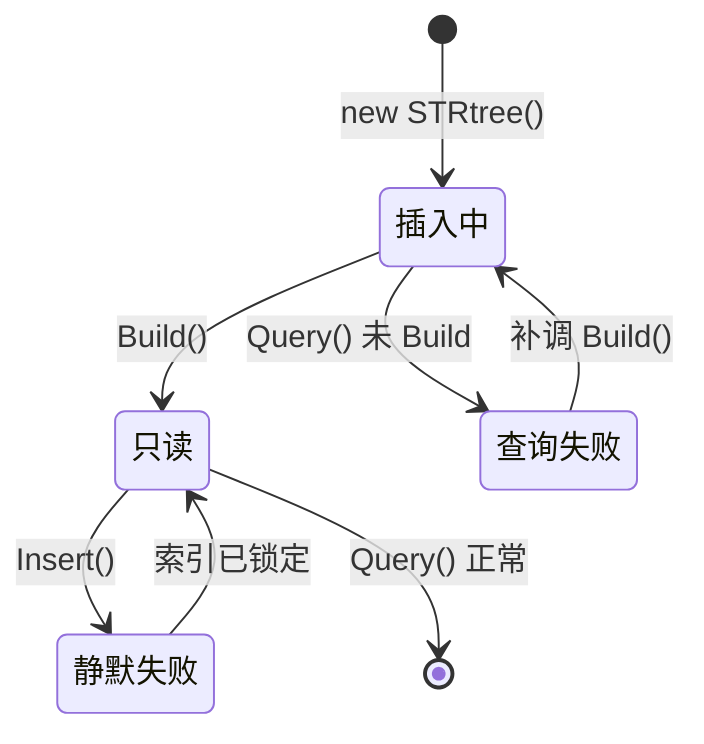

# 空间索引 STRtree

空间索引是空间数据库的"灵魂"——把 O(n) 的暴力搜索降到 O(log n)。NTS 内置了多种空间索引，其中 `STRtree` 是最常用、性能最均衡的 R-tree 变体。

## 为什么需要空间索引

假设你有 100 万个 POI，要找出某个矩形范围内的所有点：

```csharp
// ❌ 暴力：100 万次判断
var inBox = allPois.Where(p => envelope.Contains(p.Coordinate)).ToList();

// ✅ 索引：通常几千次判断
var tree = new STRtree<Point>();
foreach (var p in allPois) tree.Insert(p.EnvelopeInternal, p);
tree.Build();
var inBox = tree.Query(envelope).ToList();
```

对 100 万数据，索引查询通常 < 10ms，暴力遍历可能要数百毫秒。

## NTS 的空间索引家族

| 索引 | 数据结构 | 特点 | 适用 |
| --- | --- | --- | --- |
| `STRtree` | R-tree (Sort-Tile-Recursive) | **推荐默认**，平衡 | 通用矩形查询 |
| `Quadtree` | 四叉树 | 简单，适合均匀分布 | 中等数据量 |
| `KdTree` | k-d 树 | 仅点数据，最近邻强 | 最近邻 / 半径查询 |
| `HPRtree` | Hilbert Pack R-tree | 构建快，查询略慢 | 一次性构建 |
| `Bintree` | 一维区间 | 单维 | 线段索引 |

## STRtree 基础用法

```csharp
using NetTopologySuite.Index.Strtree;

// 1. 创建索引（指定节点容量，默认 10）
var tree = new STRtree<Point>();

// 2. 插入数据：每个项关联一个 Envelope（边界框）
tree.Insert(poi.EnvelopeInternal, poi);

// 3. 构建索引（必做！插入完调用一次）
tree.Build();

// 4. 查询
var candidates = tree.Query(queryEnvelope).ToList();
```

::: warning 别忘了 Build()
插入数据后必须调用 `Build()` 才能查询。在 `Build` 前调用 `Query` 会抛异常。

`STRtree` 在 `Build` 后变为只读——继续插入会被忽略。
:::



STRtree 的生命周期是一次性的：先批量插入，再 Build，之后只读。若需动态更新，请改用 `Quadtree`。

## 查询模式

### 1. 范围查询

```csharp
var env = new Envelope(116.3, 116.5, 39.85, 39.95);
var matched = tree.Query(env).ToList();
```

### 2. 带谓词的查询

`Query` 返回的是 **Envelope 相交** 的候选——粗过滤。需要再精确判断：

```csharp
var candidates = tree.Query(queryEnv);
var exact = candidates
    .Where(g => queryGeometry.Intersects(g))
    .ToList();
```

### 3. 自定义过滤

```csharp
tree.Query(queryEnv, item =>
{
    // 对每个候选项调用
    if (item.Intersects(queryGeometry))
        results.Add(item);
    return true;  // 继续遍历
});
```

## KdTree：最近邻王者

`KdTree` 专为点数据优化，做最近邻查询极快：

```csharp
using NetTopologySuite.Index.KdTree;

var kdtree = new KdTree<double>();
foreach (var p in points)
    kdtree.Insert(p.Coordinate, p.Value);

// 最近邻
var nearest = kdtree.NearestNeighbor(new Coordinate(5, 5));

// K 个最近邻
var kNearest = kdtree.NearestNeighbors(new Coordinate(5, 5), k: 10);

// 范围查询
var inRange = kdtree.Query(new Envelope(0, 10, 0, 10));
```

::: tip KdTree 限制
- 只支持 Point（不能存 Polygon / LineString）
- 不支持删除（重建即可）
- 内存占用比 STRtree 略高
:::

## Quadtree：四叉树

```csharp
using NetTopologySuite.Index.Quadtree;

var qt = new Quadtree<Polygon>();
foreach (var p in polygons)
    qt.Insert(p.EnvelopeInternal, p);

// Quadtree 支持动态删除
qt.Remove(p.EnvelopeInternal, p);

var matched = qt.Query(env);
```

四叉树的优势是 **支持动态增删**，适合数据频繁变化的场景。

## 实战：1 公里内的便利店

```csharp
// 假设坐标已投影到米制
var stores = LoadStores();   // 5 万家便利店

// 1. 构建 KdTree
var kdtree = new KdTree<Store>();
foreach (var s in stores)
    kdtree.Insert(s.Location.Coordinate, s);

// 2. 用户位置
var user = new Coordinate(500000, 3040000);

// 3. 找 1 公里内所有店
double radius = 1000;
var env = new Envelope(
    user.X - radius, user.X + radius,
    user.Y - radius, user.Y + radius);

var candidates = kdtree.Query(env)
    .Where(k => user.Distance(k.Coordinate) <= radius)
    .Select(k => k.Data)
    .ToList();
```

## 实战：找相交的多边形

1000 个多边形，找出与查询多边形相交的所有：

```csharp
var tree = new STRtree<Polygon>();
foreach (var p in polygons)
    tree.Insert(p.EnvelopeInternal, p);
tree.Build();

// 1. 用 Envelope 粗过滤
var candidates = tree.Query(queryPoly.EnvelopeInternal);

// 2. 用精确谓词二次过滤
var intersecting = candidates
    .Where(p => p.Intersects(queryPoly))
    .ToList();
```

::: tip 两阶段查询模式
这是空间索引的标准用法：

1. **粗过滤**：用 Envelope 相交，O(log n)
2. **精过滤**：用真实谓词，O(候选数)

候选数通常远小于总数据量，所以精过滤虽慢但可接受。如果还嫌慢，对查询几何用 `PreparedGeometry`。
:::


## 实战：批量最近邻（KNN）

对 1000 个用户，每个找最近的 3 家店：

```csharp
var kdtree = new KdTree<Store>();
foreach (var s in stores) kdtree.Insert(s.Location.Coordinate, s);

foreach (var user in users)
{
    var nearest3 = kdtree.NearestNeighbors(user.Coordinate, 3)
        .Select(k => k.Data)
        .ToList();
    // 处理 nearest3
}
```

## 索引选择指南

| 数据特征 | 推荐索引 |
| --- | --- |
| 通用、任意几何、只读 | STRtree |
| 仅点数据、要最近邻 | KdTree |
| 数据频繁增删 | Quadtree |
| 一次性构建、查询少 | HPRtree |
| 大型线段集 | MonotoneChain 或 MCIndex |

## 性能基准

对 100 万点 + 矩形查询：

| 索引 | 构建时间 | 查询时间 |
| --- | --- | --- |
| 暴力遍历 | 0 | ~400 ms |
| STRtree | ~600 ms | ~2 ms |
| KdTree | ~800 ms | ~1.5 ms |
| Quadtree | ~500 ms | ~3 ms |

## 内存与生命周期

- 索引本身占用内存（通常是数据量的 1.5~2 倍）
- 索引持有原始几何的引用，原始几何不能被 GC 回收
- 长生命周期索引要考虑内存压力，必要时重建

## 常见陷阱

### 1. 用错 Envelope

```csharp
// ❌ 用点本身的 Envelope（退化成单点）
tree.Insert(point.EnvelopeInternal, point);

// ✅ 用缓冲 Envelope，或用 KdTree
```

### 2. 忘记 Build

```csharp
var tree = new STRtree<int>();
tree.Insert(env, 1);
tree.Query(env);  // 抛异常或返回空
// 必须 tree.Build();
```

### 3. Build 后再插入

```csharp
tree.Build();
tree.Insert(...);  // ❌ 静默失败，索引已锁定
```

### 4. 直接信任 Query 结果

```csharp
// Query 返回的是 Envelope 相交，不是真实相交
var results = tree.Query(env);   // 可能误报
// 必须二次精确判断
```

## 小结

- `STRtree` 是通用默认选择
- `KdTree` 适合点数据的最近邻
- `Quadtree` 支持动态增删
- 永远是"粗过滤（Envelope） + 精过滤（谓词）"两阶段
- 不要忘记 `Build()`，不要 Build 后再 Insert

## 下一步

- [PreparedGeometry](./prepared-geometry.md)：精过滤加速
- [最近点与投影](../analysis/nearest-points.md)
- [API 速查表](../cookbook/cheatsheet.md)
