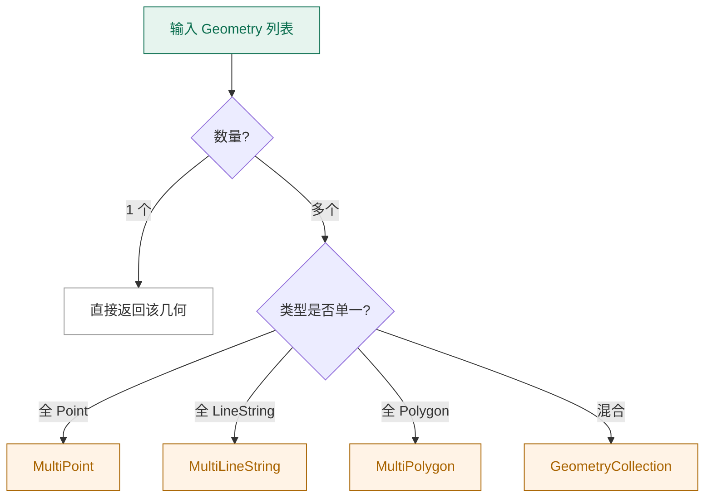

# 几何工厂 GeometryFactory

`GeometryFactory` 是 NTS 中所有几何对象的"出生地"。理解它，就理解了 NTS 的精度模型、SRID 与坐标顺序是如何贯穿整个系统的。

## 为什么要用工厂

你完全可以 `new Point(1, 2)`，但用工厂有几个好处：

1. **统一精度模型**：工厂产出的几何共享同一个 `PrecisionModel`，运算时不会出现"用浮点的点"和"用定点精度的线"打架的问题。
2. **统一 SRID**：所有几何自带空间参考 ID，便于跨几何运算。
3. **统一坐标序列工厂**：内存布局可定制（紧凑数组 vs 对象数组），影响性能。
4. **空对象**：工厂能创建"空 Point"、"空 LineString"——直接 `new` 难以表达。

## 构造一个工厂

```csharp
using NetTopologySuite.Geometries;

// 默认工厂
var f1 = new GeometryFactory();

// 指定精度 + SRID
var f2 = new GeometryFactory(
    new PrecisionModel(PrecisionModels.Floating),
    4326);   // WGS84

// 指定坐标序列工厂（性能调优）
var f3 = new GeometryFactory(
    new PrecisionModel(),
    0,
    new PackedCoordinateSequenceFactory());  // 紧凑存储
```

::: tip 推荐做法
在应用启动时创建 **一个** 单例 `GeometryFactory`，注入到需要的地方。不要每创建一个几何就 `new` 一个工厂——既慢，又会让 SRID/精度不一致。
:::

## 创建方法一览

```csharp
public class GeometryFactory
{
    // 空几何
    public Point CreateEmptyPoint();
    public LineString CreateLineString();   // 空 LineString
    public LinearRing CreateLinearRing();
    public Polygon CreatePolygon();
    public MultiPoint CreateEmptyMultiPoint();
    // ...

    // 从坐标
    public Point CreatePoint(Coordinate coordinate);
    public LineString CreateLineString(Coordinate[] coordinates);
    public LinearRing CreateLinearRing(Coordinate[] coordinates);
    public Polygon CreatePolygon(Coordinate[] shell);
    public Polygon CreatePolygon(LinearRing shell, LinearRing[] holes);

    // 从坐标序列
    public Point CreatePoint(CoordinateSequence coordinates);
    public LineString CreateLineString(CoordinateSequence coordinates);

    // 集合
    public MultiPoint CreateMultiPoint(Point[] points);
    public MultiPoint CreateMultiPoint(Coordinate[] coordinates);
    public MultiLineString CreateMultiLineString(LineString[] lineStrings);
    public MultiPolygon CreateMultiPolygon(Polygon[] polygons);
    public GeometryCollection CreateGeometryCollection(Geometry[] geometries);

    // 转换
    public Geometry BuildGeometry(ICollection<Geometry> geometries);
    public Geometry ToGeometry(Envelope envelope);
}
```

## 创建方法详解

### 点

```csharp
var p1 = factory.CreatePoint(new Coordinate(1, 2));

// 空点
var empty = factory.CreateEmptyPoint();
Console.WriteLine(empty.IsEmpty);   // True
Console.WriteLine(empty.Coordinate); // null
```

### 线

```csharp
var line = factory.CreateLineString(new[]
{
    new Coordinate(0, 0),
    new Coordinate(1, 1),
    new Coordinate(2, 0)
});

// 单点线 → NTS 会自动转成 Point
var single = factory.CreateLineString(new[] { new Coordinate(1, 1) });
Console.WriteLine(single.GeometryType);  // Point（NTS 自动降级）
```

### 环

```csharp
var ring = factory.CreateLinearRing(new[]
{
    new Coordinate(0, 0),
    new Coordinate(10, 0),
    new Coordinate(10, 10),
    new Coordinate(0, 10),
    new Coordinate(0, 0)
});

// LinearRing 要求至少 4 个点 + 闭合，否则抛 ArgumentException
```

### 多边形

```csharp
var shell = factory.CreateLinearRing(...);
var hole1 = factory.CreateLinearRing(...);
var hole2 = factory.CreateLinearRing(...);

var poly = factory.CreatePolygon(shell, new[] { hole1, hole2 });

// 捷径：直接用坐标数组创建无孔多边形
var simple = factory.CreatePolygon(new[]
{
    new Coordinate(0, 0),
    new Coordinate(10, 0),
    new Coordinate(10, 10),
    new Coordinate(0, 10),
    new Coordinate(0, 0)
});
```

### 集合

```csharp
var mp = factory.CreateMultiPoint(new[]
{
    new Point(0, 0),
    new Point(1, 1)
});

// 从 Coordinate 数组创建 MultiPoint（每个坐标变一个点）
var mp2 = factory.CreateMultiPoint(new[]
{
    new Coordinate(0, 0),
    new Coordinate(1, 1),
    new Coordinate(2, 2)
});
```

## BuildGeometry：智能聚合

`BuildGeometry` 接收一个 `Geometry` 列表，自动选择最合适的容器：



```csharp
var geoms = new List<Geometry>
{
    factory.CreatePoint(new Coordinate(0, 0)),
    factory.CreatePoint(new Coordinate(1, 1))
};

Geometry result = factory.BuildGeometry(geoms);
Console.WriteLine(result.GeometryType);  // MultiPoint
```

## ToGeometry：把 Envelope 变成几何

`Envelope` 是 NTS 的边界框类（minX, maxX, minY, maxY）。`ToGeometry` 把它转成 `Polygon`：

```csharp
var env = new Envelope(0, 10, 0, 10);
var poly = factory.ToGeometry(env);
Console.WriteLine(poly.GeometryType);  // Polygon
Console.WriteLine(poly.Area);          // 100
```

::: warning Envelope ≠ Polygon
`Envelope` 是一个 **轴对齐** 的边界框，没有旋转。它常用于空间索引的快速过滤。如果你要表达任意矩形多边形，用 `Polygon`。
:::

## SRID 与工厂的关系

工厂创建的几何会继承工厂的 SRID：

```csharp
var wgs84 = new GeometryFactory(new PrecisionModel(), 4326);
var p = wgs84.CreatePoint(new Coordinate(116.40, 39.90));
Console.WriteLine(p.SRID);  // 4326

// 不同 SRID 的几何互相运算时，NTS 不会校验——开发者自己负责
var webMercator = new GeometryFactory(new PrecisionModel(), 3857);
var p2 = webMercator.CreatePoint(new Coordinate(12958176, 4852834));
p.Distance(p2);  // 数值上有意义，但语义错误！
```

## 坐标序列工厂

每个 `GeometryFactory` 内部持有一个 `CoordinateSequenceFactory`，决定坐标如何存储：

| 实现 | 特点 | 适用 |
| --- | --- | --- |
| `CoordinateArraySequenceFactory` | 默认，存 `Coordinate[]` | 调试方便，灵活 |
| `PackedCoordinateSequenceFactory` | 紧凑 double 数组 | 大数据集，省内存 |

```csharp
// 紧凑模式：省内存约 40%
var packedFactory = new GeometryFactory(
    new PrecisionModel(),
    4326,
    PackedCoordinateSequenceFactory.DoubleFactory);

var line = packedFactory.CreateLineString(new[]
{
    new Coordinate(0, 0),
    new Coordinate(1, 1)
});
```

## 性能建议

1. **复用工厂**：一个应用一个工厂单例，不要每次创建。
2. **紧凑序列**：处理 10 万级以上几何时，切换到 `PackedCoordinateSequenceFactory`。
3. **避免反复创建 Coordinate[]**：从序列化数据恢复时，直接用 `CoordinateSequence` 接口。
4. **SRID 一致**：所有运算几何的 SRID 必须一致——养成习惯。

## 小结

- `GeometryFactory` 是 NTS 的"几何出生地"，统一精度、SRID、坐标存储
- 创建方法分两类：空几何 vs 从坐标/序列创建
- `BuildGeometry` 智能聚合，`ToGeometry` 把 Envelope 转 Polygon
- 复用单一工厂实例，性能与正确性双赢

## 下一步

- [精度模型 PrecisionModel](./precision-model.md)
- [WKT 与 WKB](./wkt-wkb.md)
- [空间谓词](../predicates/relationships.md)
