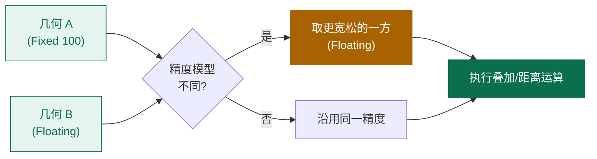

# 精度模型 PrecisionModel

浮点运算的精度问题是几何计算的"暗礁"。两个数学上应该相交的线，在浮点世界里可能恰好"擦肩而过"。NTS 用 `PrecisionModel` 来管理这种误差。

## 三种精度模型

```csharp
public enum PrecisionModels
{
    Floating = 0,           // 标准 IEEE 754 双精度
    FloatingSingle = 1,     // 单精度（较少用）
    Fixed = 2               // 固定精度（按 scale 取整）
}
```

### 1. Floating（默认）

最常见的模型，使用原始 `double` 精度，不做任何舍入。

```csharp
var pm = new PrecisionModel(PrecisionModels.Floating);
```

### 2. FloatingSingle

使用 `float` 精度，节省内存但损失精度。**极少使用**，因为现代 CPU 上 `double` 与 `float` 速度相当。

### 3. Fixed（固定精度）

把所有坐标按 `1 / scale` 网格量化。例如 `scale = 1000` 表示坐标精度为 0.001。

```csharp
var pm = new PrecisionModel(1000.0);  // scale=1000 → 精度 0.001

Console.WriteLine(pm.MakePrecise(1.23456));  // 1.235
Console.WriteLine(pm.MakePrecise(1.2344));   // 1.234
```

::: tip 何时用 Fixed
- 数据本身就有固定精度（如栅格坐标、栅格分块）
- 想消除浮点抖动带来的"伪相交"
- 与某些只支持定点精度的数据库交互
:::

## MakePrecise：把坐标拉到网格

`PrecisionModel.MakePrecise(double)` 是核心方法——它把任意 `double` 拉到该精度模型最近的精确值上。

```csharp
var pm = new PrecisionModel(100);
Console.WriteLine(pm.MakePrecise(1.234));  // 1.23
Console.WriteLine(pm.MakePrecise(1.235));  // 1.24（银行家舍入）
Console.WriteLine(pm.MakePrecise(1.236));  // 1.24
```

## 几何如何应用精度模型

`GeometryFactory` 在创建几何时，会调用精度模型对所有坐标 `MakePrecise`：

```csharp
var pm = new PrecisionModel(100);
var factory = new GeometryFactory(pm);

var p = factory.CreatePoint(new Coordinate(1.23456, 9.87654));
Console.WriteLine(p.X);  // 1.23
Console.WriteLine(p.Y);  // 9.88
```

但注意：**直接 `new Point(...)` 不会应用精度模型**！

```csharp
var p2 = new Point(1.23456, 9.87654);
Console.WriteLine(p2.X);  // 1.23456 ← 原样
```

## 运算中的精度

叠加运算（Union/Intersection 等）内部会使用输入几何的精度模型。如果两个几何精度模型不同，NTS 会取 **更宽松**（精度更低）的那个。



```csharp
var fFixed = new GeometryFactory(new PrecisionModel(100));
var fFloat = new GeometryFactory(new PrecisionModel(PrecisionModels.Floating));

var a = fFixed.CreatePoint(new Coordinate(1.234, 2.345));  // 1.23, 2.35
var b = fFloat.CreatePoint(new Coordinate(1.2341, 2.3451));

var dist = a.Distance(b);   // 0.00014...（用浮点）
```

## 浮点误差的真实后果

下面这个例子展示了"应该相交却没相交"的浮点陷阱：

```csharp
var factory = new GeometryFactory();

// 两条数学上应该相交的线，但浮点抖动让它"擦肩而过"
var line1 = factory.CreateLineString(new[]
{
    new Coordinate(0, 0),
    new Coordinate(10, 10)
});

var line2 = factory.CreateLineString(new[]
{
    new Coordinate(0, 10),
    new Coordinate(10, 0)
});

var isect = line1.Intersection(line2);
Console.WriteLine(isect.IsEmpty);  // False
Console.WriteLine(isect.AsText());  // POINT (5 5)
```

NTS 的几何算法经过精心设计，能在大多数情况下给出正确结果。但极端情况下仍可能出错，这时候用 **固定精度 + SnapRounding** 是一剂良方。

## SnapRounding：固定精度下的稳健求交

NTS 提供 `SnapRounding.Noder.SnapRoundingNoder`，用于在固定精度下处理线段求交，避免拓扑错误：

```csharp
using NetTopologySuite.Noding.SnapRounding;

// 创建一个固定精度的求交器
var pm = new PrecisionModel(100);   // 0.01 精度
var noder = new SnapRoundingNoder(pm);

// 把一组线段通过 noder 处理后，所有交点都会被"吸附"到网格点
// 适合做线段网络的批量求交
```

::: warning 高级主题
`SnapRoundingNoder` 是 NTS 的内部组件，主要用于 Overlay 算法。一般应用层很少直接使用，了解即可。如果你的数据频繁出现"自相交但 IsValid=True"或"Union 后掉点"问题，可以考虑降低精度模型 + snap rounding。
:::

## 选择精度模型的建议

| 场景 | 推荐模型 |
| --- | --- |
| Web API、一般应用 | `Floating` |
| 经纬度数据 | `Floating` |
| 栅格数据 / 像素坐标 | `Fixed(scale=1)` 或更高 |
| 高精度测量（毫米级） | `Fixed(scale=1000)` |
| 需要消除浮点抖动 | `Fixed` + snap rounding |

## 一个常见的坑：精度模型与 SRID 混淆

精度模型是"小数点后几位"的问题；SRID 是"哪个坐标系"的问题。两者完全独立，但都通过 `GeometryFactory` 设置：

```csharp
// 错误认知：以为设置 SRID=4326 就自动用经纬度精度
// 正确：SRID 与精度是两个独立的维度

var factory = new GeometryFactory(
    precisionModel: new PrecisionModel(PrecisionModels.Floating),  // 精度
    srid: 4326);                                                     // 坐标系
```

## 小结

- 精度模型控制坐标的小数位：Floating / FloatingSingle / Fixed
- `GeometryFactory` 创建几何时自动应用精度
- 不同精度的几何参与运算时，取更宽松的一方
- 浮点抖动问题可借助 Fixed + SnapRounding 缓解
- SRID 与精度模型是两件事，别混淆

## 下一步

- [WKT 与 WKB](./wkt-wkb.md)
- [空间谓词](../predicates/relationships.md)
- [几何操作：叠加分析](../operations/overlay.md)
