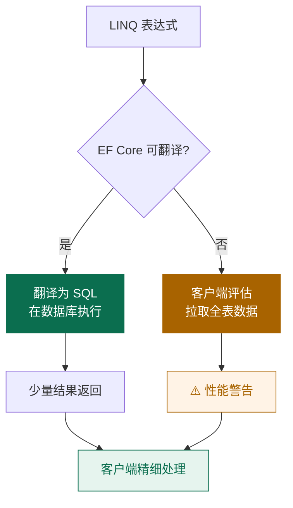

# EF Core 集成

Entity Framework Core 是 .NET 最流行的 ORM，原生支持空间数据类型——通过 NTS。本节演示如何在 EF Core 中存储、查询、操作几何数据。

## 支持的数据库

| 数据库 | NuGet 包 | 备注 |
| --- | --- | --- |
| SQL Server | `Microsoft.EntityFrameworkCore.SqlServer` | 原生支持，无需额外插件 |
| SQLite | `Microsoft.EntityFrameworkCore.Sqlite.NetTopologySuite` | 需要 NTS 插件 |
| PostgreSQL | `Npgsql.EntityFrameworkCore.PostgreSQL.NetTopologySuite` | 需要 NTS 插件 |
| MySQL | `Pomelo.EntityFrameworkCore.MySql.NetTopologySuite` | 社区插件 |

::: warning SQL Server 的特殊情况
SQL Server 有 `geography`（球面）和 `geometry`（平面）两种类型。EF Core 默认用 `geometry`。如果要用 `geography`，需要全局配置：

```csharp
optionsBuilder.UseSqlServer(connStr, sql => sql.UseNetTopologySuite());
// UseNetTopologySuite 是 SQL Server 提供的扩展
```
:::

## 安装与配置

以 SQLite 为例：

```bash
dotnet new webapi -n NtsEFDemo
cd NtsEFDemo

dotnet add package Microsoft.EntityFrameworkCore.Sqlite
dotnet add package Microsoft.EntityFrameworkCore.Sqlite.NetTopologySuite
dotnet add package Microsoft.EntityFrameworkCore.Design
```

`Program.cs` 或 `AppDbContext`：

```csharp
using Microsoft.EntityFrameworkCore;
using NetTopologySuite.Geometries;

public class AppDbContext : DbContext
{
    public DbSet<Place> Places => Set<Place>();
    public DbSet<Route> Routes => Set<Route>();

    protected override void OnConfiguring(DbContextOptionsBuilder options)
    {
        options.UseSqlite(
            "Data Source=nts.db",
            sqlite => sqlite.UseNetTopologySuite());   // 关键
    }
}

public class Place
{
    public int Id { get; set; }
    public string Name { get; set; } = "";
    public Point Location { get; set; } = default!;
}

public class Route
{
    public int Id { get; set; }
    public LineString Path { get; set; } = default!;
}
```

## Migration

```bash
dotnet ef migrations add AddSpatialTables
dotnet ef database update
```

生成的 SQL 会包含 `AddGeometryColumn` 调用（SQLite 用 SpatiaLite 扩展）或 `geometry` 类型定义。

## CRUD 操作

```csharp
// 插入
db.Places.Add(new Place
{
    Name = "天安门",
    Location = new Point(116.40, 39.90) { SRID = 4326 }
});
await db.SaveChangesAsync();

// 查询
var tiananmen = await db.Places
    .Where(p => p.Name == "天安门")
    .FirstAsync();
```

::: warning SRID 必须设置
EF Core 会把几何的 SRID 写入数据库。如果 SRID = 0（NTS 默认），数据库列的 SRID 也必须是 0，否则会冲突。**最佳实践：所有几何统一 SRID**，例如 4326。
:::

## 空间查询

EF Core 2.x+ 把 NTS 的方法翻译成 SQL 空间函数：

```csharp
// 距离查询
var nearby = await db.Places
    .Where(p => p.Location.Distance(origin) < 0.05)  // 0.05 度
    .OrderBy(p => p.Location.Distance(origin))
    .ToListAsync();

// 包含查询
var inArea = await db.Places
    .Where(p => boundary.Contains(p.Location))
    .ToListAsync();

// 相交
var intersecting = await db.Routes
    .Where(r => r.Path.Intersects(roadSegment))
    .ToListAsync();
```

EF Core 把这些方法翻译成 PostGIS / SpatiaLite / SQL Server 的对应函数。

## 可翻译的方法

| NTS 方法 | 翻译成的 SQL 函数 |
| --- | --- |
| `Distance(g)` | `ST_Distance` |
| `Buffer(d)` | `ST_Buffer` |
| `Intersects(g)` | `ST_Intersects` |
| `Contains(g)` | `ST_Contains` |
| `Within(g)` | `ST_Within` |
| `Covers(g)` | `ST_Covers` (PostGIS) |
| `Intersection(g)` | `ST_Intersection` |
| `Union(g)` | `ST_Union` |
| `Touches(g)` | `ST_Touches` |
| `Crosses(g)` | `ST_Crosses` |
| `Overlaps(g)` | `ST_Overlaps` |
| `Disjoint(g)` | `ST_Disjoint` |
| `IsValid` | `ST_IsValid` |
| `Area` | `ST_Area` |
| `Length` | `ST_Length` |
| `AsText()` | `ST_AsText` |

不可翻译的方法（会抛 `InvalidOperationException`）：
- `Buffer(d, BufferParameters)` —— 仅 `Buffer(d)` 重载可翻译
- `PreparedGeometry` —— 这是客户端优化，与 SQL 无关
- `NearestPoints` —— EF Core 不直接支持

## Client-side 评估

不能翻译的方法会被 EF Core 在客户端执行——拉取所有数据后再过滤。这通常很慢，需要警惕：



```csharp
// ⚠️ 警告：NearestPoints 不可翻译
var bad = await db.Places
    .Where(p => p.Location.NearestPoints(origin) != null)
    .ToListAsync();   // 会拉全部数据，然后客户端过滤
```

解决办法：用可翻译的方法先粗过滤，再客户端精细处理：

```csharp
// 1. 用距离 SQL 粗过滤
var candidates = await db.Places
    .Where(p => p.Location.Distance(origin) < 0.1)
    .ToListAsync();

// 2. 客户端精确算最近点
var result = candidates
    .Select(p => new { p, snap = DistanceOp.NearestPoints(p.Location, origin) })
    .OrderBy(x => x.snap[0].Distance(x.snap[1]))
    .First();
```

## 索引：让空间查询快起来

数据库的空间列需要建空间索引。EF Core 在 Migration 中可以这样手动添加：

```csharp
protected override void OnModelCreating(ModelBuilder mb)
{
    mb.Entity<Place>()
        .HasIndex(p => p.Location)
        .HasMethod("gist")        // PostGIS 用 GiST
        // SQLite SpatiaLite 用 R-tree
        ;
}
```

或在 Migration 文件中用 `migrationBuilder.Sql` 执行原生 SQL：

```csharp
// PostGIS
migrationBuilder.Sql("CREATE INDEX idx_places_location ON places USING GIST (location);");

// SpatiaLite
migrationBuilder.Sql("SELECT CreateSpatialIndex('places', 'location');");
```

::: tip 不建索引 = 暴力全表扫描
没有空间索引的 `ST_Intersects` 会扫描表里每一行。10 万行数据可能从 5ms 变成 5 秒。**永远给空间列建索引**。
:::

## 实战：附近的人

```csharp
public async Task<List<UserNearby>> FindNearby(Point center, double radiusDegrees)
{
    // 用 ST_DWithin (PostGIS) 或 Distance < r 优化
    var nearby = await db.Users
        .Where(u => u.Location.Distance(center) < radiusDegrees)
        .OrderBy(u => u.Location.Distance(center))
        .Take(50)
        .Select(u => new UserNearby
        {
            UserId = u.Id,
            Name = u.Name,
            Distance = u.Location.Distance(center)
        })
        .ToListAsync();

    return nearby;
}
```

## 实战：用户进入围栏通知

```csharp
public async Task<List<GeofenceAlert>> CheckGeofences(int userId, Point newLocation)
{
    var fences = await db.Geofences
        .Where(f => f.Boundary.Covers(newLocation))
        .ToListAsync();

    return fences.Select(f => new GeofenceAlert
    {
        UserId = userId,
        GeofenceId = f.Id,
        GeofenceName = f.Name,
        Timestamp = DateTime.UtcNow
    }).ToList();
}
```

## 序列化到 API

直接返回 `Geometry` 会触发循环引用等问题。推荐用专门的转换器：

```csharp
// Program.cs
builder.Services
    .AddControllers()
    .AddJsonOptions(o =>
    {
        o.JsonSerializerOptions.Converters.Add(new GeoJsonConverterFactory());
    });
```

`NetTopologySuite.IO.GeoJSON` 提供了 `GeoJsonConverterFactory`，能自动把 `Geometry` 序列化为标准 GeoJSON。

## 调试技巧

### 查看 EF Core 生成的 SQL

```csharp
options.UseSqlite(connStr, sql => sql.UseNetTopologySuite())
       .LogTo(Console.WriteLine, LogLevel.Information);
```

或在查询时调用 `.ToQueryString()`：

```csharp
var q = db.Places.Where(p => p.Location.Distance(origin) < 0.05);
Console.WriteLine(q.ToQueryString());
```

### 验证几何在数据库里的样子

```sql
-- PostGIS
SELECT name, ST_AsText(location), ST_SRID(location) FROM places LIMIT 5;

-- SpatiaLite
SELECT name, AsText(location), SRID(location) FROM places LIMIT 5;
```

## 小结

- EF Core 原生支持 NTS，通过 `UseNetTopologySuite()` 启用
- 多数 NTS 方法可翻译成 SQL 空间函数
- 不可翻译的方法要警惕客户端评估
- **空间列必须建索引**，否则查询极慢
- SRID 必须一致，否则数据库会报错

## 下一步

- [数据库与 PostGIS](./databases.md)
- [API 速查表](../cookbook/cheatsheet.md)
- [常见问题 FAQ](../cookbook/faq.md)
