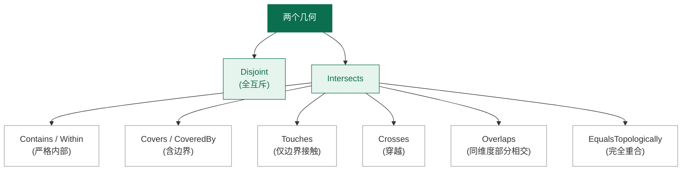

# 空间关系与谓词

空间谓词回答"两个几何之间是什么关系"——这是空间查询的核心。NTS 实现了 OGC 定义的八大谓词，外加两个扩展谓词，全部基于 [DE-9IM 模型](./de9im.md)。本页先建立 interior/boundary/exterior 的概念基础，再逐个详解每个谓词的签名、语义、可运行示例与陷阱。

```csharp
using NetTopologySuite.Geometries;

// 本页示例共用工厂
var factory = new GeometryFactory();
```

## 八大谓词速览

| 谓词 | 方法 | 含义 |
| --- | --- | --- |
| Intersects | `g1.Intersects(g2)` | 至少有一个公共点（最快） |
| Disjoint | `g1.Disjoint(g2)` | 完全没有公共点 |
| Contains | `g1.Contains(g2)` | g2 完全在 g1 内部（严格） |
| Within | `g1.Within(g2)` | g1 完全在 g2 内部（严格） |
| Covers | `g1.Covers(g2)` | g2 被 g1 覆盖（含边界，NTS 扩展） |
| CoveredBy | `g1.CoveredBy(g2)` | g1 被 g2 覆盖（含边界，NTS 扩展） |
| Touches | `g1.Touches(g2)` | 仅在边界上接触 |
| Crosses | `g1.Crosses(g2)` | 穿越关系，结果维度低于两者 |
| Overlaps | `g1.Overlaps(g2)` | 同维度部分相交，互不包含 |
| EqualsTopologically | `g1.EqualsTopologically(g2)` | 两几何拓扑相同 |

## 关键概念：interior / boundary / exterior

每个几何在拓扑上被分成三部分：**interior**（内部）、**boundary**（边界）、**exterior**（外部）。所有谓词本质上都在描述这三部分之间的交集关系。

<figure class="nts-diagram">
<svg viewBox="0 0 340 200" width="340" height="200">
  <rect x="10" y="10" width="320" height="180" fill="rgba(11,110,79,0.06)" stroke="#0b6e4f" stroke-width="1.5" stroke-dasharray="4 4"/>
  <rect x="50" y="40" width="240" height="120" fill="rgba(11,110,79,0.14)" stroke="#0b6e4f" stroke-width="2"/>
  <rect x="100" y="70" width="140" height="60" fill="rgba(11,110,79,0.32)" stroke="#0b6e4f" stroke-width="2"/>
  <text x="20" y="28" font-family="monospace" font-size="11" fill="#0b6e4f">exterior（外部）</text>
  <text x="60" y="58" font-family="monospace" font-size="11" fill="#0b6e4f">boundary（边界）</text>
  <text x="110" y="88" font-family="monospace" font-size="11" fill="#fff">interior（内部）</text>
</svg>
<figcaption>每个几何被分为 interior / boundary / exterior 三部分</figcaption>
</figure>

不同几何类型的 boundary 规则：

| 几何 | interior | boundary |
| --- | --- | --- |
| Point | 点本身 | 空 |
| LineString | 除端点外的所有点 | 两个端点 |
| LinearRing（闭合环） | 除端点外的所有点 | 空 |
| Polygon | 内部区域 | 外壳 + 所有孔洞环 |

::: tip 理解这三部分是掌握谓词的关键
`Contains` 严格内部、`Covers` 含边界、`Touches` 仅边界接触——这些差异全部源于对 interior/boundary/exterior 交集的不同要求。
:::

## 谓词关系总图



记忆要点：

- `Disjoint` 与 `Intersects` 互为补集
- `Contains`、`Within` 互为对称
- `Covers`、`CoveredBy` 互为对称
- `Covers` ⊃ `Contains`（Covers 允许边界接触）
- `Crosses` 与 `Overlaps` 在同维度下互斥

---

## Intersects / Disjoint

**签名**：
```csharp
public bool Intersects(Geometry g);
public bool Disjoint(Geometry g);
```

**语义**：

- `Intersects`：两几何至少有一个公共点（interior 或 boundary 有交集）
- `Disjoint`：两几何完全没有公共点

两者互为补集：`a.Intersects(b) == !a.Disjoint(b)`，恒成立。

```csharp
var a = factory.CreatePolygon(new[]
{
    new Coordinate(0, 0), new Coordinate(10, 0), new Coordinate(10, 10),
    new Coordinate(0, 10), new Coordinate(0, 0)
});
var p = factory.CreatePoint(new Coordinate(5, 5));    // 内部点
var q = factory.CreatePoint(new Coordinate(20, 20));  // 外部点

Console.WriteLine(a.Intersects(p));  // True
Console.WriteLine(a.Disjoint(p));    // False
Console.WriteLine(a.Intersects(q));  // False
Console.WriteLine(a.Disjoint(q));    // True
// 两者恒为补集
Console.WriteLine(a.Intersects(p) == !a.Disjoint(p));  // True
```

**输出**：
```
True
False
False
True
True
```

::: tip Intersects 是最快的谓词
`Intersects` 只要找到**一个**公共点就立即返回 `true`，不需要计算完整交集几何。在大量数据中筛选候选对象时，**永远先用 Intersects 粗过滤**，再用更严格的谓词二次判断。
:::

::: warning Disjoint 通常更慢
`Disjoint` 必须确认"没有任何公共点"，往往要完整计算交集才能下结论。需要"不相交"判断时，用 `!a.Intersects(b)` 通常比 `a.Disjoint(b)` 更快。
:::

## Contains / Within

**签名**：
```csharp
public bool Contains(Geometry g);   // this 是否包含 g
public bool Within(Geometry g);     // this 是否在 g 内
```

**语义**：

- `Contains`：`g` 的所有点都在 `this` 的 **interior** 内（不含 `this` 的边界）
- `Within`：`this` 的所有点都在 `g` 的 **interior** 内

两者互为对称：`a.Contains(b) == b.Within(a)`，恒成立。这是 **严格内部** 关系——落在边界上的点不算。

```csharp
var polygon = factory.CreatePolygon(new[]
{
    new Coordinate(0, 0), new Coordinate(10, 0), new Coordinate(10, 10),
    new Coordinate(0, 10), new Coordinate(0, 0)
});

var inside = factory.CreatePoint(new Coordinate(5, 5));   // 内部
var onEdge = factory.CreatePoint(new Coordinate(0, 5));   // 边界上

Console.WriteLine(polygon.Contains(inside));  // True
Console.WriteLine(inside.Within(polygon));    // True（等价于上式）
Console.WriteLine(polygon.Contains(onEdge));  // False！边界不算
```

**输出**：
```
True
True
False
```

<figure class="nts-diagram">
<svg viewBox="0 0 360 150" width="360" height="150">
  <rect x="30" y="30" width="120" height="90" fill="rgba(11,110,79,0.2)" stroke="#0b6e4f" stroke-width="2"/>
  <circle cx="90" cy="75" r="4" fill="#0b6e4f"/>
  <text x="98" y="79" font-family="monospace" font-size="10" fill="#0b6e4f">inside → Contains=True</text>
  <rect x="200" y="30" width="120" height="90" fill="rgba(11,110,79,0.2)" stroke="#0b6e4f" stroke-width="2"/>
  <circle cx="200" cy="75" r="4" fill="#a00"/>
  <text x="208" y="79" font-family="monospace" font-size="10" fill="#a00">onEdge → Contains=False</text>
</svg>
<figcaption>Contains 是严格内部关系：落在边界上的点不算被包含</figcaption>
</figure>

::: warning 边界陷阱
OGC `Contains` / `Within` 是 **严格内部** 关系：如果点正好在边界上，返回 `false`。这是最常见的谓词踩坑点。

如果你需要"边界也算包含"，用 `Covers` / `CoveredBy`。日常业务（如"点是否在行政区内"）几乎总是该用 `Covers`。
:::

## Covers / CoveredBy

**签名**：
```csharp
public bool Covers(Geometry g);      // this 是否覆盖 g（含边界）
public bool CoveredBy(Geometry g);   // this 是否被 g 覆盖（含边界）
```

**语义**：

- `Covers`：`g` 的所有点都在 `this` 的 **interior 或 boundary** 内（含边界）
- `CoveredBy`：`this` 的所有点都在 `g` 的 **interior 或 boundary** 内

两者互为对称：`a.Covers(b) == b.CoveredBy(a)`。这是 NTS 对 OGC 谓词的扩展，比 `Contains`/`Within` 更符合直觉——边界点也算"在内"。

```csharp
var polygon = factory.CreatePolygon(new[]
{
    new Coordinate(0, 0), new Coordinate(10, 0), new Coordinate(10, 10),
    new Coordinate(0, 10), new Coordinate(0, 0)
});

var inside = factory.CreatePoint(new Coordinate(5, 5));
var onEdge = factory.CreatePoint(new Coordinate(0, 5));

Console.WriteLine(polygon.Covers(inside));    // True
Console.WriteLine(polygon.Covers(onEdge));    // True（含边界）
Console.WriteLine(onEdge.CoveredBy(polygon)); // True
Console.WriteLine(polygon.Contains(onEdge));  // False（对比：Contains 不含边界）
```

**输出**：
```
True
True
True
False
```

<figure class="nts-diagram">
<svg viewBox="0 0 360 150" width="360" height="150">
  <rect x="30" y="30" width="120" height="90" fill="rgba(11,110,79,0.2)" stroke="#0b6e4f" stroke-width="2"/>
  <circle cx="90" cy="75" r="4" fill="#0b6e4f"/>
  <text x="98" y="79" font-family="monospace" font-size="10" fill="#0b6e4f">inside → Covers=True</text>
  <rect x="200" y="30" width="120" height="90" fill="rgba(11,110,79,0.2)" stroke="#0b6e4f" stroke-width="2"/>
  <circle cx="200" cy="75" r="4" fill="#0b6e4f"/>
  <text x="208" y="79" font-family="monospace" font-size="10" fill="#0b6e4f">onEdge → Covers=True</text>
</svg>
<figcaption>Covers 含边界：内部点和边界点都算被覆盖</figcaption>
</figure>

::: tip 日常业务优先用 Covers
`Covers` 比 `Contains` 更实用，几乎总是更符合业务直觉。常见场景对照：

| 场景 | 推荐 |
| --- | --- |
| 用户是否在配送区内 | `Covers` |
| 餐厅是否在行政区里 | `Covers` |
| 严格拓扑判定（学术、规范要求） | `Contains` / `Within` |

此外 `Covers` 在实现上比 `Contains` 更稳健——它不依赖 interior 的完整计算，浮点误差更小。
:::

## Touches

**签名**：
```csharp
public bool Touches(Geometry g);
```

**语义**：两几何仅在 **boundary** 上有公共点，interior 不相交。换句话说：有交集，但交集只在边界上。

`Touches` 是 `Intersects` 的子集——`Touches` 为 `true` 时 `Intersects` 必为 `true`，反之不成立。

```csharp
var a = factory.CreatePolygon(new[]
{
    new Coordinate(0, 0), new Coordinate(5, 0), new Coordinate(5, 5),
    new Coordinate(0, 5), new Coordinate(0, 0)
});
var b = factory.CreatePolygon(new[]
{
    new Coordinate(5, 0), new Coordinate(10, 0), new Coordinate(10, 5),
    new Coordinate(5, 5), new Coordinate(5, 0)
});

Console.WriteLine(a.Touches(b));     // True（共享一条边 x=5）
Console.WriteLine(a.Intersects(b));  // True
Console.WriteLine(a.Overlaps(b));    // False（interior 无交集）
Console.WriteLine(a.Crosses(b));     // False（同维度不能用 Crosses）
```

**输出**：
```
True
True
False
False
```

::: warning Touches 要求双方都有 boundary
`Point` 的 boundary 是空的，所以两个 `Point` 之间、或 `Point` 与其它几何之间永远不会 `Touches`。`Touches` 最常见于多边形共边、线段共端点、多边形与线在边上接触的场景。
:::

## Crosses

**签名**：
```csharp
public bool Crosses(Geometry g);
```

**语义**："穿越"关系——两几何相交，且交集的维度 **严格低于** 两者维度的最大值，同时双方的 interior 都有参与。`Crosses` 是对称的：`a.Crosses(b) == b.Crosses(a)`。

典型场景：河流穿过省界、铁路穿过城市、两条道路在路口相交。

```csharp
var poly = factory.CreatePolygon(new[]
{
    new Coordinate(0, 0), new Coordinate(10, 0), new Coordinate(10, 10),
    new Coordinate(0, 10), new Coordinate(0, 0)
});
var line = factory.CreateLineString(new[]
{
    new Coordinate(-1, 5), new Coordinate(11, 5)
});

Console.WriteLine(poly.Crosses(line));  // True（线穿过面，交集是 1 维线段）
Console.WriteLine(line.Crosses(poly));  // True（对称）
```

**输出**：
```
True
True
```

<figure class="nts-diagram">
<svg viewBox="0 0 360 150" width="360" height="150">
  <rect x="60" y="30" width="120" height="90" fill="rgba(11,110,79,0.2)" stroke="#0b6e4f" stroke-width="2"/>
  <line x1="20" y1="75" x2="220" y2="75" stroke="#a00" stroke-width="2.5"/>
  <text x="80" y="24" font-family="monospace" font-size="10" fill="#0b6e4f">Polygon</text>
  <text x="20" y="68" font-family="monospace" font-size="10" fill="#a00">LineString</text>
  <text x="250" y="79" font-family="monospace" font-size="10" fill="#333">Crosses=True（交集为线段）</text>
</svg>
<figcaption>Crosses：线穿过面，交集维度(1)低于面维度(2)</figcaption>
</figure>

::: warning Crosses 的维度规则
`Crosses` 对维度有严格要求，不同组合语义不同：

| 组合 | 交集维度 | 是否可用 Crosses |
| --- | --- | --- |
| Line × Line | 0（点） | 可用 |
| Line × Polygon | 1（线段） | 可用 |
| Polygon × Polygon | — | **不可用**（同维度），改用 `Overlaps` |

同维度的两个多边形相交不叫"穿越"——那是 `Overlaps` 的范畴。`Crosses` 只在"低维穿高维"或"同维交于更低维"时成立。
:::

## Overlaps

**签名**：
```csharp
public bool Overlaps(Geometry g);
```

**语义**：同维度的"部分相交"——两几何维度相同，interior 有交集，但谁也不包含谁，交集几何与原几何维度相同。简单说：既不是包含，也不是不相交，而是"搭界重叠"。

```csharp
var a = factory.CreatePolygon(new[]
{
    new Coordinate(0, 0), new Coordinate(10, 0), new Coordinate(10, 10),
    new Coordinate(0, 10), new Coordinate(0, 0)
});
var b = factory.CreatePolygon(new[]
{
    new Coordinate(5, 5), new Coordinate(15, 5), new Coordinate(15, 15),
    new Coordinate(5, 15), new Coordinate(5, 5)
});

Console.WriteLine(a.Overlaps(b));    // True（相交区 [5,10]×[5,10]，互不包含）
Console.WriteLine(a.Intersects(b));  // True
Console.WriteLine(a.Contains(b));    // False
Console.WriteLine(b.Contains(a));    // False
```

**输出**：
```
True
True
False
False
```

<figure class="nts-diagram">
<svg viewBox="0 0 360 150" width="360" height="150">
  <rect x="30" y="30" width="100" height="100" fill="rgba(11,110,79,0.2)" stroke="#0b6e4f" stroke-width="2"/>
  <rect x="80" y="80" width="100" height="100" fill="rgba(11,110,79,0.2)" stroke="#0b6e4f" stroke-width="2"/>
  <rect x="80" y="80" width="50" height="50" fill="rgba(11,110,79,0.45)" stroke="#0b6e4f" stroke-width="1.5"/>
  <text x="50" y="24" font-family="monospace" font-size="10" fill="#0b6e4f">a</text>
  <text x="165" y="175" font-family="monospace" font-size="10" fill="#0b6e4f">b</text>
  <text x="95" y="108" font-family="monospace" font-size="9" fill="#fff">交集</text>
  <text x="200" y="60" font-family="monospace" font-size="10" fill="#333">Overlaps=True（同维度部分相交）</text>
</svg>
<figcaption>Overlaps：两个同维度多边形部分相交，互不包含</figcaption>
</figure>

::: warning Overlaps 要求同维度
`Overlaps` 只在两几何 **维度相同** 时成立。两个 `Polygon` 部分相交、两条 `LineString` 部分重合都适用；但 `Polygon` 与 `LineString` 之间不会 `Overlaps`（维度不同），那种情况属于 `Crosses` 或 `Touches`。
:::

## EqualsTopologically / EqualsExact / EqualsNormalized

**签名**：
```csharp
public bool EqualsTopologically(Geometry g);  // 拓扑相等
public bool EqualsExact(Geometry g);          // 严格逐点比较
public bool EqualsNormalized(Geometry g);     // 归一化后逐点比较
```

**语义**：三种"相等"的比较方式，严格程度依次递减（语义上）：

| 方法 | 比较方式 | 顶点顺序敏感 |
| --- | --- | --- |
| `EqualsExact` | 逐顶点比较，坐标与顺序必须完全相同 | 是 |
| `EqualsNormalized` | 双方先 `Normalize()` 再逐点比较 | 否（归一化消除顺序差异） |
| `EqualsTopologically` | 拓扑相等，只要覆盖同一区域即可 | 否 |

```csharp
var a = factory.CreatePolygon(new[]
{
    new Coordinate(0, 0), new Coordinate(10, 0), new Coordinate(10, 10),
    new Coordinate(0, 10), new Coordinate(0, 0)
});
// 顶点顺序不同，但同一个多边形
var b = factory.CreatePolygon(new[]
{
    new Coordinate(10, 10), new Coordinate(10, 0), new Coordinate(0, 0),
    new Coordinate(0, 10), new Coordinate(10, 10)
});

Console.WriteLine(a.EqualsExact(b));          // False（顶点顺序不同）
Console.WriteLine(a.EqualsNormalized(b));     // True（归一化后一致）
Console.WriteLine(a.EqualsTopologically(b));  // True（拓扑相等）
```

**输出**：
```
False
True
True
```

::: tip 选哪个？
- 判断"两几何是否表示同一片地" → `EqualsTopologically`（最常用，但内部计算较重）
- 判断"两几何是否逐点一致" → `EqualsExact`（最快，用于缓存键、去重）
- 折中：`EqualsNormalized`（先归一化再逐点比，比拓扑相等快）

注意 `EqualsExact` 受 `PrecisionModel` 影响——若两几何来自不同工厂、精度模型不同，可能本应相等却返回 `False`。
:::

::: warning 不要用 .NET 的 Equals()
`object.Equals` / `==` 在 NTS 中是引用比较，不是几何相等。判断几何相等必须用上述三个方法之一。
:::

## Relate(pattern)

**签名**：
```csharp
public bool Relate(Geometry g, string intersectionPattern);
public IntersectionMatrix Relate(Geometry g);  // 返回完整 DE-9IM 矩阵
```

**语义**：每个谓词背后都是 DE-9IM 矩阵的某个模式。`Relate(pattern)` 让你直接指定 9 字符模式字符串，自定义谓词。模式字符含义：

- `T`：对应交集非空（维度 ≥ 0）
- `F`：对应交集为空
- `0/1/2`：对应交集恰好为该维度
- `*`：任意（不关心）

9 个字符按行优先排列，对应 `[I(a)∩I(b), I(a)∩B(b), I(a)∩E(b), B(a)∩I(b), B(a)∩B(b), B(a)∩E(b), E(a)∩I(b), E(a)∩B(b), E(a)∩E(b)]`（I=interior, B=boundary, E=exterior）。

```csharp
var a = factory.CreatePolygon(new[]
{
    new Coordinate(0, 0), new Coordinate(10, 0), new Coordinate(10, 10),
    new Coordinate(0, 10), new Coordinate(0, 0)
});
var p = factory.CreatePoint(new Coordinate(5, 5));

// 等价于 p.Within(a)：p 的 interior 在 a 的 interior 内，不接触 a 的 exterior
Console.WriteLine(p.Relate(a, "T*F**F***"));  // True

// 弱条件：p 的 interior 与 a 的 interior 有交集
Console.WriteLine(p.Relate(a, "T********"));  // True

// 获取完整 DE-9IM 矩阵
IntersectionMatrix m = a.Relate(p);
Console.WriteLine(m);  // 例如 "2FF10FF2"
```

**输出**：
```
True
True
2FF10FF2
```

::: tip 常用谓词的 DE-9IM 模式
| 谓词 | 模式 |
| --- | --- |
| Intersects | `T********` 或 `*T*******` 或 `***T*****` 或 `****T****`（任一非空即可） |
| Disjoint | `FF*FF****` |
| Contains | `T*****FF*` |
| Within | `T*F**F***` |
| Covers | `T*****FF*` 或 `*T****FF*` |
| Touches | `FT*******` 或 `F**T*****` 或 `F***T****` |
| Crosses（线×面） | `T*T******` |

需要自定义谓词时（如"两几何相交但边界不接触"），直接拼模式字符串即可，不必自己算矩阵。
:::

## 谓词的边界情况

### 空几何的行为

空几何是合法几何（不是 `null`），参与谓词时有明确规则：

- `empty.Intersects(any)` → `False`
- `empty.Disjoint(any)` → `True`
- `empty.Contains(any)` / `empty.Within(any)` → `False`（除非 `any` 也是空）
- `empty.EqualsTopologically(empty)` → `True`
- 两个空几何互相 `Disjoint`、`EqualsTopologically` 为 `True`，其余谓词多为 `False`

```csharp
var empty = factory.CreatePolygon();
var p = factory.CreatePoint(new Coordinate(0, 0));

Console.WriteLine(empty.Intersects(p));   // False
Console.WriteLine(empty.Disjoint(p));     // True
Console.WriteLine(empty.Contains(p));     // False
Console.WriteLine(empty.EqualsTopologically(factory.CreatePolygon()));  // True
```

::: warning 先判 IsEmpty 再做谓词
空间查询结果常产生空几何（如两几何不相交时的 `Intersection`）。谓词前用 `IsEmpty` 防御，避免误把"无结果"当"有意义的关系"。
:::

### GeometryCollection 的行为

`Multi*` 与 `GeometryCollection` 的谓词按"任一子几何满足即成立"的语义计算，无需手动遍历：

```csharp
var multi = factory.CreateMultiPolygon(new[]
{
    factory.CreatePolygon(new[]
    {
        new Coordinate(0, 0), new Coordinate(5, 0), new Coordinate(5, 5),
        new Coordinate(0, 5), new Coordinate(0, 0)
    }),
    factory.CreatePolygon(new[]
    {
        new Coordinate(100, 100), new Coordinate(110, 100), new Coordinate(110, 110),
        new Coordinate(100, 110), new Coordinate(100, 100)
    })
});

var p1 = factory.CreatePoint(new Coordinate(2, 2));
var p2 = factory.CreatePoint(new Coordinate(105, 105));

Console.WriteLine(multi.Covers(p1));  // True（落在第 0 个子多边形内）
Console.WriteLine(multi.Covers(p2));  // True（落在第 1 个子多边形内）
```

::: tip 不必手动遍历 Multi*
`MultiPolygon.Contains(point)` 在任一子多边形包含该点时返回 `true`，NTS 内部已做遍历。手写循环反而更慢且可能遗漏边界情况。
:::

## 谓词的互斥与包含关系

理解谓词之间的逻辑关系，有助于选对谓词、避免重复判断：

| 关系 | 说明 |
| --- | --- |
| `Intersects` ⊃ `Touches` | `Touches` 是 `Intersects` 的子集 |
| `Intersects` ⊃ `Crosses` | `Crosses` 是 `Intersects` 的子集 |
| `Intersects` ⊃ `Overlaps` | `Overlaps` 是 `Intersects` 的子集 |
| `Intersects` ⊃ `Contains`/`Within` | 包含关系必相交 |
| `Intersects` ⊃ `Covers`/`CoveredBy` | 覆盖关系必相交 |
| `Disjoint` = `!Intersects` | 严格互补 |
| `Contains` ↔ `Within` | 对称：`a.Contains(b) == b.Within(a)` |
| `Covers` ↔ `CoveredBy` | 对称：`a.Covers(b) == b.CoveredBy(a)` |
| `Covers` ⊃ `Contains` | `Contains` 为 `true` 时 `Covers` 必为 `true` |
| `Crosses` ⊥ `Overlaps`（同维度） | 互斥：同维度下两者不会同时成立 |
| `Touches` ⊥ `Crosses`/`Overlaps` | `Touches` 要求 interior 不相交，与后两者互斥 |

::: tip Crosses 与 Overlaps 的互斥
同维度的两个几何若 interior 相交，要么 `Overlaps`（交集同维度），要么 `Contains`/`Covers`（一方包含另一方）。`Crosses` 只在交集维度严格更低时成立，所以 **同维度下 Crosses 与 Overlaps 互斥**。这就是为什么 `Crosses` 不适用于两个多边形——那种情况只能用 `Overlaps`。
:::

## 性能：Intersects 粗过滤模式

### 两步过滤法

面对大量候选几何时，用"快谓词粗筛 + 慢谓词精筛"的两步法：

```csharp
var district = LoadDistrictPolygon();   // 区县多边形
var pois = LoadAllPois();               // 1 万个 POI

// 第一步：用 Intersects 粗过滤，剔除大部分明显不在范围内的 POI
var candidates = pois.Where(p => district.Intersects(p)).ToList();

// 第二步：用更严格的 Covers 精确判断
var result = candidates.Where(p => district.Covers(p)).ToList();
```

`Intersects` 内部会用 envelope（外接矩形）做快速排除，绝大多数候选项在这一步被滤掉，只有少数进入昂贵的精确计算。

### PreparedGeometry：同一几何多次判定

若对 **同一个几何** 做多次谓词判断（如检查 1 万个点是否在一个城市多边形内），用 `PreparedGeometry`：

```csharp
using NetTopologySuite.Geometries.Prepared;

var city = LoadCityPolygon();
var preparedCity = PreparedGeometryFactory.Prepare(city);

// 预先构建索引后，重复判定速度提升 10~100 倍
var inside = pois.Where(p => preparedCity.Covers(p)).ToList();
```

`PreparedGeometry` 预先构建空间索引和拓扑结构，对反复查询同一几何的场景提速显著。详见 [PreparedGeometry](../advanced/prepared-geometry.md)。

## 常见陷阱总结

### 1. 边界上的点

```csharp
district.Contains(pointOnEdge);  // False！
district.Covers(pointOnEdge);    // True
```

日常业务用 `Covers`，避免边界遗漏。

### 2. MultiPolygon 不用手动遍历

`MultiPolygon.Contains(point)` 在任一子多边形包含该点时返回 `true`，NTS 内部已处理。

### 3. 浮点精度导致 false negative

```csharp
// 应该相交，但浮点误差让它"擦肩而过"
a.Intersects(b);  // 可能返回 false
```

应对方案：
- 降低 `PrecisionModel`（用 `Fixed`）
- 对几何做轻微 `Buffer(epsilon)` 再判断
- 优先用 `Covers`（对浮点误差更稳健）

### 4. 用错相等比较

```csharp
a.Equals(b);   // 这是 object.Equals，引用比较！
a == b;        // 同上，引用比较！
// 正确做法
a.EqualsTopologically(b);
```

### 5. 同维度误用 Crosses

两个多边形部分相交时，`Crosses` 返回 `false`——那是 `Overlaps` 的场景。`Crosses` 只用于低维穿高维（线穿面）或同维交于更低维（线×线交于点）。

### 6. SRID 不一致

NTS **不校验** SRID 一致性。混用 4326（经纬度）和 3857（Web 墨卡托）的几何做谓词，会得到无意义结果。约定所有几何来自同一 `GeometryFactory`，自然共享 SRID。

## 小结

| 谓词 | 方法 | 用途 | 关键特性 |
| --- | --- | --- | --- |
| Intersects | `Intersects` | 任何公共点 | 最快，粗过滤首选 |
| Disjoint | `Disjoint` | 完全不相交 | Intersects 的补集 |
| Contains | `Contains` | 严格包含 | 不含边界 |
| Within | `Within` | 严格被包含 | Contains 的对称 |
| Covers | `Covers` | 覆盖（含边界） | NTS 扩展，日常推荐 |
| CoveredBy | `CoveredBy` | 被覆盖（含边界） | Covers 的对称 |
| Touches | `Touches` | 仅边界接触 | interior 不相交 |
| Crosses | `Crosses` | 穿越关系 | 结果维度更低 |
| Overlaps | `Overlaps` | 同维度部分相交 | 互不包含 |
| EqualsTopologically | `EqualsTopologically` | 拓扑相等 | 顶点顺序无关 |
| EqualsExact | `EqualsExact` | 逐点相等 | 顺序敏感，最快 |
| EqualsNormalized | `EqualsNormalized` | 归一化后相等 | 折中方案 |
| Relate | `Relate(pattern)` | 自定义 DE-9IM | 灵活定制 |

选型速查：

- 默认业务判定 → `Covers` / `CoveredBy`
- 批量筛选 → `Intersects` 粗过滤 + `PreparedGeometry`
- 严格学术/规范 → `Contains` / `Within`
- 同维度重叠 → `Overlaps`
- 穿越关系 → `Crosses`
- 自定义关系 → `Relate(pattern)`

## 下一步

- [DE-9IM 模型](./de9im.md)：理解谓词背后的数学
- [PreparedGeometry](../advanced/prepared-geometry.md)：谓词性能优化
- [空间索引 STRtree](../advanced/spatial-index.md)：批量查询加速
- [几何属性](../core/geometry-properties.md)：几何自身的度量与元数据
